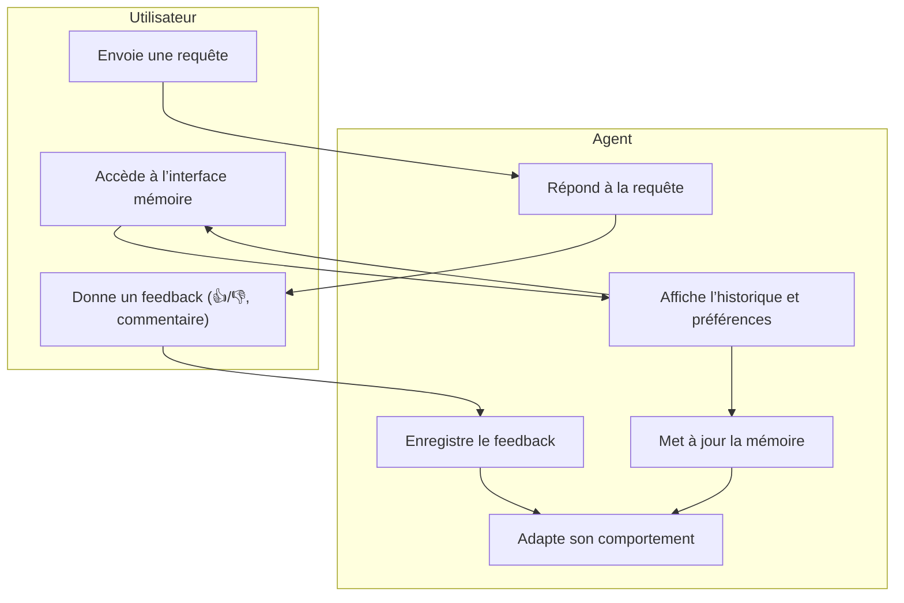
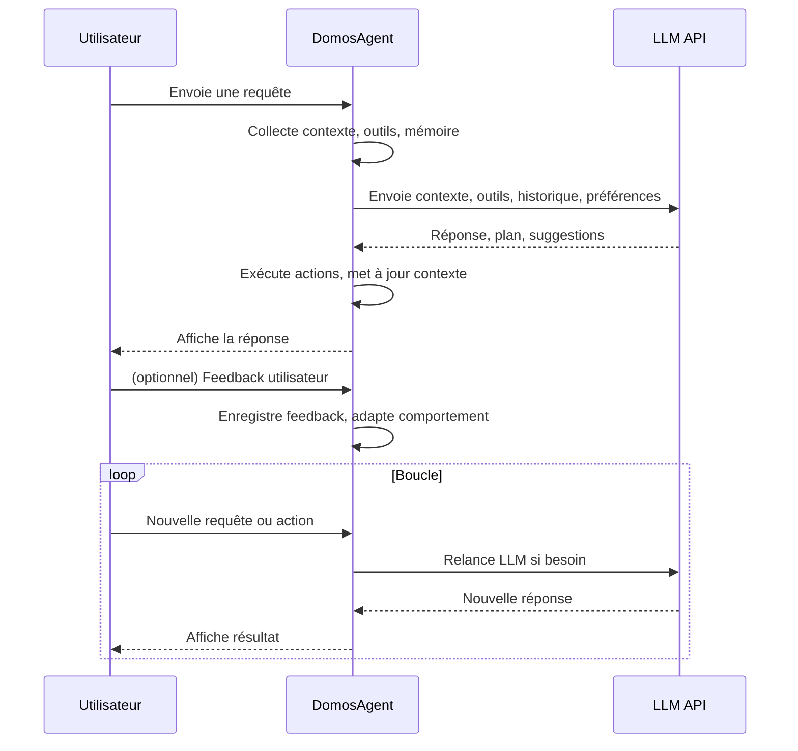
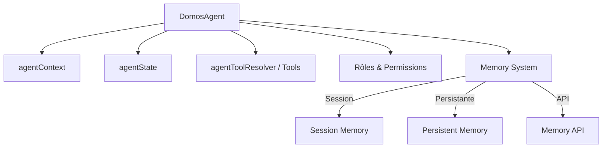
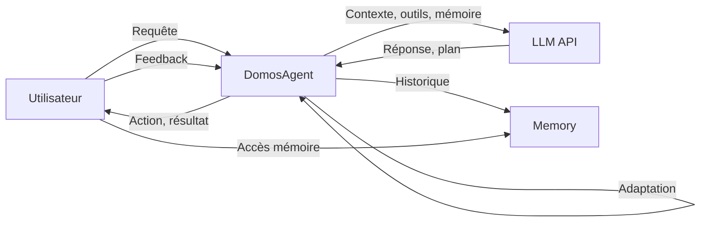
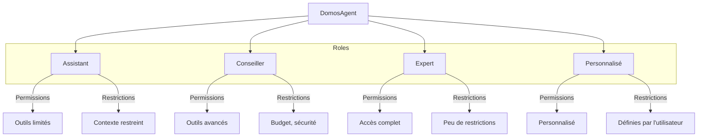
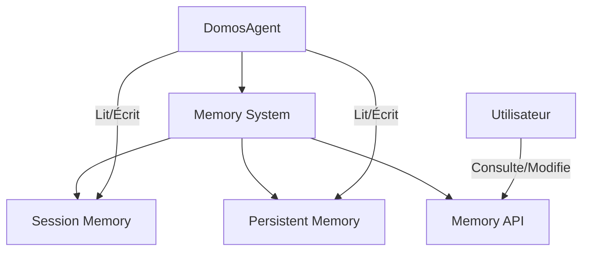
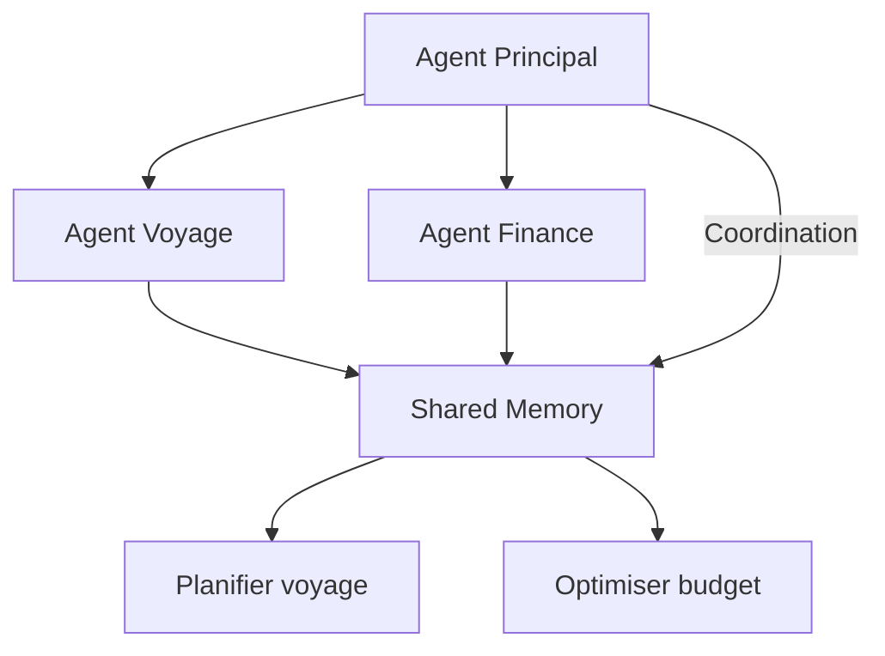
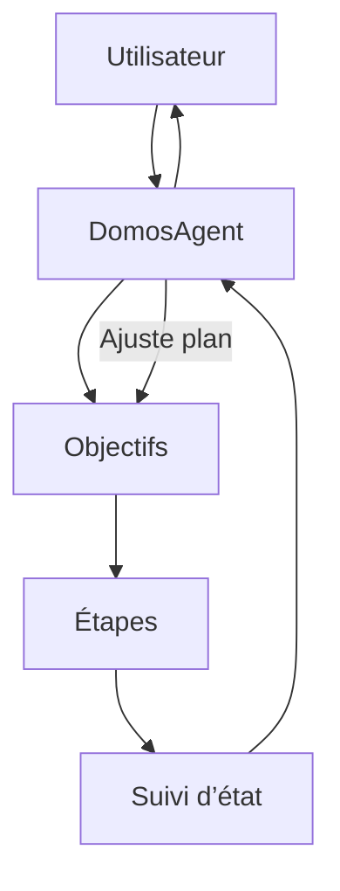
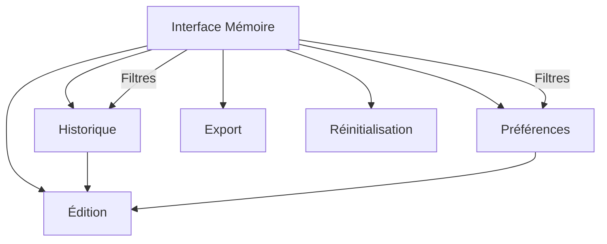
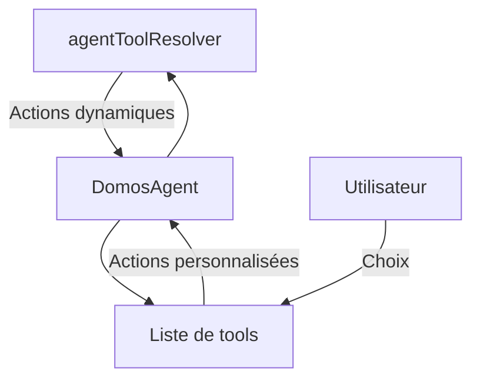

# DomosAgent — Architecture d’un Agent Intelligent connecté à un LLM

## Objectif
Créer un agent intelligent pour DomOS, capable d’interagir avec un LLM (Large Language Model) via API, afin d’offrir une expérience dynamique, personnalisée et autonome. L’agent orchestre le contexte, les outils, l’état, la mémoire et les rôles pour piloter l’application.

---


## 1. Structure de l’Agent

### 1.1. Contexte
- **agentContext** : état global (page, données, historique, préférences, rôle)
- **agentState** : statut de l’agent (connected, thinking, speaking, etc.)

### 1.2. Outils
- **agentToolResolver** : expose toutes les actions disponibles (schémas, descriptions, risques)
- Outils globaux (définis dans App.svelte) et locaux (par page)

### 1.3. Rôles
- Rôle dynamique (assistant, conseiller, expert, etc.)
- Permissions, objectifs, restrictions

### 1.4. Mémoire (Memory System)
- **Session Memory** : stocke l’historique des interactions, actions, et contexte pour la session en cours
- **Persistent Memory** : sauvegarde les préférences, objectifs, et historique cross-session (par utilisateur)
- **Memory API** : interface pour lire, écrire, et interroger la mémoire
- **Exemple de structure** :
  ```js
  agentMemory = {
    session: [
      { timestamp, userRequest, agentResponse, contextSnapshot },
      ...
    ],
    persistent: {
      preferences: { language: 'fr', theme: 'dark', ... },
      objectives: [ ... ],
      history: [ ... ]
    }
  }
  ```
- **Utilisation** :
  - Adapter les réponses du LLM selon l’historique
  - Personnaliser l’expérience utilisateur
  - Garder une continuité et un apprentissage

---

## 2. Flux d’Interaction

### 2.1. Déclenchement
- L’utilisateur ou le système initie une requête (ex : “Planifie mon voyage”)
- L’agent collecte le contexte, les outils, l’état, l’historique, le rôle

### 2.2. Appel LLM (API)
- L’agent envoie au LLM :
  - contexte (page, données, objectifs, rôle)
  - outils/actions disponibles (schémas, descriptions)
  - historique (conversations, actions passées)
  - préférences (utilisateur, restrictions)
- Le LLM analyse, propose un plan, une action, ou une réponse

### 2.3. Réponse
- L’agent reçoit :
  - instructions (ex : “Ajoute Paris à l’itinéraire, budget 1200€”)
  - suggestions (ex : “Voici trois hôtels à Paris”)
  - plan d’action (ex : “Étape 1 : choisir destination, Étape 2 : réserver hôtel”)
- L’agent exécute les actions via agentToolResolver, met à jour le contexte, et affiche le résultat

### 2.4. Boucle
- L’agent mémorise l’historique, adapte son comportement, et relance le LLM si besoin

---

## 3. Exemple de Code (pseudo)

```js
const agent = new DomOSAgent({
  context: agentContext,
  tools: agentToolResolver,
  state: agentState,
  memory: agentMemory,
});

agent.onUserRequest = async (request) => {
  const payload = {
    context: agent.getContext(),
    tools: agent.getTools(),
    history: agent.getHistory(),
    request,
  };
  const llmResponse = await callLLMApi(payload);
  agent.handleLLMResponse(llmResponse);
};
```

---

## 4. Schéma d’Architecture

```
[UI/Utilisateur] → [DomosAgent] → [LLM API]
        ↑                ↓
   [Actions]        [Réponses]
```

---

## 5. Points Clés
- Centraliser le contexte, les outils et la mémoire
- Exposer les outils globaux et locaux
- Adapter le rôle et les permissions dynamiquement
- Utiliser le LLM pour piloter l’agent, proposer des plans, exécuter des actions
- Mémoriser l’historique et personnaliser l’expérience

---

## 6. Extensions possibles
- Multi-agents (plusieurs rôles, spécialités)
- Mémoire longue (historique cross-session)
- Personnalisation avancée (objectifs, préférences, restrictions)
- Feedback utilisateur (apprentissage, adaptation)

---

## 7. Avantages
- Expérience utilisateur enrichie et proactive
- Adaptation dynamique selon le contexte et le rôle
- Orchestration intelligente des outils et des actions
- Possibilité d’intégrer plusieurs LLM ou sources d’intelligence

---

## 8. Conclusion
DomosAgent permet de transformer l’application DomOS en une plateforme pilotée par un agent intelligent, capable de comprendre, planifier, exécuter et personnaliser toutes les interactions grâce à la puissance d’un LLM.

## Note sur l’intégration des outils
L’agent DomOS peut recevoir les outils de deux manières :
- **agentToolResolver** : pour exposer dynamiquement toutes les actions disponibles (schémas, descriptions, risques).
- **Liste de tools** : si l’utilisateur utilise `useAgentTool`, il peut fournir directement une liste d’outils personnalisés à l’agent.

L’agent doit donc être capable de gérer à la fois un resolver dynamique et une liste statique d’outils selon le contexte d’intégration.

## 12. Système de feedback et interface mémoire

### Système de feedback
- L’agent intègre un mécanisme pour recevoir des retours utilisateur (feedback positif/négatif, suggestions, corrections).
- Le feedback peut être utilisé pour :
  - Adapter les réponses futures
  - Améliorer la pertinence des suggestions
  - Détecter et corriger les erreurs
- Exemple d’intégration :
  ```js
  agentFeedback = [
    { timestamp, type: 'positive', message: 'Bonne suggestion !' },
    { timestamp, type: 'correction', message: 'Ce n’est pas la bonne ville.' }
  ];
  agent.addFeedback(feedback);
  ```

### Interface mémoire
- Une interface utilisateur permet de :
  - Visualiser l’historique des interactions (session/persistant)
  - Consulter et modifier les préférences mémorisées
  - Exporter ou réinitialiser la mémoire
- L’interface peut proposer des filtres (par date, type d’action, etc.) et des options d’édition.
- Exemple de fonctionnalités :
  - Affichage chronologique des requêtes/réponses
  - Modification des objectifs ou préférences sauvegardées
  - Suppression d’éléments de l’historique

### Schéma du workflow feedback & mémoire



### Schéma du workflow d’une session d’interaction



### Schéma : Structure interne de DomosAgent



### Schéma : Flux d'interaction DomosAgent



### Schéma : Rôles, permissions et restrictions



### Schéma : Architecture du système de mémoire



### Schéma : Architecture multi-agents DomosAgent



### Schéma : Gestion de la planification & objectifs



### Schéma : Interface de visualisation et configuration mémoire



### Schéma : Intégration des outils : resolver vs liste



### Exemple d’UI pour feedback et mémoire

#### Feedback utilisateur
- Boutons ou icônes (👍 / 👎) à côté de chaque réponse de l’agent
- Champ texte pour laisser un commentaire ou une correction
- Historique des feedbacks consultable dans un panneau dédié

#### Visualisation de la mémoire
- Tableau ou timeline affichant l’historique des interactions (requêtes, réponses, actions)
- Filtres par date, type d’action, ou mot-clé
- Section “Préférences” éditable (langue, objectifs, thèmes, etc.)
- Bouton pour exporter ou réinitialiser la mémoire

#### Workflow utilisateur
1. L’utilisateur interagit avec l’agent (requête → réponse)
2. Il peut donner un feedback immédiat sur la réponse (👍 / 👎 ou commentaire)
3. Il accède à l’interface mémoire pour consulter/modifier l’historique ou les préférences
4. Les modifications ou feedbacks sont pris en compte par l’agent pour adapter son comportement
