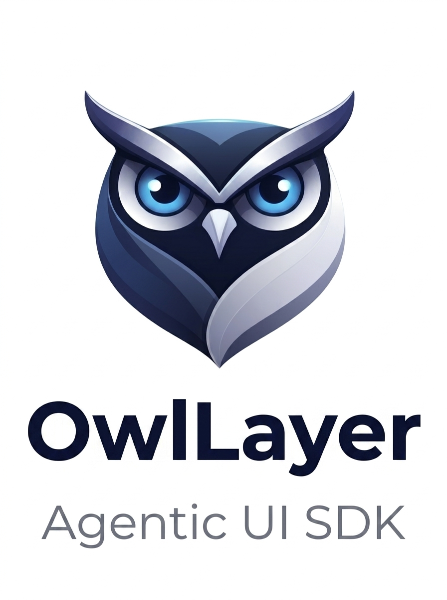

<p align="center">
  
</p>

<h1 align="center">OwlLayer AI</h1>

<p align="center">
  <strong>Turn your product UI into a safe, live capability surface for AI agents.</strong>
</p>

<p align="center">
  OwlLayer AI is an open-source TypeScript <strong>Agentic UI SDK</strong> for building interfaces where actions are explicit, contextual, and always owned by your application.
</p>

<p align="center">
  <a href="https://borisbob91.github.io/owllayer/"><strong>Documentation</strong></a>
  ·
  <a href="https://borisbob91.github.io/owllayer/getting-started/">Get started</a>
  ·
  <a href="./CONTRIBUTING.md">Contributing</a>
  ·
  <a href="./SECURITY.md">Security</a>
  ·
  <a href="./README_FR.md">Français</a>
</p>

> **Naming:** OwlLayer AI is the public brand. Use **Agentic UI SDK** for developer-facing integrations and **OwlLayer AI Runtime** for the execution layer. **AITP** is the Agent-to-Interface Transfer Protocol.

OwlLayer turns your product UI into a safe, live capability surface for AI. The agent sees explicit tools, read-only context, and approval policies; your application keeps business logic, permissions, and side effects. In practice, the page exposes only what is relevant right now, and the AI can act through those declared capabilities instead of guessing or bypassing your UI.

<p align="center">
  <a href="https://github.com/borisbob91/owllayer/actions/workflows/ci.yml?query=branch%3Amaster"></a>
  <a href="./LICENSE"></a>
  
  
  
</p>

---

## Table of contents

- [Table of contents](#table-of-contents)
- [1. Why OwlLayer AI](#1-why-owllayer-ai)
- [2. The OwlLayer AI model](#2-the-owllayer-ai-model)
  - [2.1 Declare a capability where it belongs](#21-declare-a-capability-where-it-belongs)
  - [2.2 Publish context without exposing the whole app](#22-publish-context-without-exposing-the-whole-app)
- [3. Neural-DOM Binding](#3-neural-dom-binding)
- [4. What an interaction looks like](#4-what-an-interaction-looks-like)
  - [4.1 In practice](#41-in-practice)
- [5. Framework support](#5-framework-support)
- [6. Models, realtime, and voice](#6-models-realtime-and-voice)
- [7. Security by construction](#7-security-by-construction)
- [8. Architecture and protocol](#8-architecture-and-protocol)
- [9. Start building](#9-start-building)
- [10. Repository development](#10-repository-development)
- [11. Quick start for contributors](#11-quick-start-for-contributors)
  - [11.1 Recommended entry points](#111-recommended-entry-points)
  - [11.2 Package maturity](#112-package-maturity)
  - [11.3 Getting started for contributors](#113-getting-started-for-contributors)
- [12. Contributing](#12-contributing)
- [13. Project status](#13-project-status)
- [14. License](#14-license)

## 1. Why OwlLayer AI

Most AI integrations can describe a product, but they cannot safely operate it. OwlLayer AI gives an agent a **bounded, live view of what it is allowed to do** in the interface that the user is currently using.

It is not a DOM scraper, a generated replacement UI, or a chatbot bolted onto an application. Your components, business rules, and existing workflows remain the source of truth.

With OwlLayer AI, an agent can:

- understand the allow-listed context you decide to share;
- discover only the actions available on the active screen;
- invoke application-owned handlers with validated input;
- request human approval before sensitive work;
- return results to the conversation without bypassing your domain logic.

This makes OwlLayer AI useful for guided commerce, product operations, support flows, enterprise dashboards, and voice experiences where an AI must be helpful without becoming an unrestricted automation layer.

## 2. The OwlLayer AI model

The OwlLayer AI model is built around four concepts. They are deliberately independent of any UI framework or backend implementation.

| Concept | What it means |
| --- | --- |
| **Neural-DOM Binding** | The governed connection between the living page and the LLM's neural intelligence: the page exposes what it means and what it can do, and the model can reason about those intentions without being given control of the DOM. |
| **Shadow Context** | A compact, allow-listed representation of relevant UI state. It gives the agent product awareness without exposing the DOM, internal stores, or arbitrary data. |
| **Policy-controlled execution** | Every tool has an explicit contract. Risky operations can pause for Human-in-the-Loop approval before any handler runs. |
| **AITP** | The Agent-to-Interface Transfer Protocol synchronizes context, capabilities, messages, calls, approvals, and results across the runtime boundary. |

### 2.1 Declare a capability where it belongs

```tsx
useAgentTool(
  {
    name: 'add_to_cart',
    description: 'Add the current product to the shopping cart',
    schema: z.object({ quantity: z.number().int().min(1) }),
    risk: 'low',
  },
  async ({ quantity }) => {
    await cart.add(product, quantity);
    return { productId: product.id, quantity };
  },
);
```

When this product view unmounts, its capability leaves the live registry. Navigating to checkout exposes a different surface. The agent therefore acts on the current interface, not on a stale global command list.

### 2.2 Publish context without exposing the whole app

```tsx
useAgentContext({
  page: {
    type: 'catalog',
    title: 'Running shoes',
    description: 'A product listing page for running footwear with filtering, sorting, and size selection.',
    goal: 'Help the user compare options and complete a purchase.',
    visibleContent: [
      'Featured collection: Running shoes',
      'Filters: brand, price, size',
      'Top actions: sort, add to cart, view details',
    ],
    category: 'sport',
    filters: {
      brand: ['Nike', 'Adidas'],
      priceRange: '$80-$200',
      size: '42',
    },
  },
  cart: {
    itemCount: 2,
    subtotal: 219.98,
    currency: 'EUR',
  },
  user: {
    session: 'guest',
    country: 'FR',
    locale: 'fr-FR',
  },
  intent: 'help_user_choose_and_buy',
});
```

This gives the agent the same type of information a user can perceive on the screen, plus the structured data that supports a decision. The page summary explains what the screen is about, the visible content describes what the user can interact with, and the data fields provide the precise state needed for a safe recommendation or action. The payload stays narrow and read-only: it exposes the relevant context without leaking raw internals or arbitrary DOM state.

## 3. Neural-DOM Binding

**Neural-DOM Binding is the connection between a living page and an LLM brain.**

- **Neural** is the reasoning network: Gemini, GPT, Claude, or another language model that understands intent and decides what to do.
- **DOM** is the living product interface: the current page, its visible state, its available actions, and its rules.
- **Binding** is the governed link that lets the model understand and act on the page through explicit contracts.

OwlLayer AI turns the page into a semantic, agent-readable surface. Instead of making an agent hunt for a button, click it, and guess what changed, the application tells the model: *these are the intentions that exist on this page, this is the safe context, and these are the rules for executing them.*

It is not browser automation and it is not a framework virtual DOM. OwlLayer AI does not hand raw DOM control to the model. The agent receives a named, typed, policy-governed intention such as `add_to_cart`, `get_order`, or `approve_refund`.

| Imperative UI automation | Neural-DOM Binding |
| --- | --- |
| Find a button, click it, wait for the screen, then infer whether it worked. | Request a declared intention with validated input; the application executes its own handler and returns a structured result. |
| Fragile when layout, labels, or navigation change. | Stable across UI changes because the capability contract is explicit. |
| May bypass product permissions and domain rules. | Keeps permissions, Human-in-the-Loop approval, transactions, and business logic in the application. |

The binding is declarative and lifecycle-aware: a component exposes a tool when it is relevant, receives the execution through its own handler, and removes the tool when the interface disappears. This preserves the ownership that makes a product reliable:

- the component owns its action and the state it needs;
- the agent receives a typed contract, not an imperative escape hatch;
- navigation changes the agent's capability surface automatically;
- human approval and application permissions stay on the execution path.

It is the same model across every OwlLayer AI integration, from a React hook to a Vue composable, Svelte action, Angular directive, or plain HTML declaration. The UI stays the source of truth; OwlLayer AI gives the agent a safe language for acting on it.

## 4. What an interaction looks like

```text
1. UI declares capabilities and publishes safe context.
2. The user asks for help in text or voice.
3. The agent receives the current context and capability contracts.
4. It chooses a declared action and provides schema-valid input.
5. Policy evaluates the action; approval is requested when required.
6. Your handler executes inside your application and returns a result.
7. The agent responds with the completed outcome.
```

The important boundary is step 6: the agent does not implement business operations. It requests a named capability; your application performs the work.

### 4.1 In practice

The runtime model is simple: the app defines the connection, exposes only the tools that are relevant on the current screen, and sends a compact context snapshot the agent can reason about without owning the UI.

```tsx
import React from 'react';
import { OwlLayerProvider } from '@owllayer/react';
import MainLayout from './MainLayout';

export default function App() {
  return (
    <OwlLayerProvider
      apiKey="pk_live_your_public_api_key"
      endpoint="wss://api.owllayer.ai/aitp"
      config={{
        voice: true,
        hitl: { ui: 'modal' },
        debug: true,
      }}
    >
      <MainLayout />
    </OwlLayerProvider>
  );
}
```

This establishes the live connection and makes the agent context available across the application.

```tsx
import React, { useState } from 'react';
import { useAgentTool } from '@owllayer/react';
import { z } from 'zod';

export function ProductCard({ product }) {
  const [quantity, setQuantity] = useState(1);

  useAgentTool({
    name: `add_to_cart_${product.id}`,
    description: `Add "${product.name}" to the user's cart`,
    schema: z.object({ qty: z.number().min(1).default(1) }),
    risk: 'low',
    handler: async ({ qty }) => {
      await apiAddToCart(product.id, qty);
      setQuantity((prev) => prev + qty);
      return { success: true, message: `${qty} x ${product.name} added` };
    },
  });

  return <button onClick={() => apiAddToCart(product.id, quantity)}>Add to cart</button>;
}
```

The tool exists only while that component is mounted, which keeps the capability surface aligned with the active screen.

```tsx
import React from 'react';
import { useAgentContext } from '@owllayer/react';

export function CatalogPage({ category, activeFilters, cartCount }) {
  useAgentContext({
    page: 'catalog',
    currentCategory: category,
    filters: activeFilters,
    itemsInCart: cartCount,
  });

  return <div>{/* catalog content */}</div>;
}
```

This publishes read-only state without exposing arbitrary internals. In HTML-first stacks, the same idea can be expressed declaratively with data attributes:

```html
<button
  data-owllayer-tool="open_contact_form"
  data-owllayer-description="Open the contact form modal"
  data-owllayer-risk="none"
  data-owllayer-action="click"
  data-owllayer-selector="#contact-button"
>
  Contact us
</button>
```

The pattern stays consistent: explicit action + scoped context + policy-aware execution.

## 5. Framework support

Pick the integration style that matches your product. Each guide covers installation, runtime setup, components, voice, and framework-specific API details.

| Integration | Best for | Guide |
| --- | --- | --- |
|  | Hooks, providers, components, and embedded widgets | [React guide](https://borisbob91.github.io/owllayer/react/readme/) |
|  | Plugin-based setup, composables, and Vue widgets | [Vue guide](https://borisbob91.github.io/owllayer/vue/readme/) |
|  | Stores, actions, and Svelte-native components | [Svelte guide](https://borisbob91.github.io/owllayer/svelte/readme/) |
|  | Providers, services, signals, directives, and widgets | [Angular guide](https://borisbob91.github.io/owllayer/angular/readme/) |
|  | HTML, multi-page applications, server-rendered pages, and progressive adoption | [Browser guide](https://borisbob91.github.io/owllayer/browser/readme/) |
|  | Cross-platform mobile runtime | Roadmap |
|  | Native Android surface | Roadmap |
|  | Native iOS surface | Roadmap |
|  | Kotlin Multiplatform surface | Roadmap |

## 6. Models, realtime, and voice

OwlLayer AI separates agent reasoning, low-latency conversation, and speech services so each product can choose the right interaction model.

| Category | Current support | What it enables |
| --- | --- | --- |
| **LLM and tool calling** |    | Text conversations, structured tool calls, and provider-specific model selection. |
| **Native realtime models** |   | Persistent bidirectional audio, live transcriptions, barge-in, and tools during a voice turn. |
| **Speech-to-text** |   | Audio transcription for voice experiences that use a text-model pipeline. |
| **Text-to-speech** |    | Configurable speech synthesis and voice selection. |
| **Voice runtime** |  | Rooms, tokens, agent-session bridging, Gemini realtime, and tool execution routed back through the OwlLayer AI Runtime. |
| **Roadmap** |  | Planned speech-provider integration; not yet part of the public package surface. |

The runtime keeps the same capability and approval model whether a turn is text-based, STT/LLM/TTS, or native realtime audio. See the [server documentation](https://borisbob91.github.io/owllayer/server/) and [voice guide](https://borisbob91.github.io/owllayer/livekit/) for integration details.

## 7. Security by construction

OwlLayer AI treats AI execution as an explicit application capability, not as arbitrary automation.

- **No DOM scraping:** agents receive structured contracts and selected context, never implicit access to the rendered page.
- **Schema validation:** every tool defines the input it accepts before execution.
- **Risk-aware policy:** `high` and `critical` actions can require a human decision before running.
- **Scoped context:** only data you publish becomes available to the agent.
- **Authoritative handlers:** application code owns side effects, permissions, transactions, and domain rules.
- **Runtime observability:** sessions, calls, approvals, and tool results remain traceable through the runtime surface.

Read the [HITL security guide](https://borisbob91.github.io/owllayer/hitl_security/) before exposing destructive or high-impact operations. Never place provider credentials in browser bundles. For vulnerabilities, follow [SECURITY.md](./SECURITY.md) instead of opening a public issue.

## 8. Architecture and protocol

AITP is a typed JSON protocol designed for the agentic interaction loop, rather than a generic chat transport.

```text
HANDSHAKE_INIT / HANDSHAKE_ACK
          ↓
CONTEXT_UPDATE and capability synchronization
          ↓
USER_INPUT or audio input
          ↓
TOOL_CALL → policy / approval → application handler → TOOL_RESULT
          ↓
AGENT_RESPONSE
```

The runtime merges the current UI capabilities with declared backend capabilities before an agent turn. Backend declarations remain authoritative if a name collides, preventing a transient UI component from weakening a protected operation.

For the complete model, read [Core concepts](https://borisbob91.github.io/owllayer/core-concepts/), [Architecture](https://borisbob91.github.io/owllayer/architecture/), and the [AITP protocol](https://borisbob91.github.io/owllayer/aitp-protocol/).

## 9. Start building

Use the maintained guide for your framework rather than copying a long SDK tutorial from this page:

- [Getting started](https://borisbob91.github.io/owllayer/getting-started/)
- [Widget and embedded UI](https://borisbob91.github.io/owllayer/widget/)
- [Text and voice experiences](https://borisbob91.github.io/owllayer/livekit/)
- [Server orchestration](https://borisbob91.github.io/owllayer/server/)
- [Plugin model](https://borisbob91.github.io/owllayer/plugins/)

## 10. Repository development

Requirements: Node.js 22 and pnpm 9.

```bash
git clone https://github.com/borisbob91/owllayer.git
cd owllayer
pnpm install --frozen-lockfile
pnpm lint:packages
pnpm test:packages
pnpm build:packages
```

Public npm artifacts are built only from `packages/`. Applications, plugins, documentation sites, and local planning material are not released. Package imports remain `@owllayer/*` until their individual compatibility migration is delivered; do not copy future `@owllayer/*` names into current examples.

## 11. Quick start for contributors

If you want to contribute to OwlLayer AI, the repository is easier to navigate when you keep three layers in mind:

- `packages/` contains the core framework surface: public runtime packages, shared primitives, adapters, and the main integrations that are meant to be used by other projects.
- `apps/` contains demo applications and validation environments used to exercise the framework in real scenarios. These are excellent for testing behavior and UX, but they are not the primary public package surface.
- `packages/shopify/` and `packages/woocommerce/` are still experimental integrations. They can evolve quickly and should be treated as early-stage work rather than stable, fully supported integrations.

The audio and realtime-related packages are foundational pieces that are tightly coupled to the rest of the system. Changes there should be validated across the packages that depend on them.

### 11.1 Recommended entry points

- For framework changes: start with the core packages under `packages/`, especially the runtime, UI, server, and adapter packages that match the feature you want to improve.
- For demos and end-to-end validation: inspect the apps under `apps/` and use them to verify behavior in realistic flows.
- For experimental integrations: begin with `packages/shopify/` and `packages/woocommerce/` and expect a more iterative development cycle.

### 11.2 Package maturity

- Public packages: the main framework packages intended for broad reuse and integration.
- Experimental packages: integrations such as Shopify and WooCommerce that are still being validated.
- Internal or foundational packages: supporting runtime and architecture packages that are essential to the system but are often consumed indirectly.

### 11.3 Getting started for contributors

If you want to start contributing quickly, use this path:

1. Install the required tools:
   - Node.js 22
   - pnpm 9
2. Install dependencies:
   ```bash
   pnpm install --frozen-lockfile
   ```
3. Run the baseline checks:
   ```bash
   pnpm lint:packages
   pnpm test:packages
   pnpm build:packages
   ```
4. Pick a contribution area:
   - core framework work: start with packages under `packages/`
   - demos and validation: inspect the apps in `apps/`
   - experimental integrations: review `packages/shopify/` and `packages/woocommerce/` first
5. Keep the change focused and document it clearly.

For package-specific development, you can also run commands such as:

```bash
pnpm --filter @owllayer/core test
pnpm --filter @owllayer/react build
```

## 12. Contributing

Focused contributions are welcome. Read [CONTRIBUTING.md](./CONTRIBUTING.md), open or reference an issue, keep changes within one domain, and add a Changeset for functional modifications to public packages.

Please also follow the [Code of Conduct](./CODE_OF_CONDUCT.md).

## 13. Project status

OwlLayer AI is under active development and preparing its first public npm release. APIs may change before the first stable release; use exact versions for production evaluation and review migration notes when upgrading.

## 14. License

OwlLayer AI is available under the [MIT License](./LICENSE).
