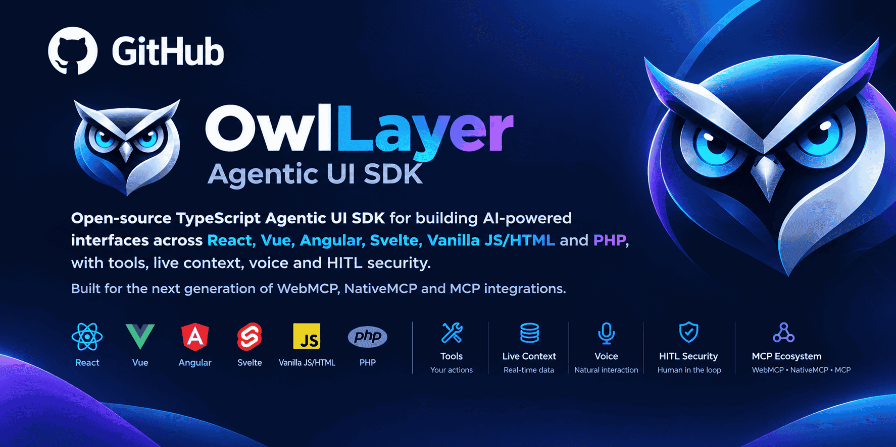

<p align="center">
  
</p>

<h1 align="center">OwlLayer AI</h1>

<p align="center">
  <strong>Make your web interface drivable by AI: turn buttons, links, and form fields into tools an agent can call.</strong>
</p>

<p align="center">
  <a href="https://borisbob91.github.io/owllayer/"><strong>Documentation</strong></a>
  ·
  <a href="https://borisbob91.github.io/owllayer/getting-started/">Get started</a>
  ·
  <a href="./CONTRIBUTING.md">Contributing</a>
  ·
  <a href="./SECURITY.md">Security</a>
  ·
  <a href="./README_FR.md">Français</a>
</p>

<p align="center">
  <a href="https://github.com/borisbob91/owllayer/actions/workflows/ci.yml?query=branch%3Amaster"></a>
  <a href="https://www.npmjs.com/package/@owllayer/core"></a>
  <a href="https://github.com/borisbob91/owllayer/releases/latest"></a>
  <a href="https://github.com/borisbob91/owllayer/stargazers"></a>
  <a href="./LICENSE"></a>
  
</p>

> **TL;DR for developers** — OwlLayer AI is an open-source TypeScript **Agentic UI SDK**. You mark the elements and actions of your app that an AI agent may use; OwlLayer turns them into typed tools, sends them to the model with the context of the current screen, and runs the agent's calls through your own code. The agent lives inside your app: your users talk to it in text or voice, and nothing has to be installed on their side.

<p align="center">
  
</p>

---

## Table of contents

- [1. What it does](#1-what-it-does)
- [2. OwlLayer AI and MCP](#2-owllayer-ai-and-mcp)
- [3. How it works](#3-how-it-works)
- [4. Quick start](#4-quick-start)
- [5. Security and human approval](#5-security-and-human-approval)
- [6. Frameworks, models, and voice](#6-frameworks-models-and-voice)
- [7. Project status and license](#7-project-status-and-license)

## 1. What it does

A user tells your app: *"add two of these headphones to my cart and check out"*. With OwlLayer AI, the agent embedded in your app does it — with the buttons and forms your app already has, on the screen the user is on, and it asks the user before paying.

- **Your UI becomes the agent's toolbox.** A button, a link, a form field, or a component declares itself as a tool (`add_to_cart`, `fill_shipping_address`, `track_order`).
- **Only what is on screen.** On the product page the agent can add to cart; on checkout it can fill the address. Tools appear and disappear with the components that declare them.
- **Your code does the work.** The agent requests a named action with valid input; your handler runs it, with your permissions and business rules.
- **The user stays in control.** Actions marked `high` or `critical` wait for the user's approval.

## 2. OwlLayer AI and MCP

The **Model Context Protocol (MCP)** is a standard for exposing tools **on the server side**: an MCP server declares functions (`query_database`, `create_ticket`, …) that an AI agent such as Codex or Claude Code can call from the developer's environment.

OwlLayer AI works **on the interface side**: it turns the elements of your web app into tools, and puts the agent **inside the app**. Your users chat with it directly in your product; they do not install or configure any agent tool.

| | MCP | OwlLayer AI |
| --- | --- | --- |
| **Tools come from** | Functions declared in a backend MCP server | Buttons, forms, and components of your UI (plus server tools if you need them) |
| **Who uses them** | An agent in the developer's or user's own AI client (Codex, Claude Code, …) | The agent embedded in your app, used by your end users in text or voice |
| **What the agent knows** | What each tool returns | The current screen, through the context you choose to share |
| **When a tool exists** | As long as the server exposes it | Only while its component is on screen |
| **Human approval** | Depends on the client | Built in for `high` and `critical` actions |

## 3. How it works

<p align="center">
  
</p>

**HTML elements become tools** — no framework needed, with `@owllayer/browser`:

```html
<!-- A button: the agent can click it. -->
<button data-owllayer-tool="add_to_cart" data-owllayer-description="Add the Bluetooth Pro headphones to the cart" data-owllayer-risk="low">
  Add to cart
</button>

<!-- A form field: the agent can fill it. -->
<input name="city"
  data-owllayer-tool="set_shipping_city"
  data-owllayer-description="Set the shipping city"
  data-owllayer-action="setValue"
  data-owllayer-schema='{"type":"object","properties":{"value":{"type":"string"}},"required":["value"]}' />
```

**Components declare tools** — with the React, Vue, Svelte, or Angular SDK:

```tsx
useAgentTool(
  {
    name: 'add_to_cart',
    description: 'Add a product to the cart',
    schema: z.object({ productId: z.string(), qty: z.number().int().min(1) }),
    risk: 'low',
  },
  async ({ productId, qty }) => cart.add(productId, qty),
);
```

The agent also receives a short description of the current screen that you publish (`useAgentContext`, `OwlLayer.updateContext`), never the DOM or your stores. Messages travel over **AITP** (Agent-to-Interface Transfer Protocol), typed JSON over WebSocket.

More: [Core concepts](https://borisbob91.github.io/owllayer/core-concepts/) · [Browser attributes](https://borisbob91.github.io/owllayer/browser/readme/) · [AITP protocol](https://borisbob91.github.io/owllayer/aitp-protocol/).

## 4. Quick start

```bash
npm install @owllayer/server @owllayer/adapter-google   # server
npm install @owllayer/react @owllayer/core zod          # front end (or vue, svelte, angular, browser)
```

```ts
// server.ts — model keys stay here
import { OwlLayerServer } from '@owllayer/server';
import { GoogleAdapter } from '@owllayer/adapter-google';

const server = new OwlLayerServer({
  llm: new GoogleAdapter({ model: 'gemini-2.0-flash', apiKey: process.env.GOOGLE_API_KEY! }),
  port: 3001,
  path: '/owllayer',
});
server.addApiKey('pk_dev_local');
server.listen();
```

```tsx
// App.tsx — connect the app once, at the root
<OwlLayerProvider apiKey="pk_dev_local" endpoint="ws://localhost:3001/owllayer" config={{ voice: true }}>
  <MainLayout />
</OwlLayerProvider>
```

Step-by-step guides for each framework: [Getting started](https://borisbob91.github.io/owllayer/getting-started/).

## 5. Security and human approval

<p align="center">
  
</p>

| Risk | What happens | Example |
| --- | --- | --- |
| `none` | Runs directly | `search_products` |
| `low` | Runs; the user sees a notification | `add_to_cart` |
| `high` | **Waits for the user's approval** | `clear_cart` |
| `critical` | **Waits for the user's approval**, with a stronger warning | `confirm_order` |

The agent never reads or drives the DOM; each tool validates its input; your handlers own side effects and permissions; the server has the last word (`server.blockTool('name')`, and a server tool wins over a UI tool with the same name). Read the [HITL security guide](https://borisbob91.github.io/owllayer/hitl_security/) before exposing destructive actions, and report vulnerabilities through [SECURITY.md](./SECURITY.md).

## 6. Frameworks, models, and voice

| | Supported |
| --- | --- |
| **Web** | [React / Next.js](https://borisbob91.github.io/owllayer/react/readme/) · [Vue / Nuxt](https://borisbob91.github.io/owllayer/vue/readme/) · [Svelte](https://borisbob91.github.io/owllayer/svelte/readme/) · [Angular](https://borisbob91.github.io/owllayer/angular/readme/) · [HTML / Browser](https://borisbob91.github.io/owllayer/browser/readme/) |
| **Storefronts** (experimental) | [Shopify](./packages/shopify/README.md) · [WooCommerce](./packages/woocommerce/README.md) |
| **Mobile** | [Flutter](https://github.com/borisbob91/owllayer-flutter) · [Swift](https://github.com/borisbob91/owllayer-swift) · [Kotlin](https://github.com/borisbob91/owllayer-kotlin) |
| **Models** | OpenAI · Google Gemini · Anthropic Claude |
| **Realtime voice** | OpenAI Realtime · Gemini Live · LiveKit |
| **Speech** | Whisper, Google STT (speech-to-text) · OpenAI TTS, Google TTS, ElevenLabs (text-to-speech) |

Text, speech pipelines, and realtime voice use the same tools and the same approval rules: a tool called during a voice turn still runs through OwlLayer. See the [server](https://borisbob91.github.io/owllayer/server/) and [voice](https://borisbob91.github.io/owllayer/livekit/) guides.

## 7. Project status and license

The packages are published on npm and are pre-1.0: APIs may change between minor versions, so pin exact versions. To work on the repository, see [CONTRIBUTING.md](./CONTRIBUTING.md).

OwlLayer AI is available under the [MIT License](./LICENSE).
