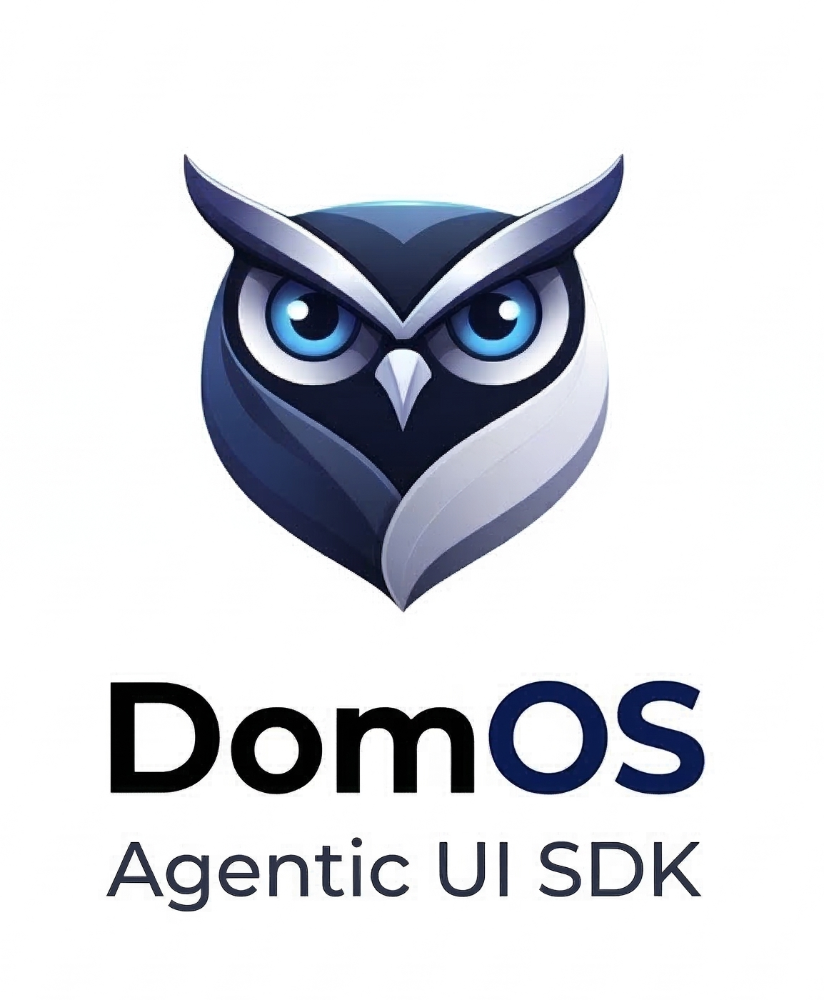

<p align="center">
  
</p>

<h1 align="center">DomOS</h1>

<p align="center">
  <strong>Give your AI control of your interface.</strong>
</p>

<p align="center">
  The open-source SDK for building <strong>Agentic UIs</strong> — where an AI agent acts inside your existing app through explicit, declared tools.
</p>

<p align="center">
  <a href="https://borisbob91.github.io/domos/"><strong>Documentation</strong></a> &nbsp;&bull;&nbsp;
  <a href="#-quick-start">Quick Start</a> &nbsp;&bull;&nbsp;
  <a href="#-packages">Packages</a> &nbsp;&bull;&nbsp;
  <a href="CONTRIBUTING.md">Contributing</a>
</p>

<p align="center">
  
  
  
  
</p>

---

## What is DomOS?

DomOS lets an AI agent **act inside your existing interface** through explicit, declared tools. No DOM scraping. No generative UI replacing your product. Your app stays in control.

The agent only sees what you expose: a **Shadow Context** (what's on screen right now) and a list of **tools** (what it's allowed to do). Everything else stays invisible.

```
Your App  ↔  DomOSClient  ↔  ADTP / WebSocket  ↔  DomOSServer  ↔  LLM
```

---

## Why DomOS?

<table>
  <tr>
    <td width="33%" valign="top" align="center">
      <br/>
      <strong>Your UI, your rules</strong><br/>
      <sub>The agent calls tools you declared. It never touches the DOM directly.</sub>
    </td>
    <td width="33%" valign="top" align="center">
      <br/>
      <strong>Dynamic tools</strong><br/>
      <sub>Tools mount and unmount with your components. The LLM only sees what's relevant now.</sub>
    </td>
    <td width="33%" valign="top" align="center">
      <br/>
      <strong>Framework-agnostic</strong><br/>
      <sub>React, Vue, Svelte, Angular, vanilla JS. Same protocol underneath.</sub>
    </td>
  </tr>
  <tr>
    <td width="33%" valign="top" align="center">
      <br/>
      <strong>Human-in-the-Loop</strong><br/>
      <sub>Built-in risk levels (none / low / high / critical) with approval UI in Shadow DOM.</sub>
    </td>
    <td width="33%" valign="top" align="center">
      <br/>
      <strong>Voice-ready</strong><br/>
      <sub>Audio pipeline and LiveKit integration for realtime voice agents.</sub>
    </td>
    <td width="33%" valign="top" align="center">
      <br/>
      <strong>Production-tested</strong><br/>
      <sub>Shopify & WooCommerce integrations, session management, rate limiting.</sub>
    </td>
  </tr>
</table>

---

## 🚀 Quick Start

```bash
git clone https://github.com/borisbob91/domos.git
cd domos
pnpm install && pnpm build
```

**Start the server:**

```bash
cd apps/demo-server
cp .env.example .env   # add your GOOGLE_API_KEY
pnpm dev
```

**Start the client:**

```bash
cd apps/demo
pnpm dev
```

Open `http://localhost:5173`. Try: *"Add the headphones to my cart"* or *"Empty my cart"* (triggers a HITL confirmation).

> Prefer building from scratch? See the [Quick Start guide](https://borisbob91.github.io/domos/quick-start).

---

## Minimal Example (React)

```tsx
import { DomOSProvider, useAgentTool, useAgent } from '@domos/react';
import { z } from 'zod';

function App() {
  return (
    <DomOSProvider apiKey="pk_dev" endpoint="ws://localhost:3000/domos">
      <MyPage />
    </DomOSProvider>
  );
}

function MyPage() {
  const { sendText, lastResponse } = useAgent();

  useAgentTool({
    name: 'add_to_cart',
    description: 'Add the visible product to the cart',
    schema: z.object({ quantity: z.number().min(1) }),
    risk: 'low',
  }, async ({ quantity }) => {
    await cartApi.add(currentProduct.id, quantity);
    return { added: true, quantity };
  });

  return <div>{lastResponse}</div>;
}
```

When the component unmounts, the tool disappears. The LLM never sees stale actions.

---

## How It Works (30 seconds)

1. Your component declares a **tool** (name + schema + handler + risk level).
2. `DomOSClient` syncs active tools and the **Shadow Context** to the server via ADTP.
3. The user talks to the agent (text or voice).
4. The LLM picks a tool → server sends `TOOL_CALL` → your handler runs locally → result goes back.
5. If `risk` is `high` or `critical`, the user must approve first.

---

## 📦 Packages

| Package | Description |
|---|---|
| `@domos/core` | Shared runtime, ADTP protocol, tool registry, HITL |
| `@domos/server` | Node.js server, sessions, transport, security |
| `@domos/react` | React SDK (hooks, provider, widget) |
| `@domos/vue` | Vue SDK (composables, plugin, widget) |
| `@domos/svelte` | Svelte SDK (actions, stores, widget) |
| `@domos/angular` | Angular SDK (services, signals, DI) |
| `@domos/browser` | Vanilla JS SDK (imperative API, HTML auto-discovery) |
| `@domos/adapter-google` | Gemini adapter |
| `@domos/adapter-openai` | OpenAI adapter |
| `@domos/adapter-livekit` | LiveKit realtime voice adapter |

---

## Documentation

- **[Full docs (EN)](https://borisbob91.github.io/domos/)** — concise, code-first
- [Core Concepts](https://borisbob91.github.io/domos/concepts) · [Tools Guide](https://borisbob91.github.io/domos/tools-guide) · [Architecture](https://borisbob91.github.io/domos/architecture)
- [ADTP Protocol Spec](https://borisbob91.github.io/domos/adtp-protocol) · [LiveKit](https://borisbob91.github.io/domos/livekit)

---

## Tech Stack

- TypeScript monorepo (**pnpm** + **Turborepo**)
- **Vitest** for testing
- WebSocket transport
- **Zod** for tool schemas
- LLM-agnostic via the adapter pattern

---

## Contributing

Contributions are welcome. See [CONTRIBUTING.md](CONTRIBUTING.md) and our [Code of Conduct](CODE_OF_CONDUCT.md).

```bash
pnpm install
pnpm build
pnpm test
```

Found a security issue? Please read [SECURITY.md](SECURITY.md).

---

## License

[MIT](LICENSE) © 2026 DomOS
