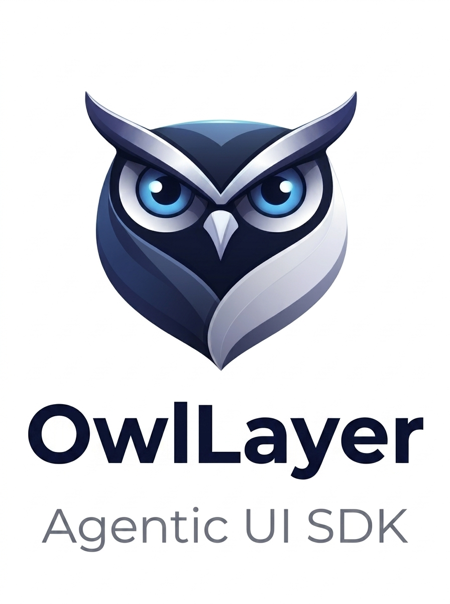
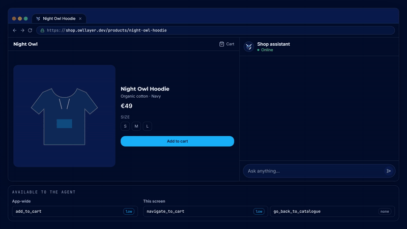
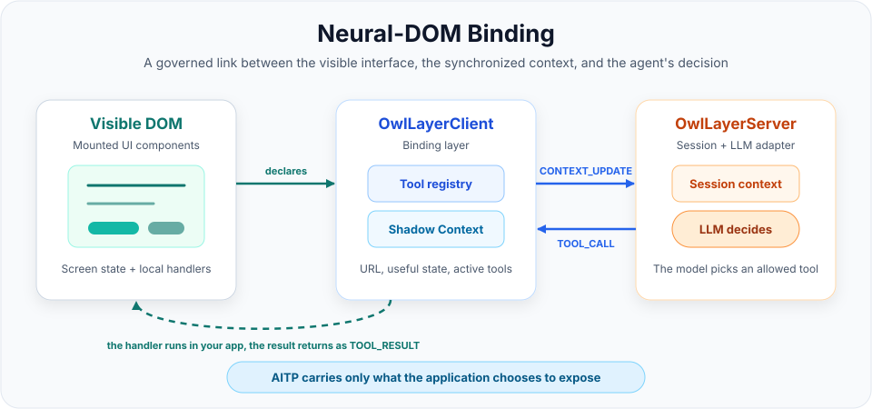
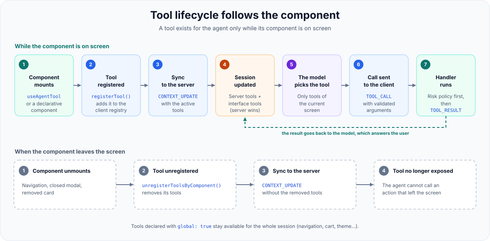
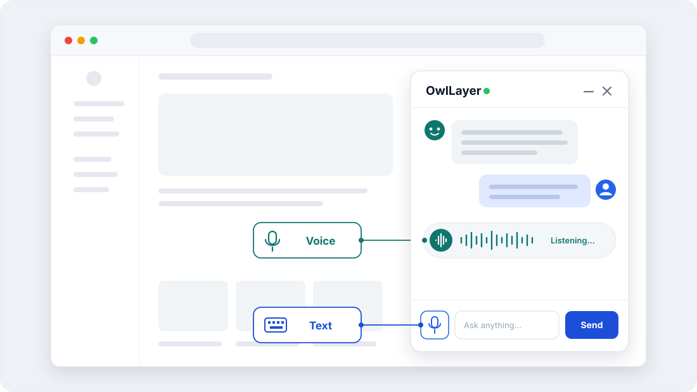
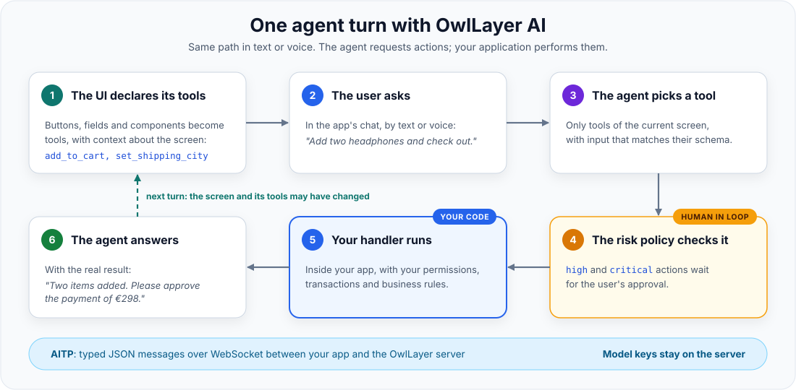
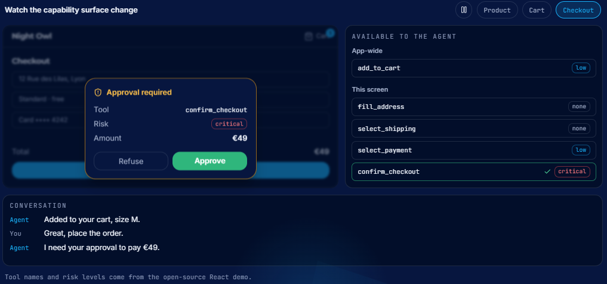
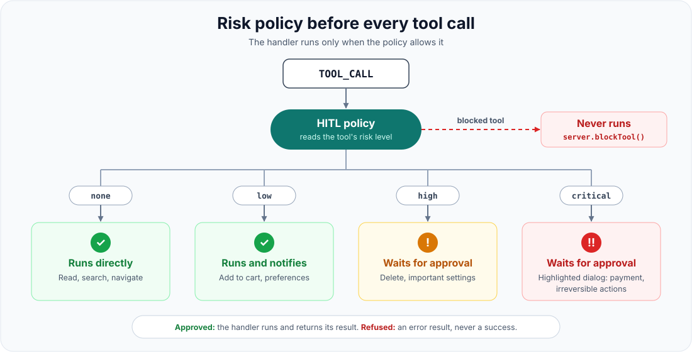

<p align="center">
  
</p>

<h1 align="center">OwlLayer AI</h1>

<p align="center">
  <strong>Rendez votre interface web pilotable par l'IA : transformez vos boutons, liens et champs de formulaire en outils qu'un agent peut appeler.</strong>
</p>

<p align="center">
  OwlLayer AI est un <strong>Agentic UI SDK</strong> open source en TypeScript pour construire des interfaces où les actions sont explicites, contextuelles et toujours détenues par votre application : boutons, liens, champs de formulaire et composants deviennent des <strong>outils que l'agent IA peut appeler</strong> pour piloter l'interface, et l'agent vit dans votre application, vos utilisateurs lui parlent simplement.
</p>

<p align="center">
  <a href="https://borisbob91.github.io/owllayer/"><strong>Documentation</strong></a>
  ·
  <a href="https://borisbob91.github.io/owllayer/quick-start.html">Démarrer</a>
  ·
  <a href="./CONTRIBUTING_FR.md">Contribuer</a>
  ·
  <a href="./SECURITY.md">Sécurité</a>
  ·
  <a href="./README.md">English</a>
</p>

<p align="center">
  <a href="https://github.com/borisbob91/owllayer/actions/workflows/ci.yml?query=branch%3Amaster"></a>
  <a href="https://github.com/borisbob91/owllayer/actions/workflows/pages-docs.yml"></a>
  <a href="https://github.com/borisbob91/owllayer/releases/latest"></a>
  <a href="https://www.npmjs.com/package/@owllayer/core"></a>
  <a href="https://github.com/borisbob91/owllayer/releases"></a>
  <a href="https://github.com/borisbob91/owllayer/stargazers"></a>
  <a href="https://github.com/borisbob91/owllayer"></a>
  <a href="https://github.com/borisbob91/owllayer/commits/master"></a>
  <a href="./LICENSE"></a>
  
  
  
</p>

<p align="center">
  <a href="https://borisbob91.github.io/owllayer/"></a>
</p>
<p align="center">
  <sub>L'utilisateur le dit, c'est tout. L'agent intégré à la boutique cherche, filtre, ouvre le produit et passe la commande avec les outils que chaque écran déclare.</sub>
</p>

---

## Sommaire

- [Sommaire](#sommaire)
- [1. Pourquoi OwlLayer AI](#1-pourquoi-owllayer-ai)
  - [1.1 OwlLayer AI et MCP](#11-owllayer-ai-et-mcp)
- [2. Le modèle OwlLayer AI](#2-le-modèle-owllayer-ai)
  - [2.1 Neural-DOM Binding](#21-neural-dom-binding)
  - [2.2 Outils](#22-outils)
- [3. Frameworks supportés](#3-frameworks-supportés)
- [4. Modèles, temps réel et voix](#4-modèles-temps-réel-et-voix)
- [5. Connecter votre application](#5-connecter-votre-application)
- [6. Déclarer une capacité là où elle a sa place](#6-déclarer-une-capacité-là-où-elle-a-sa-place)
  - [6.1 En script](#61-en-script)
  - [6.2 Composants déclaratifs](#62-composants-déclaratifs)
  - [6.3 Attributs HTML](#63-attributs-html)
- [7. Publier du contexte sans exposer toute l'application](#7-publier-du-contexte-sans-exposer-toute-lapplication)
  - [7.1 En script (React)](#71-en-script-react)
  - [7.2 SDK navigateur (impératif)](#72-sdk-navigateur-impératif)
- [8. Cycle d'une interaction et protocole](#8-cycle-dune-interaction-et-protocole)
- [9. Sécurité par construction](#9-sécurité-par-construction)
- [10. Développer et contribuer au dépôt](#10-développer-et-contribuer-au-dépôt)
  - [10.1 Organisation du dépôt](#101-organisation-du-dépôt)
  - [10.2 Workflow de contribution](#102-workflow-de-contribution)
- [11. État du projet](#11-état-du-projet)
- [12. Licence](#12-licence)

## 1. Pourquoi OwlLayer AI

La plupart des intégrations IA dans des applications web savent décrire un produit, mais ne savent pas l'utiliser en toute sécurité. OwlLayer AI donne à un agent une **vue bornée et vivante de ce qu'il a le droit de faire** dans l'interface que l'utilisateur utilise en ce moment.

Ce n'est ni un scraper de DOM, ni une UI générée qui remplace la vôtre, ni un chatbot greffé sur une application. Vos composants, vos règles métier et vos parcours existants restent la source de vérité.

Avec OwlLayer AI, un agent peut :

- comprendre le contexte autorisé que vous choisissez de partager ;
- découvrir uniquement les actions disponibles sur l'écran actif ;
- appeler des handlers détenus par l'application, avec des entrées validées ;
- demander l'accord d'un humain avant une opération sensible ;
- renvoyer des résultats dans la conversation sans contourner votre logique métier.

OwlLayer AI est donc utile pour le commerce guidé, les opérations produit, les parcours de support, les tableaux de bord d'entreprise et les expériences vocales, partout où une IA doit être utile sans devenir une couche d'automatisation sans limites.

### 1.1 OwlLayer AI et MCP

Le **Model Context Protocol (MCP)** est un standard pour exposer des outils **côté serveur** : un serveur MCP déclare des fonctions (`query_database`, `create_ticket`, …) qu'un agent IA comme Codex ou Claude Code peut appeler.

OwlLayer AI travaille **côté interface** : il transforme en outils les éléments de votre application web (boutons, liens, champs de formulaire, composants), et place l'agent **dans l'application**. Vos utilisateurs discutent avec lui directement dans votre produit ; ils n'installent et ne configurent aucun outil d'agent.

| | MCP | OwlLayer AI |
| --- | --- | --- |
| **D'où viennent les outils** | Des fonctions déclarées dans un serveur MCP backend | Des boutons, formulaires et composants de votre UI (plus des outils serveur si besoin) |
| **Qui les utilise** | Un agent dans le client IA de l'utilisateur (Codex, Claude Code, …) | L'agent intégré à votre application, utilisé par vos utilisateurs finaux, à l'écrit ou à la voix |
| **Ce que l'agent sait** | Ce que chaque outil renvoie | L'écran courant, à travers le contexte que vous choisissez de partager |
| **Quand un outil existe** | Tant que le serveur l'expose | Seulement tant que son composant est à l'écran |
| **Accord humain** | Dépend du client | Intégré pour les actions `high` et `critical` |

## 2. Le modèle OwlLayer AI

Le modèle repose sur cinq concepts, volontairement indépendants de tout framework UI et de toute implémentation backend.

| Concept | Ce que cela signifie | Détails |
| --- | --- | --- |
| **Neural-DOM Binding** | Le principe : la page expose les actions définies et ce qu'elle permet de faire, et le modèle raisonne sur ces intentions sans jamais prendre le contrôle du DOM. | [2.1](#21-neural-dom-binding) |
| **Outils** | Les actions que l'agent peut appeler. L'interface les enregistre quand elles apparaissent à l'écran, les retire quand elles disparaissent, et votre code les exécute. | [2.2](#22-outils), [6](#6-déclarer-une-capacité-là-où-elle-a-sa-place) |
| **Shadow Context** | Une représentation compacte et autorisée de l'état utile de l'UI. Elle donne à l'agent la connaissance du produit sans exposer le DOM, les stores internes ni des données arbitraires. | [7](#7-publier-du-contexte-sans-exposer-toute-lapplication) |
| **Exécution contrôlée par politique** | Chaque outil a un contrat explicite. Les opérations à risque peuvent être suspendues pour un accord humain (Human-in-the-Loop) avant l'exécution de tout handler. | [9](#9-sécurité-par-construction) |
| **AITP** | L'Agent-to-Interface Transfer Protocol synchronise le contexte, les capacités, les messages, les appels, les accords et les résultats de part et d'autre du runtime. | [8](#8-cycle-dune-interaction-et-protocole) |

### 2.1 Neural-DOM Binding

**Le Neural-DOM Binding est la connexion entre une page vivante et le cerveau d'un LLM.**

<p align="center">
  
</p>

- **Neural** est le réseau de raisonnement : Gemini, GPT, Claude ou un autre modèle de langage qui comprend l'intention et décide quoi faire.
- **DOM** est l'interface produit vivante : la page courante, son état visible, ses actions disponibles et ses règles.
- **Binding** est le lien gouverné qui permet au modèle de comprendre la page et d'y agir à travers des contrats explicites.

OwlLayer AI fait de la page une surface sémantique, lisible par un agent IA. Au lieu de laisser un agent chercher un bouton, cliquer dessus et deviner ce qui a changé, l'application dit au modèle : *voici les intentions qui existent sur cette page, voici le contexte, et voici les règles pour les exécuter.*

Ce n'est pas de l'automatisation de navigateur, ni le DOM virtuel d'un framework. L'agent reçoit une intention nommée, typée et gouvernée par une politique, comme `add_to_cart`, `get_order` ou `approve_refund`.

| Automatisation impérative de l'UI | Neural-DOM Binding |
| --- | --- |
| Trouver un bouton, cliquer, attendre l'écran, puis deviner si cela a marché. | Demander une intention déclarée avec des entrées validées ; l'application exécute son propre handler et renvoie un résultat structuré. |
| Fragile dès que la mise en page, les libellés ou la navigation changent. | Stable face aux changements d'UI, car le contrat de la capacité est explicite. |
| Peut contourner les permissions et les règles métier du produit. | Garde les permissions, l'accord humain, les transactions et la logique métier dans l'application. |

### 2.2 Outils

Un outil est une action que l'agent peut appeler : un nom, une description que lit le modèle, un schéma d'entrée, un niveau de risque et un handler dans votre code applicatif. Le binding est déclaratif et suit le cycle de vie. Trois éléments du runtime le gèrent :

- **Enregistrement :** un composant enregistre ses outils quand il apparaît à l'écran (`useAgentTool`, composants déclaratifs, `OwlLayer.registerTool()` ou attributs `data-owllayer-tool`). Le client envoie la liste à jour au serveur.
- **Désenregistrement :** quand le composant disparaît, ses outils sont retirés ; la navigation change donc ce que l'agent peut faire. Les outils déclarés avec `global: true` restent disponibles pendant toute la session.
- **Exécution :** quand l'agent appelle un outil, l'exécuteur le retrouve, applique la politique de risque, attend la fin du handler et renvoie un résultat structuré. Si l'outil a changé de page, il attend d'abord les outils de la nouvelle page : l'agent continue avec les outils du nouvel écran. Côté serveur, le routeur d'outils exécute lui-même les outils serveur et transmet les outils d'interface au client.

<p align="center">
  
</p>

Le même modèle s'applique à toutes les intégrations. La [section 6](#6-déclarer-une-capacité-là-où-elle-a-sa-place) montre comment déclarer un outil.

## 3. Frameworks supportés

Choisissez le style d'intégration qui correspond à votre produit.

| Intégration | Idéal pour | Guide |
| --- | --- | --- |
|  <br/>  | React et Next.js partagent le même modèle d'intégration : hooks, providers et composants ; dans Next.js, utilisés depuis des composants client. | [Guide React](https://borisbob91.github.io/owllayer/react-sdk.html) |
|  <br/>  | Vue et Nuxt.js partagent le même modèle d'intégration : plugin, composables et composants ; dans Nuxt, utilisés depuis des composants client. | [Guide Vue](https://borisbob91.github.io/owllayer/vue-sdk.html) |
|  | Stores, actions et composants Svelte natifs | [Guide Svelte](https://borisbob91.github.io/owllayer/svelte-sdk.html) |
|  | Providers, services, signals, directives et widgets | [Guide Angular](https://borisbob91.github.io/owllayer/angular-sdk.html) |
|  | HTML, applications multi-pages, pages rendues côté serveur et adoption progressive | [Guide Browser](https://borisbob91.github.io/owllayer/vanilla-browser.html) |
|  | Achat à la voix sur une boutique Shopify existante (expérimental) | [Plugin Shopify](./packages/shopify/README.md) |
|  | Achat à la voix sur une boutique WooCommerce existante (expérimental) | [Plugin WooCommerce](./packages/woocommerce/README.md) |
|  | Runtime mobile multiplateforme | [SDK Flutter](https://github.com/borisbob91/owllayer-flutter) |
|  | Surface iOS native | [SDK Swift](https://github.com/borisbob91/owllayer-swift) |
|  | Surface Kotlin Multiplatform | [SDK Kotlin](https://github.com/borisbob91/owllayer-kotlin) |

Chaque guide couvre l'installation, la mise en place du runtime, les composants et les détails d'API propres au framework. Points d'entrée maintenus :

- [Démarrer](https://borisbob91.github.io/owllayer/quick-start.html)
- [Widget et UI intégrée](https://borisbob91.github.io/owllayer/chat-widget.html)
- [Expériences texte et voix](https://borisbob91.github.io/owllayer/livekit.html)
- [Orchestration serveur](https://borisbob91.github.io/owllayer/server-setup.html)
- [Modèle de plugins](https://borisbob91.github.io/owllayer/plugins-system.html)

Sur mobile natif, l'équivalent est un contexte compact, limité à l'écran : `ScreenContext`. La même règle s'applique : n'exposer que l'état utile de l'UI et les outils actifs, et garder l'exécution dans l'application.

## 4. Modèles, temps réel et voix

OwlLayer AI sépare le raisonnement de l'agent, la conversation à faible latence et les services vocaux, pour que chaque produit choisisse le bon modèle d'interaction.

<p align="center">
  
</p>

| Catégorie | Support actuel | Ce que cela permet |
| --- | --- | --- |
| **LLM et appels d'outils** |    | Conversations texte, appels d'outils structurés et choix du modèle par fournisseur. |
| **Modèles temps réel natifs** |   | Audio bidirectionnel persistant, transcriptions en direct, interruption (barge-in) et outils pendant un tour vocal. |
| **Reconnaissance vocale (STT)** |    | Transcription audio pour les expériences vocales qui utilisent un modèle texte. |
| **Synthèse vocale (TTS)** |     | Synthèse vocale configurable et choix de la voix. |
| **Runtime vocal** |  | Rooms, tokens, pont de session d'agent, Gemini temps réel, et exécution des outils renvoyée vers l'OwlLayer AI Runtime. |
| **Voix Deepgram** |  | Trois modes vocaux avec une seule clé : voix par lots (Nova + Aura), voix en streaming avec détection de fin de tour et n'importe quel modèle texte (Flux + Aura), ou le Deepgram Voice Agent comme modèle temps réel. |

Le runtime garde le même modèle de capacités et d'accord, qu'un tour soit textuel, passe par un pipeline STT/LLM/TTS ou tourne sur un modèle audio temps réel natif. Voir la [documentation serveur](https://borisbob91.github.io/owllayer/server-setup.html) et le [guide vocal](https://borisbob91.github.io/owllayer/livekit.html) pour les détails d'intégration.

## 5. Connecter votre application

Tous les packages sont publiés sur npm. Installez le serveur et le SDK de votre front-end :

```bash
npm install @owllayer/server @owllayer/adapter-google   # serveur
npm install @owllayer/react @owllayer/core zod          # front-end (ou vue, svelte, angular, browser)
```

Le serveur relie le modèle, les sessions et la politique d'accord. Les clés des modèles restent sur le serveur ; le navigateur ne détient que la clé publique `pk_…`.

```ts
import { OwlLayerServer } from '@owllayer/server';
import { GoogleAdapter } from '@owllayer/adapter-google';

const server = new OwlLayerServer({
  llm: new GoogleAdapter({ model: 'gemini-2.0-flash', apiKey: process.env.GOOGLE_API_KEY! }),
  port: 3001,
  path: '/owllayer',
});
server.addApiKey('pk_live_your_public_api_key');
server.listen();
```

Côté client, le runtime est mis en place une seule fois, à la racine de l'application. Il ouvre la connexion et rend le contexte de l'agent et l'enregistrement des outils disponibles pour tous les composants en dessous.

```tsx
import React from 'react';
import { OwlLayerProvider } from '@owllayer/react';
import MainLayout from './MainLayout';

export default function App() {
  return (
    <OwlLayerProvider
      apiKey="pk_live_your_public_api_key"
      endpoint="wss://your-server.example.com/owllayer"
      config={{
        voice: true,
        hitl: { ui: 'modal' },
      }}
    >
      <MainLayout />
    </OwlLayerProvider>
  );
}
```

## 6. Déclarer une capacité là où elle a sa place

Une capacité, c'est-à-dire un **outil**, est une action que l'agent peut appeler. Elle se déclare à côté de l'UI à laquelle elle appartient, avec une description que lit le modèle, le schéma des entrées acceptées et le niveau de risque qui la gouverne. Le handler est votre code applicatif existant. (Ce que l'agent doit savoir sans agir, comme ce que montre la page ou ce que l'utilisateur cherche à faire, relève du **contexte**, traité en [section 7](#7-publier-du-contexte-sans-exposer-toute-lapplication).) Il y a deux façons de la déclarer : en script, pour les outils dynamiques ou avec schéma, ou avec des composants déclaratifs pour les éléments isolés. Les exemples utilisent React ; les autres SDK suivent le même modèle.

### 6.1 En script

```tsx
import React from 'react';
import { useAgentTool } from '@owllayer/react';
import { z } from 'zod';

const addToCartSchema = z.object({
  productId: z.string(),
  qty: z.number().min(1).default(1),
});

export function ProductCatalog({ products }) {
  // Un seul outil pour toute la liste : le LLM choisit le bon produit via productId.
  // Lister tous les produits dans la description donne au modèle une vue complète.
  // Créer un outil par produit remplirait le registre d'entrées presque identiques.
  useAgentTool(
    {
      name: 'add_to_cart',
      description: `Add a product to the cart. Available: ${
        products.map((p) => `${p.id} — ${p.name} $${p.price}`).join('; ')
      }`,
      schema: addToCartSchema,
      risk: 'low',
    },
    async ({ productId, qty }) => {
      const product = products.find((p) => p.id === productId);
      await apiAddToCart(productId, qty);
      return {
        success: true,
        message: `${qty}× "${product?.name ?? productId}" added to cart.`,
      };
    },
  );

  return (
    <ul>
      {products.map((p) => (
        <li key={p.id}>
          {p.name} — <button onClick={() => apiAddToCart(p.id, 1)}>Add to cart</button>
        </li>
      ))}
    </ul>
  );
}
```

Comme l'outil est enregistré au montage et retiré au démontage, la surface de capacités suit l'écran de l'utilisateur. Aller au paiement expose une autre surface : l'agent n'agit jamais sur une liste globale de commandes périmée.

Le handler doit renvoyer (ou attendre avec `await`) tout le travail asynchrone dont dépend son résultat : le résultat n'est envoyé à l'agent qu'une fois le handler terminé. Le [guide des outils](https://borisbob91.github.io/owllayer/tools-guide.html) détaille les bonnes pratiques et les erreurs à éviter.

Sans framework, la même déclaration est impérative :

```ts
import { OwlLayer } from '@owllayer/browser';

await OwlLayer.init({ apiKey: 'pk_live_your_public_api_key', endpoint: 'wss://your-server.example.com/owllayer' });

OwlLayer.registerTool('track_order', {
  description: "Show the delivery status of one of the user's orders",
  parameters: {
    type: 'object',
    properties: { orderId: { type: 'string', description: 'Order number, e.g. A-1042' } },
    required: ['orderId'],
  },
  risk: 'none',
  handler: async ({ orderId }) => fetchOrderStatus(String(orderId)),
});
```

### 6.2 Composants déclaratifs

Pour les éléments isolés, chaque SDK de framework propose deux composants de co-localisation. `<OwlLayerToolBtn>` affiche son propre `<button>` et enregistre l'outil en une étape : le même handler est appelé par l'agent et par le clic de l'utilisateur. `<OwlLayerTool>` enveloppe un élément existant et déclenche une action DOM ou un callback direct. Vue et Svelte utilisent les mêmes noms ; Angular propose `<owllayer-tool-button>` et la directive `owllayerToolName`.

**Exemple React :**

```tsx
import { OwlLayerToolBtn, OwlLayerTool } from '@owllayer/react';
import { Link } from 'react-router-dom';

// Bouton autonome, pour un seul produit (par exemple une fiche produit).
// Le même handler est appelé par le clic de l'utilisateur et par l'agent.
// Utilisez context pour donner à l'agent les informations produit dont il a besoin.
<OwlLayerToolBtn
  name="add_to_cart"
  description="Add the current product to the cart"
  risk="low"
  handler={async () => {
    await apiAddToCart(product.id, 1);
    return { success: true, message: `"${product.name}" added to cart.` };
  }}
  context={{ productId: product.id, name: product.name, price: product.price }}
>
  Add to cart
</OwlLayerToolBtn>

// Enveloppe transparente : l'agent clique sur un élément existant.
<OwlLayerTool
  name="go_to_checkout"
  description="Navigate to the checkout page"
  risk="none"
  action="click"
>
  <Link to="/checkout">Checkout →</Link>
</OwlLayerTool>
```

Utilisez `useAgentTool` quand l'outil a besoin d'un schéma Zod, gère une liste d'éléments dynamiques ou demande une logique métier asynchrone. Utilisez `<OwlLayerToolBtn>` ou `<OwlLayerTool>` pour les éléments isolés sans schéma, quand la co-localisation suffit.

### 6.3 Attributs HTML

Pour du HTML simple ou des pages rendues côté serveur, sans framework, `@owllayer/browser` transforme les éléments marqués en outils : un bouton que l'agent peut cliquer, un champ de formulaire qu'il peut remplir.

```html
<button
  data-owllayer-tool="add_to_cart"
  data-owllayer-description="Add the Bluetooth Pro headphones to the cart"
  data-owllayer-risk="low"
>
  Add to cart
</button>

<input
  name="city"
  data-owllayer-tool="set_shipping_city"
  data-owllayer-description="Set the city of the shipping address"
  data-owllayer-action="setValue"
  data-owllayer-schema='{"type":"object","properties":{"value":{"type":"string"}},"required":["value"]}'
/>
```

`data-owllayer-action` accepte `click` (par défaut), `setValue`, `focus`, `scrollIntoView`, `show`, `hide`, `addClass` et `removeClass`. Pour des éléments créés dynamiquement, utilisez plutôt `OwlLayer.registerTool()`.

## 7. Publier du contexte sans exposer toute l'application

Le contexte est une information passive que l'agent lit pour comprendre la situation : ce que montre la page, ce que l'utilisateur cherche à faire, et les consignes que le développeur veut que l'agent suive sur cet écran. Ce n'est pas un outil et il ne déclenche aucune action. Rédigez-le comme une description lisible par un humain : le LLM le lit comme du texte, donc des phrases explicites sont plus utiles que des variables brutes.

### 7.1 En script (React)

```tsx
import { useAgentContext } from '@owllayer/react';

function CartPage({ cart, user }) {
  useAgentContext({
    page: 'Shopping cart',
    summary: `${user.name} has ${cart.items.length} item(s) in their cart for a total of $${cart.total}. ` +
             `The cart contains: ${cart.items.map((i) => `${i.qty}× ${i.name}`).join(', ')}.`,
    nextStep: 'User can confirm the order, remove items, or continue shopping.',
  });

  return <CartView cart={cart} />;
}
```

Le hook republie le contexte dès que ses données changent.

### 7.2 SDK navigateur (impératif)

Sans framework, le contexte est envoyé de façon impérative à chaque changement d'état de la page. Un élément marqué comme outil peut aussi porter du contexte en HTML, en JSON dans `data-owllayer-context`.

```ts
import { OwlLayer } from '@owllayer/browser';

// À appeler après une navigation ou dès que l'état utile change.
OwlLayer.updateContext({
  page: 'Product catalog',
  summary: 'User is browsing 24 headphones. Active filter: Bluetooth. Sort: Price ascending.',
});
```

## 8. Cycle d'une interaction et protocole

Un tour suit le même chemin, que l'utilisateur écrive ou parle.

<p align="center">
  
</p>

L'étape 5 est la frontière qui compte : l'agent n'implémente aucune opération métier. Il demande une capacité nommée, et votre application fait le travail. Les messages circulent via **AITP**, un protocole JSON typé sur WebSocket. Il définit 14 types de messages, et le serveur vérifie strictement la version du protocole à l'ouverture de la connexion.

Pour le modèle complet, lisez [Concepts clés](https://borisbob91.github.io/owllayer/concepts.html), [Architecture](https://borisbob91.github.io/owllayer/architecture.html) et le [protocole AITP](https://borisbob91.github.io/owllayer/aitp-protocol.html).

## 9. Sécurité par construction

<p align="center">
  
</p>

OwlLayer AI traite l'exécution par l'IA comme une capacité applicative explicite, pas comme une automatisation arbitraire.

<p align="center">
  
</p>

- **Pas de scraping du DOM :** les agents reçoivent des contrats structurés et un contexte choisi, jamais un accès implicite à la page affichée.
- **Validation par schéma :** chaque outil définit les entrées qu'il accepte avant l'exécution.
- **Politique selon le risque :** `none` s'exécute directement, `low` s'exécute avec une notification, et `high` et `critical` attendent toujours l'accord de l'utilisateur avant de s'exécuter.
- **Fenêtre d'approbation isolée :** dans les SDK React et navigateur, la fenêtre d'approbation est rendue dans un Shadow DOM fermé : ni les scripts ni les styles de la page ne peuvent l'atteindre ou la masquer.
- **Contexte limité :** seules les données que vous publiez deviennent accessibles à l'agent.
- **Handlers qui font autorité :** le code applicatif détient les effets de bord, les permissions, les transactions et les règles métier.
- **Autorité du serveur :** le runtime fusionne les outils de l'UI avec ceux déclarés sur le serveur avant chaque tour de l'agent ; une déclaration serveur l'emporte en cas de nom identique, si bien qu'un composant UI passager ne peut pas affaiblir une opération protégée, et `server.blockTool('name')` bloque un outil même si un client le déclare.
- **Observabilité du runtime :** sessions, appels, accords et résultats d'outils restent traçables.

Lisez le [guide de sécurité HITL](https://borisbob91.github.io/owllayer/security-hitl.html) avant d'exposer des opérations destructrices ou à fort impact. Ne placez jamais de clés de fournisseur dans le code du navigateur. Pour une vulnérabilité, suivez [SECURITY.md](./SECURITY.md) au lieu d'ouvrir une issue publique.

## 10. Développer et contribuer au dépôt

Prérequis : Node.js 22 et pnpm 9.

```bash
git clone https://github.com/borisbob91/owllayer.git
cd owllayer
pnpm install --frozen-lockfile
pnpm lint:packages
pnpm test:packages
pnpm build:packages
```

Pendant le développement, ciblez un seul package :

```bash
pnpm --filter @owllayer/core test
pnpm --filter @owllayer/react build
```

Les artefacts npm publics sont construits uniquement depuis `packages/`. Les applications, plugins, sites de documentation et documents de planification locaux ne sont pas publiés.

### 10.1 Organisation du dépôt

- `packages/` : la surface publique du framework : packages de runtime, primitives partagées, adaptateurs et intégrations principales destinées à d'autres projets. C'est ce qui est publié sur npm.
- `apps/` : applications de démonstration et environnements de validation qui exercent le framework dans des scénarios réels. Idéales pour tester le comportement et l'UX, mais hors de la surface publiée.
- `packages/shopify/` et `packages/woocommerce/` : intégrations expérimentales qui apportent l'achat à la voix aux boutiques existantes. Elles évoluent vite et ne sont pas publiées sur npm.
- `packages/angular/` : SDK Angular avec providers, service injectable, directives et composants standalone.
- `packages/adapter-anthropic/` : adaptateur Anthropic Claude (texte et appels d'outils).
- `packages/adapter-livekit/` : runtime LiveKit optionnel pour les rooms WebRTC, Gemini Live et le pont de session d'agent.
- Les packages audio et temps réel sont fondamentaux et fortement couplés au reste du système. Toute modification doit être validée dans chaque package qui en dépend.

### 10.2 Workflow de contribution

1. Lisez [CONTRIBUTING_FR.md](./CONTRIBUTING_FR.md) et le [Code de conduite](./CODE_OF_CONDUCT.md).
2. Cherchez les issues existantes, puis ouvrez-en une ou référencez-la avant tout travail non trivial.
3. Gardez la modification dans un seul domaine : un SDK, Core, Serveur/adaptateurs, UI ou infrastructure.
4. Ajoutez un Changeset pour toute modification fonctionnelle d'un package public `@owllayer/*`.
5. Expliquez dans la pull request les packages et les API publiques concernés, et gardez la CI verte avant de demander une revue.

## 11. État du projet

OwlLayer AI est en développement actif. Les packages sont publiés sur npm et sont en version 0.x : les API peuvent changer entre versions mineures, utilisez donc des versions exactes pour une évaluation en production et lisez les changelogs lors des mises à jour.

## 12. Licence

OwlLayer AI est disponible sous [licence MIT](./LICENSE).
