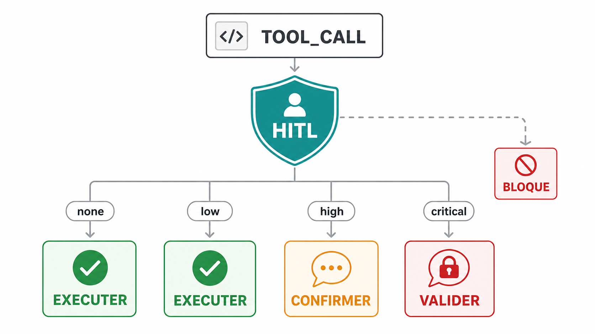

import { CardGrid, LinkCard } from '@astrojs/starlight/components';

# Sécurité HITL (Human-in-the-Loop)

DomOS est un SDK d'interfaces agentiques : l'agent n'agit que par les tools déclarés par l'application. **HITL** (*Human-in-the-Loop*) ajoute une décision humaine lorsque l'impact du tool exige une confirmation.

## Pourquoi HITL ?

Quand une IA a le pouvoir d'agir sur l'interface (ajouter au panier, supprimer des donnees, confirmer des paiements), il faut un mecanisme de controle. DomOS integre un systeme a 4 niveaux pour que l'utilisateur garde toujours le controle.

## Les 4 niveaux de risque

### `none` — Execution silencieuse

Actions sans consequence visible. L'utilisateur ne voit rien.

```tsx
useAgentTool({
  name: 'search_products',
  description: 'Rechercher des produits',
  risk: 'none',
}, async ({ query }) => {
  return searchProducts(query);
});
```

**Exemples :** recherche, filtrage, navigation, lecture de donnees.

### `low` - Exécution directe, notification disponible dans la politique

La politique classe l'action comme exécutable et produit un message de notification. Le runtime client actuel exécute le handler sans afficher automatiquement un toast : si cette information doit apparaître dans votre UI, affichez-la explicitement.

```tsx
useAgentTool({
  name: 'add_to_cart',
  description: 'Ajouter un produit au panier',
  risk: 'low',
}, async ({ quantity }) => {
  cart.add(product, quantity);
  return 'Ajoute au panier';
});
```

**Exemples :** ajout au panier, like, mise a jour de preferences.

### `high` — Approbation requise

L'action est **bloquee** jusqu'a ce que l'utilisateur approuve via un modal.

```tsx
useAgentTool({
  name: 'clear_cart',
  description: 'Vider le panier',
  risk: 'high',
}, async () => {
  cart.clear();
  return 'Panier vide';
});
```

**Exemples :** suppression de donnees, modification de parametres importants.

### `critical` — Approbation renforcee

Comme `high` mais avec un avertissement visuel renforce (badge rouge, message explicite).

```tsx
useAgentTool({
  name: 'confirm_order',
  description: 'Confirmer la commande et proceder au paiement',
  risk: 'critical',
}, async () => {
  await api.processPayment();
  return 'Commande confirmee';
});
```

**Exemples :** paiement, suppression de compte, actions irreversibles.

## Architecture de securite



## Composants UI

### React

```tsx
import { DomOSProvider } from '@domos/react';

function App() {
  return (
    <DomOSProvider
      apiKey="pk_dev_123"
      endpoint="ws://localhost:3000/domos"
      config={{
        hitl: { ui: 'modal' }, // 'modal' (defaut) | 'banner' | 'none'
      }}
    >
      <MyApp />
    </DomOSProvider>
  );
}
```

Par defaut, `DomOSProvider` affiche un **modal global bloquant** pour `risk: high|critical`.

### Vue

```ts
// main.ts
import { createApp } from 'vue';
import { DomOSPlugin } from '@domos/vue';
import App from './App.vue';

createApp(App).use(DomOSPlugin, {
  endpoint: 'ws://localhost:3000/domos',
  apiKey: 'pk_dev_123',
  hitl: { ui: 'modal' }, // 'modal' (defaut) | 'banner' | 'none'
}).mount('#app');
```

Par defaut, `DomOSPlugin` monte aussi une UI HITL globale bloquante.

## Isolation de l'interface React

Dans le SDK React, la modal d'approbation est rendue dans un **Shadow DOM fermé** (`mode: 'closed'`). Cela isole son style du reste de la page :

- Le CSS de l'application ne peut pas le masquer
- Les scripts de la page ne peuvent pas y acceder
- Le modal est visuellement et fonctionnellement isole

```tsx
// Le ShadowContainer cree un shadow root ferme
<ShadowContainer>
  <ApprovalForm ... />
</ShadowContainer>
```

## Blocage serveur

Le serveur peut bloquer certains tools meme si le client les a enregistres :

```ts
// server.ts
server.blockTool('delete_all_data'); // Empêche toute exécution de ce tool
```

`DomOSServer` expose actuellement le blocage public d'un tool. Si votre politique de production doit changer dynamiquement, recréez une configuration de serveur cohérente avec la politique souhaitée.

## HITLPolicy

La classe `HITLPolicy` dans `@domos/core` determine l'action a prendre :

```ts
import { HITLPolicy, RiskLevel } from '@domos/core';

const policy = new HITLPolicy();

const action = policy.evaluate('call_123', 'delete_account', RiskLevel.CRITICAL, {});
// → { type: 'require_approval', request: { id, callId, toolName, message, ... } }

const action2 = policy.evaluate('call_456', 'search', RiskLevel.NONE, {});
// → { type: 'execute' }
```

## Bonnes pratiques

1. **Utilisez `none` par defaut** pour les actions de lecture
2. **Utilisez `low`** pour les modifications mineures et reversibles
3. **Utilisez `high`** pour les suppressions et modifications importantes
4. **Utilisez `critical`** uniquement pour les actions irreversibles (paiement, suppression permanente)
5. **Bloquez cote serveur** les tools dangereux en production
6. **Validez côté serveur** les actions qui touchent vos données ou secrets, même si l'interface exige déjà une approbation

## SSR (Next/Nuxt)

- React/Next: utilisez DomOS dans un composant client (`'use client'`).
- Vue/Nuxt: installez DomOS dans un plugin client (`plugins/domos.client.ts`).
- Le SDK UI est **client-only officiel** en V1: pas de rendu SSR complet du widget/modal.

## Continuer

<CardGrid>
  <LinkCard
    title="Concepts cles"
    description="Comprendre la place du HITL dans le contrat des tools."
    href="/core-concepts/"
  />
  <LinkCard
    title="Protocole ADTP"
    description="Suivre le tool call avant sa validation."
    href="/adtp-protocol/"
  />
  <LinkCard
    title="Pipeline audio"
    description="Lire les regles de stabilite du mode vocal."
    href="/audio_pipeline_rules/"
  />
</CardGrid>
