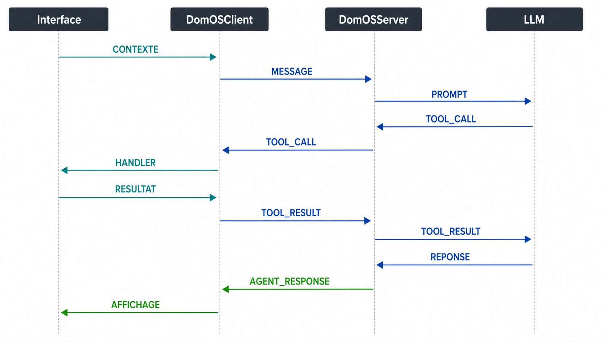

import { Card, CardGrid, LinkCard } from '@astrojs/starlight/components';

DomOS est un SDK d'**AI-driven interfaces**, ou interfaces agentiques : l'agent agit seulement par les actions déclarées par l'application.

**ADTP** signifie **Agent-to-DOM Transfer Protocol**. C'est le protocole d'échange de DomOS : il transporte le contexte utile et les tools que l'application choisit d'exposer, puis les demandes d'action et leurs résultats.

ADTP ne donne pas à l'agent un accès général au DOM. Il transporte des messages structurés entre :

- `DomOSClient`, partagé par les SDK frontend ;
- `DomOSServer`, qui maintient la session et appelle l'adapter LLM.

## Ce que le protocole permet

<CardGrid>
  <Card title="Synchroniser" icon="setting">
    Transmettre la page courante, son contexte métier et les outils réellement actifs.
  </Card>
  <Card title="Interagir" icon="message">
    Transporter la question utilisateur et les réponses textuelles ou audio de l'agent.
  </Card>
  <Card title="Agir" icon="rocket">
    Acheminer `TOOL_CALL` et `TOOL_RESULT` lorsqu'une action explicitement déclarée est demandée.
  </Card>
  <Card title="Contrôler" icon="shield">
    Porter les demandes d'approbation, interruptions vocales et événements système.
  </Card>
</CardGrid>

## Enveloppe d'un message

Dans `@domos/core`, chaque message porte un identifiant et un timestamp au niveau racine :

```json
{
  "id": "msg_generated_id",
  "type": "CONTEXT_UPDATE",
  "timestamp": 1706000000000,
  "payload": {
    "url": "/products/headphones",
    "activeTools": []
  }
}
```

Le champ `meta` est optionnel et peut transporter un `sessionId` ou un `token`. Les payloads sont validés dans `@domos/core` avant d'être traités.

## Démarrage de la connexion

Dans le runtime courant, deux traitements sont déclenchés à l'ouverture du socket :

- côté serveur, la connexion est authentifiée, associée à une session, puis confirmée par `HANDSHAKE_ACK` ;
- côté client, l'ouverture du socket déclenche `HANDSHAKE_INIT`, qui porte la version du SDK et du protocole.

Ces opérations proviennent de handlers distincts ; ne fondez pas votre intégration sur un ordre applicatif additionnel entre `HANDSHAKE_ACK` et `HANDSHAKE_INIT`. Une fois la session active, le serveur utilise notamment `protocolVersion` pour rejeter une incompatibilité. Le client synchronise ensuite son contexte et ses tools par `CONTEXT_UPDATE`.

### `HANDSHAKE_INIT` - client vers serveur

```json
{
  "type": "HANDSHAKE_INIT",
  "payload": {
    "apiKey": "pk_dev_local",
    "userAgent": "DomOSClient",
    "viewport": "0x0",
    "sdkVersion": "0.1.0",
    "protocolVersion": "1.0.0"
  }
}
```

### `HANDSHAKE_ACK` - serveur vers client

```json
{
  "type": "HANDSHAKE_ACK",
  "payload": {
    "sessionId": "sess_a1b2c3d4",
    "serverVersion": "1.0.0",
    "protocolVersion": "1.0.0",
    "capabilities": ["text", "audio", "tools"]
  }
}
```

## Contexte et tools actifs

### `CONTEXT_UPDATE` - client vers serveur

Ce message est la source du registre de tools de la session côté serveur. Il est renvoyé lorsque l'écran, les données utiles ou les tools montés changent.

```json
{
  "type": "CONTEXT_UPDATE",
  "payload": {
    "url": "/cart",
    "title": "Mon panier",
    "activeTools": [
      {
        "name": "confirm_order",
        "description": "Confirmer la commande visible dans le panier",
        "risk": "critical",
        "parameters": {
          "type": "OBJECT",
          "properties": {},
          "required": []
        }
      }
    ],
    "context": {
      "page": "cart",
      "itemCount": 2,
      "total": 239.98
    }
  }
}
```

`activeTools` n'est pas une documentation statique de tout le produit : c'est la liste applicable à la session et à l'écran au moment de l'échange.

## Conversation texte et exécution d'un tool

### `USER_INPUT` - client vers serveur

```json
{
  "type": "USER_INPUT",
  "payload": {
    "modality": "text",
    "content": "Confirme ma commande"
  }
}
```

### `TOOL_CALL` - serveur vers client

Lorsque le modèle demande l'exécution d'un tool frontend et que les contrôles l'autorisent :

```json
{
  "type": "TOOL_CALL",
  "payload": {
    "callId": "call_a1b2c3d4",
    "name": "confirm_order",
    "args": {}
  }
}
```

### `TOOL_RESULT` - client vers serveur

```json
{
  "type": "TOOL_RESULT",
  "payload": {
    "callId": "call_a1b2c3d4",
    "result": {
      "confirmed": true,
      "orderId": "ord_123"
    },
    "status": "success"
  }
}
```

Le statut peut être `success`, `error` ou `pending_approval`. Le serveur remet ce résultat à l'adapter pour obtenir la réponse finale.

### `AGENT_RESPONSE` - serveur vers client

```json
{
  "type": "AGENT_RESPONSE",
  "payload": {
    "chunk": "Votre commande est confirmée.",
    "done": true
  }
}
```



## Approbation humaine

Lorsque le flux nécessite une décision de l'utilisateur, ADTP transporte :

| Message | Direction | Rôle |
| --- | --- | --- |
| `APPROVAL_REQUEST` | Client ou serveur vers son pair selon le flux | Décrire l'action, son risque, ses arguments et le message d'approbation. |
| `APPROVAL_RESPONSE` | Client vers serveur | Retourner la décision utilisateur et, si applicable, le résultat. |
| `SYSTEM_EVENT` avec `approval_required` | Serveur vers client | Signaler à l'interface qu'une approbation est requise. |

La décision d'autoriser ou de suspendre un tool est appliquée avant son exécution dans le serveur.

## Audio et voix

ADTP couvre également les échanges vocaux :

| Message | Direction | Usage |
| --- | --- | --- |
| `USER_INPUT` avec `modality: "audio"` | Client vers serveur | Envoyer un audio complet pour le pipeline live ou STT/TTS. |
| `AUDIO_STREAM` | Client ou serveur selon le flux live | Échanger des chunks audio encodés en base64. |
| `VOICE_INPUT_END` | Client vers serveur | Marquer la fin du tour vocal de l'utilisateur. |
| `VOICE_INTERRUPT` | Client vers serveur | Interrompre la réponse en cours (`barge_in`). |
| `VOICE_STATE_EVENT` | Serveur vers client | Notifier `turn_complete`, `interrupted` ou `waiting_for_input`. |

## Événements système

`SYSTEM_EVENT` transmet des événements de contrôle ou d'erreur. Les kinds déclarés par le protocole sont :

- `reload` ;
- `redirect` ;
- `error` ;
- `disconnect` ;
- `waiting` ;
- `approval_required` ;
- `rate_limit`.

## Références côté code

```ts
import {
  ADTP_VERSION,
  MessageType,
  Messages,
  tryDecode,
} from '@domos/core';
```

| Export | Utilité |
| --- | --- |
| `ADTP_VERSION` | Version de protocole attendue (`1.0.0`). |
| `MessageType` | Enumération des quatorze messages ADTP. |
| `Messages` | Fabriques de messages avec identifiant et timestamp. |
| `tryDecode()` | Décodage et validation sans exception pour un message invalide. |

## Continuer

<CardGrid>
  <LinkCard
    title="Concepts clés"
    description="Replacer le protocole dans le modèle Agentic UI."
    href="/core-concepts/"
  />
  <LinkCard
    title="Serveur DomOS"
    description="Voir comment la session traite ces messages."
    href="/server/"
  />
  <LinkCard
    title="Sécurité HITL"
    description="Comprendre la validation des actions sensibles."
    href="/hitl_security/"
  />
</CardGrid>
