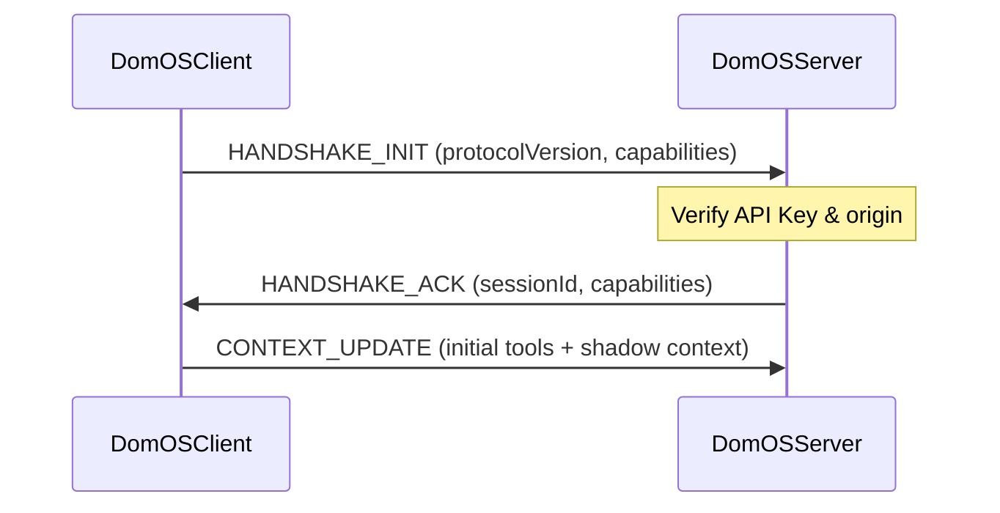
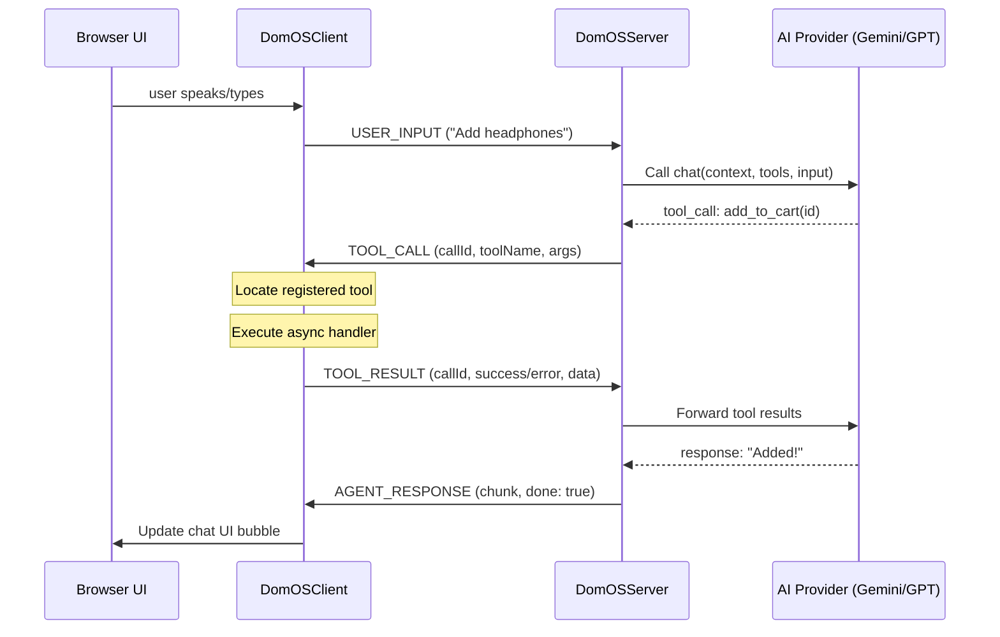

# ADTP Protocol Specification

The **Agent-to-DOM Transfer Protocol (ADTP)** is a JSON-based protocol operating over WebSockets. It facilitates real-time bidirectional communication between the client (web application runtime) and the server (orchestration layer & LLM).

---

## Message Envelope Structure

All ADTP messages share a common envelope structure:

```json
{
  "type": "MESSAGE_TYPE",
  "payload": {
    ...
  },
  "meta": {
    "id": "msg_f3c8a980-0a56-4b21-827b-fb8ee0b66a9d",
    "timestamp": 1706000000000,
    "version": "1.0.0"
  }
}
```

---

## Sequence Diagrams

### 1. Connection & Initial Handshake

The client initiates the handshake immediately upon opening the WebSocket connection. The server replies with a session acknowledgment containing a unique session ID.



### 2. Message Flow & Tool Execution

When the user sends input (either text or voice), the server feeds the input, current context, and active tools into the LLM. If the LLM requests a tool call, the server routes it to the client, awaits the results, and streams back the final response.



---

## Message Types Reference

### 1. `HANDSHAKE_INIT` (Client → Server)
Sent by the client to initialize the session parameters.
```json
{
  "type": "HANDSHAKE_INIT",
  "payload": {
    "protocolVersion": "1.0.0",
    "capabilities": ["text", "audio", "tools"]
  }
}
```

### 2. `HANDSHAKE_ACK` (Server → Client)
Sent by the server to confirm connection validation.
```json
{
  "type": "HANDSHAKE_ACK",
  "payload": {
    "sessionId": "ses_9e210bbf",
    "protocolVersion": "1.0.0",
    "capabilities": ["text", "audio", "tools"]
  }
}
```

### 3. `CONTEXT_UPDATE` (Client → Server)
Sent dynamically whenever page state, URL, or tools registration changes.
```json
{
  "type": "CONTEXT_UPDATE",
  "payload": {
    "url": "/products/headphones",
    "title": "Pro Headphones - Store",
    "activeTools": [
      {
        "name": "add_to_cart",
        "description": "Add the currently viewed product to the shopping cart",
        "parameters": {
          "type": "object",
          "properties": {
            "quantity": { "type": "number", "minimum": 1 }
          },
          "required": ["quantity"]
        }
      }
    ],
    "data": {
      "page": "product_detail",
      "productId": "pro-headphones",
      "price": 149.99
    }
  }
}
```

### 4. `USER_INPUT` (Client → Server)
Carries user messages in either text format or base64 raw PCM audio data.
```json
{
  "type": "USER_INPUT",
  "payload": {
    "modality": "text",
    "content": "Add 2 to my cart"
  }
}
```

### 5. `TOOL_CALL` (Server → Client)
The server requests the client to invoke a local front-end tool.
```json
{
  "type": "TOOL_CALL",
  "payload": {
    "callId": "tc_4892c90",
    "name": "add_to_cart",
    "args": {
      "quantity": 2
    }
  }
}
```

### 6. `TOOL_RESULT` (Client → Server)
The client returns the execution status of a tool.
```json
{
  "type": "TOOL_RESULT",
  "payload": {
    "callId": "tc_4892c90",
    "status": "success",
    "result": {
      "added": true,
      "cartTotal": 299.98
    }
  }
}
```

### 7. `AGENT_RESPONSE` (Server → Client)
Streams the text chunk response from the LLM back to the client.
```json
{
  "type": "AGENT_RESPONSE",
  "payload": {
    "chunk": "I have added two Pro Headphones to your cart.",
    "done": true
  }
}
```

### 8. `SYSTEM_EVENT` (Bidirectional)
Reports system alerts, disconnect states, rate limits, or validation errors.
```json
{
  "type": "SYSTEM_EVENT",
  "payload": {
    "kind": "error",
    "message": "API key usage limit exceeded."
  }
}
```

---

## Connection Troubleshooting: Handshake Timeout

To prevent the client application from stalling in a perpetual `connecting` state when a WebSocket transport opens but the server fails to respond, `DomOSClient` implements an automatic **Handshake Timeout**.

### Lifecycle and Mechanics
1. Immediately upon opening the network channel (WebSocket or WebRTC DataChannel), the client sends a `HANDSHAKE_INIT` packet and starts an internal timer set to **`5000ms`** (`HANDSHAKE_TIMEOUT_MS`).
2. If a valid `HANDSHAKE_ACK` message is received from the server, the timer is cleared, and the client transitions to the `connected` state.
3. If the timer expires before receiving the `HANDSHAKE_ACK` acknowledgment:
   - The connection state transitions to **`error`**.
   - A system event error notification is emitted.
   - The active WebSocket/DataChannel transport is closed (`close(4000, 'Handshake timeout')`) to free up system resources.
   - The client triggers the configured reconnection delay strategy.

