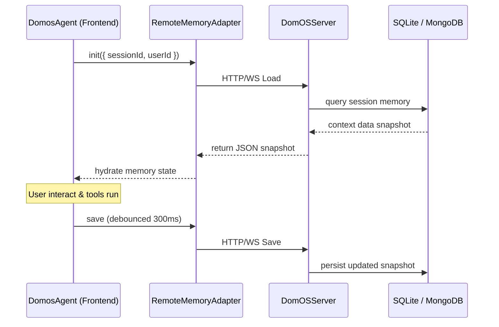

# Agent Memory System

OwlLayer features an adaptive, persistent memory architecture designed to retain user and session contexts across multiple interactions.

---

## 1. Core Architecture

The memory system relies on three main components:
- **Client Agent**: `DomosAgent` in `@domos/core` maintains the local session memory state, feedback loop, and user context for the Agentic UI SDK.
- **Server Persistence**: The backend `MemoryManager` orchestrates load and save operations.
- **Adapter Contract**: The `MemoryAdapter` interface decouples the memory engine from any specific database technology.



---

## 2. Server Configuration

The server supports multiple persistent database backends:

| Backend Store | Usage | Persistence |
|---|---|---|
| `MemoryStore` | Development and unit testing. Zero dependencies. | No (stored in RAM only). |
| `SQLiteStore` | Recommended default for production. | Yes (saved to a local file). |
| `MongoStore` | Suitable for distributed and horizontally scaled backends. | Yes (saved to MongoDB collections). |

### SQLite Setup Example
To configure a SQLite persistent store on your backend server:

```typescript
import { DomOSServer } from '@domos/server';

const server = new DomOSServer({
  llm: llmAdapter,
  agentMemory: {
    provider: 'sqlite',
    sqlitePath: './data/domos-memory.db',
    journalMode: 'WAL' // WAL (Write-Ahead Logging) or DELETE
  }
});
```

The server automatically exposes these operations internally:
- `loadAgentMemory(identity)`: Queries the adapter to fetch a JSON snapshot.
- `saveAgentMemory(identity, snapshot)`: Persists the state snapshot.
- `deleteAgentMemory(identity)`: Wipes the storage for the given user/session.

---

## 3. Client Frontend Usage (Hybrid Sync)

The Agentic UI SDK integrations do not communicate with the database directly. Instead, they use a **Hybrid Sync** pattern where `DomosAgent` runs locally in the browser and synchronizes its state with the server via the `RemoteMemoryAdapter`.

### Configuration Hook Example
```typescript
import { DomosAgent, RemoteMemoryAdapter } from '@domos/core';

// Set up the remote transport adapter
const adapter = new RemoteMemoryAdapter({
  transport: {
    load: (identity) => api.memory.load(identity),
    save: (identity, snapshot) => api.memory.save(identity, snapshot),
    delete: (identity) => api.memory.delete(identity)
  }
});

// Instantiate and initialize the agent
const agent = new DomosAgent({ adapter, saveDebounceMs: 300 });
await agent.init({ sessionId: 'sess_993', userId: 'user_42' });

// Interact with the agent
agent.onUserRequest({ content: 'Plan my itinerary' });
agent.onAgentResponse({ content: 'Here is your trip details' });

// Force immediate synchronization (unmount cleanup)
await agent.flush();
```

### Resiliency and Offline Fallback
The `RemoteMemoryAdapter` implements a automatic fallback to **`localStorage` cache** inside the Vanilla Browser SDK if the network is disconnected or the server handshake is offline. The agent buffers updates locally and flushes them to the server database as soon as the connection state transitions back to `connected`.
