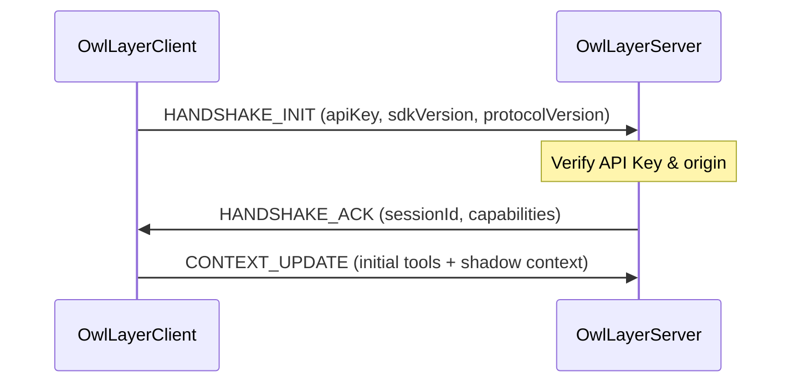
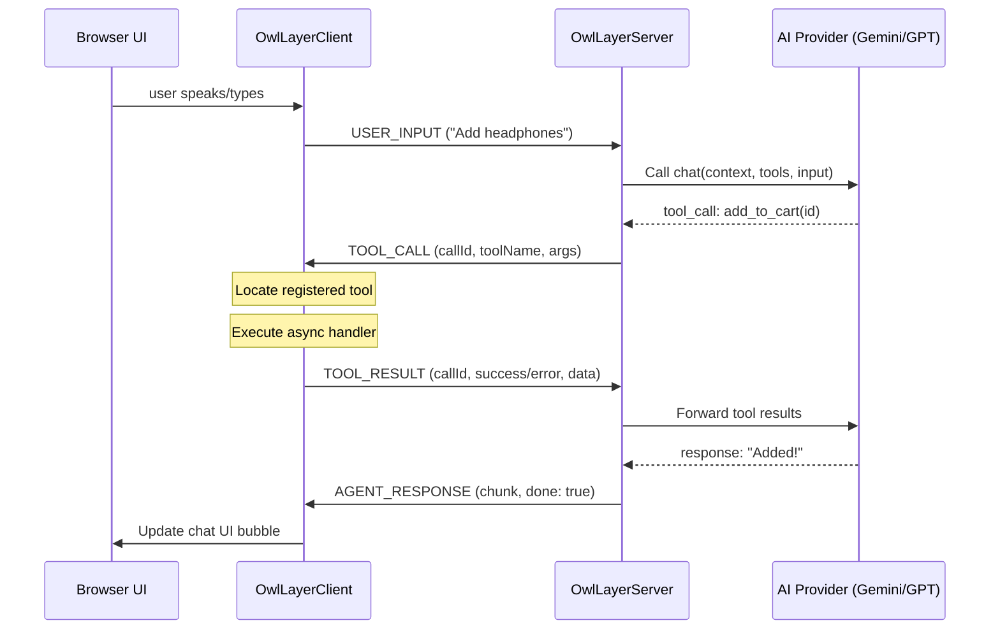

# AITP Protocol Specification

The **Agent-to-Interface Transfer Protocol (AITP)** is a JSON-based protocol operating over WebSockets. AITP facilitates real-time bidirectional communication between the client (web application runtime) and the server (OwlLayer Server orchestration layer & LLM).

---

## Message Envelope Structure

All AITP messages share a common envelope structure:

```json
{
  "id": "msg_f3c8a980-0a56-4b21-827b-fb8ee0b66a9d",
  "type": "MESSAGE_TYPE",
  "timestamp": 1706000000000,
  "payload": {
    ...
  },
  "meta": {
    "sessionId": "ses_9e210bbf"
  }
}
```

`meta` is optional. Messages are serialized with `JSON.stringify`; on reception, invalid JSON and payloads that fail the validation of `@owllayer/core` are rejected.

## Version Negotiation

The client sends `HANDSHAKE_INIT` with its `protocolVersion` as soon as the channel opens. The server compares it strictly with its own version (currently `1.0.0`). If they differ, it sends a `SYSTEM_EVENT` of kind `error` and closes the connection with code `1008`.

---

## Sequence Diagrams

### 1. Connection & Initial Handshake

The client initiates the handshake immediately upon opening the WebSocket connection. The server replies with a session acknowledgment containing a unique session ID.



### 2. Message Flow & Tool Execution


When the user sends input (either text or voice), the server feeds the input, current context, and active tools into the LLM. If the LLM requests a tool call, the server routes it to the client, awaits the results, and streams back the final response.



### 3. Human Approval

When the client executes a `TOOL_CALL` for a `high` or `critical` tool, the HITL policy suspends it before the handler runs. The client sends `APPROVAL_REQUEST` to the server, which extends the call timeout while the user decides. After the decision, the client sends `APPROVAL_RESPONSE` with `approved` and, if the tool ran, its result. A refusal is never turned into a success.

For a risky server-side tool, the direction is reversed: the server sends `APPROVAL_REQUEST` to the client, the user decides in the interface, and the client answers with `APPROVAL_RESPONSE`. The server runs the tool only if it was approved.

---

## Message Types Reference

The protocol defines 14 message types.

| Message | Direction | Role |
|---|---|---|
| `HANDSHAKE_INIT` | Client → Server | Announces the API key, SDK version and protocol version at socket open |
| `HANDSHAKE_ACK` | Server → Client | Confirms the session and the negotiated capabilities |
| `CONTEXT_UPDATE` | Client → Server | Synchronizes URL, title, context, and active tools |
| `USER_INPUT` | Client → Server | Sends a user text message or a complete audio message |
| `TOOL_CALL` | Server → Client | Requests execution of an interface tool |
| `TOOL_RESULT` | Client → Server | Returns `success`, `error`, or `pending_approval` |
| `APPROVAL_REQUEST` | Client ↔ Server | Describes an action waiting for the user's approval |
| `APPROVAL_RESPONSE` | Client → Server | Returns the user's decision and, for an interface tool, its result |
| `AGENT_RESPONSE` | Server → Client | Streams the agent's text response |
| `AUDIO_STREAM` | Client ↔ Server | Streams live audio chunks (microphone up, agent voice down) |
| `VOICE_INPUT_END` | Client → Server | Signals the end of the user's speech (`user_stop`, `vad`, or `timeout`) |
| `VOICE_INTERRUPT` | Client → Server | Signals that the user interrupted the agent (barge-in) |
| `VOICE_STATE_EVENT` | Server → Client | Signals `turn_complete`, `interrupted`, or `waiting_for_input` |
| `SYSTEM_EVENT` | Server → Client | Signals errors, waiting, approvals, and runtime control |

### 1. `HANDSHAKE_INIT` (Client → Server)
Sent by the client to initialize the session parameters.
```json
{
  "type": "HANDSHAKE_INIT",
  "payload": {
    "apiKey": "pk_live_your_public_api_key",
    "userAgent": "Mozilla/5.0 ...",
    "viewport": "1440x900",
    "sdkVersion": "0.4.0",
    "protocolVersion": "1.0.0"
  }
}
```

### 2. `HANDSHAKE_ACK` (Server → Client)
Sent by the server to confirm connection validation.
```json
{
  "type": "HANDSHAKE_ACK",
  "payload": {
    "sessionId": "ses_9e210bbf",
    "serverVersion": "0.4.0",
    "protocolVersion": "1.0.0",
    "capabilities": ["text", "audio", "tools"]
  }
}
```

### 3. `CONTEXT_UPDATE` (Client → Server)
Sent dynamically whenever page state, URL, or tools registration changes.
```json
{
  "type": "CONTEXT_UPDATE",
  "payload": {
    "url": "/products/headphones",
    "title": "Pro Headphones - Store",
    "activeTools": [
      {
        "name": "add_to_cart",
        "description": "Add the currently viewed product to the shopping cart",
        "parameters": {
          "type": "OBJECT",
          "properties": {
            "quantity": { "type": "NUMBER", "description": "Quantity to add" }
          },
          "required": ["quantity"]
        },
        "risk": "low"
      }
    ],
    "context": {
      "page": "product_detail",
      "productId": "pro-headphones",
      "price": 149.99
    }
  }
}
```

### 4. `USER_INPUT` (Client → Server)
Carries a user message, either as text or as a complete base64 audio message (`modality: "audio"` with a `mimeType`). Live audio uses `AUDIO_STREAM` instead.
```json
{
  "type": "USER_INPUT",
  "payload": {
    "modality": "text",
    "content": "Add 2 to my cart"
  }
}
```

### 5. `TOOL_CALL` (Server → Client)
The server requests the client to invoke a local front-end tool.
```json
{
  "type": "TOOL_CALL",
  "payload": {
    "callId": "tc_4892c90",
    "name": "add_to_cart",
    "args": {
      "quantity": 2
    }
  }
}
```

### 6. `TOOL_RESULT` (Client → Server)
The client returns the execution status of a tool.
```json
{
  "type": "TOOL_RESULT",
  "payload": {
    "callId": "tc_4892c90",
    "status": "success",
    "result": {
      "added": true,
      "cartTotal": 299.98
    }
  }
}
```

`status` is `success`, `error` (with an `error` message), or `pending_approval` when the tool waits for the user.

### 7. `APPROVAL_REQUEST` (Client ↔ Server)
Describes an action waiting for the user's approval: sent by the client for an interface tool, or by the server for a server-side tool.
```json
{
  "type": "APPROVAL_REQUEST",
  "payload": {
    "callId": "tc_7a1d220",
    "toolName": "process_payment",
    "risk": "critical",
    "args": { "amount": 299.98 },
    "message": "Pay 299.98 USD with the saved card?"
  }
}
```

### 8. `APPROVAL_RESPONSE` (Client → Server)
Returns the user's decision. For an approved interface tool, it also carries the result or the error of the handler.
```json
{
  "type": "APPROVAL_RESPONSE",
  "payload": {
    "callId": "tc_7a1d220",
    "approved": true,
    "result": { "paid": true }
  }
}
```

### 9. `AGENT_RESPONSE` (Server → Client)
Streams the text chunk response from the LLM back to the client.
```json
{
  "type": "AGENT_RESPONSE",
  "payload": {
    "chunk": "I have added two Pro Headphones to your cart.",
    "done": true
  }
}
```

### 10. `AUDIO_STREAM` (Client ↔ Server)
Streams live audio chunks: the microphone from the client in realtime voice mode, and the agent's voice from the server.
```json
{
  "type": "AUDIO_STREAM",
  "payload": {
    "data": "UklGRiQAAABXQVZF...",
    "mimeType": "audio/pcm;rate=24000"
  }
}
```

### 11. `VOICE_INPUT_END` (Client → Server)
Signals that the user finished speaking. `reason` is `user_stop` (button), `vad` (voice activity detection), or `timeout`.
```json
{
  "type": "VOICE_INPUT_END",
  "payload": { "reason": "vad" }
}
```

### 12. `VOICE_INTERRUPT` (Client → Server)
Signals that the user started speaking while the agent was talking (barge-in).
```json
{
  "type": "VOICE_INTERRUPT",
  "payload": { "reason": "barge_in" }
}
```

### 13. `VOICE_STATE_EVENT` (Server → Client)
Signals a change of the voice turn: `turn_complete`, `interrupted`, or `waiting_for_input`.
```json
{
  "type": "VOICE_STATE_EVENT",
  "payload": { "event": "turn_complete" }
}
```

### 14. `SYSTEM_EVENT` (Server → Client)
Reports errors, waiting states, approvals, and runtime control. `kind` is one of `error`, `waiting`, `approval_required`, `tools_effective`, `reload`, `redirect`, or `disconnect`.
```json
{
  "type": "SYSTEM_EVENT",
  "payload": {
    "kind": "error",
    "message": "API key usage limit exceeded."
  }
}
```

---

## Connection Troubleshooting: Handshake Timeout

To prevent the client application from stalling in a perpetual `connecting` state when a WebSocket transport opens but the server fails to respond, `OwlLayerClient` implements an automatic **Handshake Timeout**.

### Lifecycle and Mechanics
1. Immediately upon opening the network channel (WebSocket or WebRTC DataChannel), the client sends a `HANDSHAKE_INIT` packet and starts an internal timer set to **`5000ms`** (`HANDSHAKE_TIMEOUT_MS`).
2. If a valid `HANDSHAKE_ACK` message is received from the server, the timer is cleared, and the client transitions to the `connected` state.
3. If the timer expires before receiving the `HANDSHAKE_ACK` acknowledgment:
   - The connection state transitions to **`error`**.
   - A system event error notification is emitted.
   - The active WebSocket/DataChannel transport is closed (`close(4000, 'Handshake timeout')`) to free up system resources.
   - The client triggers the configured reconnection delay strategy.

