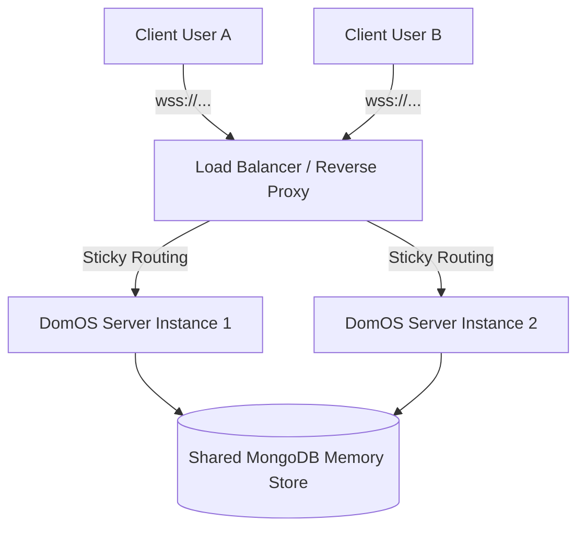

# Production Deployment & Scaling

Deploying a real-time WebSockets and WebRTC engine like DomOS in production requires special infrastructure considerations. This guide covers horizontal scaling, SSL configurations, and rate-limiting strategies.

---

## 1. Horizontal Scaling & Session Sticking

Because DomOS sessions hold memory state (`DomosAgent` context buffers) and manage persistent WebSocket connections, scaling horizontally across multiple servers requires a shared state store and routing configurations:

- **MongoDB Store**: Use the `MongoStore` adapter to persist and share session history snapshots across multiple servers.
- **Session Stickiness**: Ensure your load balancer (e.g. AWS ALB, HAProxy, Cloudflare) is configured with **Session Affinity (Sticky Sessions)**. This guarantees that WebSocket frames from a specific client are routed to the same Node.js server instance handling the active pipeline.



---

## 2. Reverse Proxy Configuration (Nginx & Caddy)

Production environments require secure connections (`wss://` / HTTPS) to satisfy browser permissions for microphone access.

### Nginx Configuration Example
Configure Nginx as a reverse proxy to terminate SSL and handle WebSocket upgrade headers:

```nginx
server {
    listen 443 ssl;
    server_name api.domos.dev;

    ssl_certificate /etc/letsencrypt/live/api.domos.dev/fullchain.pem;
    ssl_certificate_key /etc/letsencrypt/live/api.domos.dev/privkey.pem;

    location /domos {
        proxy_pass http://localhost:4001;
        
        # Enable WebSocket upgrades
        proxy_http_version 1.1;
        proxy_set_header Upgrade $http_upgrade;
        proxy_set_header Connection "upgrade";
        
        # Forward client headers
        proxy_set_header Host $host;
        proxy_set_header X-Real-IP $remote_addr;
        proxy_set_header X-Forwarded-For $proxy_add_x_forwarded_for;
        proxy_set_header X-Forwarded-Proto $scheme;

        # Disable buffers to enable real-time streaming
        proxy_buffering off;
        
        # Set timeouts suitable for long websocket calls
        proxy_read_timeout 3600s;
        proxy_send_timeout 3600s;
    }
}
```

### Caddyfile Configuration Example
Caddy handles automatic SSL certificates out-of-the-box and manages WebSockets cleanly:

```caddy
api.domos.dev {
    # Reverse proxy websocket traffic to Node server
    reverse_proxy /domos* localhost:4001 {
        header_up Host {host}
        header_up X-Real-IP {remote}
    }
}
```

---

## 3. Concurrency Limits & Rate-Limiting (`virtualLines`)

WebSocket connections are resource-intensive. To prevent server exhaustion (CPU/RAM spikes during heavy audio processing), `DomOSServer` features a rate-limiting tool called **`virtualLines`**.

You configure concurrent connection slots per API key directly in your server options:

```typescript
import { DomOSServer } from '@domos/server';

const server = new DomOSServer({
  llm: llmAdapter,
  virtualLines: {
    // Defines lines limit specifications
    lines: [
      { 
        apiKey: 'pk_free_trial_xxx', 
        count: 5,           // Maximum 5 concurrent WebSocket connections allowed
        ttlMs: 1800000      // Connection duration cap (e.g., 30 minutes)
      },
      { 
        apiKey: 'pk_enterprise_xxx', 
        count: 100,         // Maximum 100 concurrent lines
        ttlMs: 3600000
      }
    ]
  }
});
```

### Handshake Rejection
If a client attempts to connect using an API key that has already exhausted its concurrency slots:
1. The server rejects the handshake during the `HANDSHAKE_INIT` negotiation.
2. The server sends a `SYSTEM_EVENT` frame containing an error payload: `"Concurrency limit exceeded for this API key"`.
3. The server immediately closes the connection, saving compute resources.
