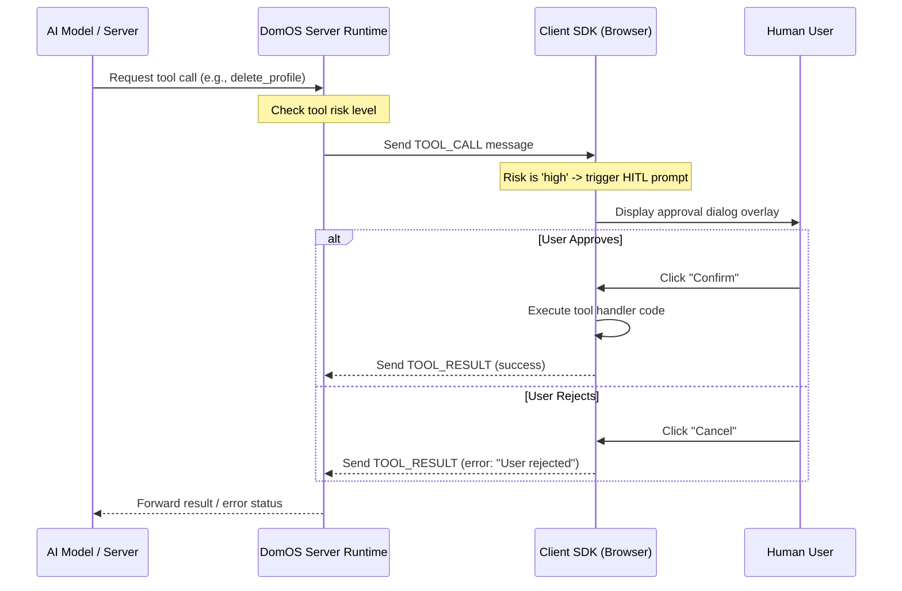

# Security & Human-in-the-Loop (HITL)

Security is a core design principle of DomOS. Because AI agents dynamically execute tools that manipulate client interfaces or database states, DomOS enforces a strict sandboxed safety model called **Human-in-the-Loop (HITL)**.

---

## 1. What is Human-in-the-Loop?

HITL guarantees that an AI agent cannot execute critical actions (such as placing an order, deleting user data, or transferring funds) without explicit authorization from the human user.



---

## 2. Tool Risk Levels

When declaring tools using `useAgentTool` (frontend) or `server.tool` (backend), you assign a **Risk Level** representing the potential impact of the action:

| Risk Level | Impact | User Experience | Use Cases |
|---|---|---|---|
| `none` | Read-only / Passive | Invisible execution. No user prompt. | Checking product lists, reading weather, looking up tracking IDs. |
| `low` | Minor UI change | Lightweight toast/badge notification. | Adding items to shopping carts, opening/closing panels. |
| `medium` | Non-destructive update | Auto-closing confirm banner, easy to revert. | Filling text fields, applying discount coupons. |
| `high` | Destructive or Financial | Modal pop-up blocking action. Requires explicit click. | Redirecting to checkout, removing profile accounts. |
| `critical`| Severe / Financial | Modal pop-up requiring multi-factor or secondary approval. | Confirming transactions, executing payments. |

### Code Example: Specifying Tool Risks
```typescript
import { useAgentTool } from '@domos/react';
import { z } from 'zod';

useAgentTool({
  name: 'wipe_entire_cart',
  description: 'Remove all products from the current cart',
  schema: z.object({}),
  risk: 'high' // Will block execution until the user clicks confirm
}, async () => {
  cart.clear();
  return { success: true };
});
```

---

## 3. Session Authentication & Security Tokens

### API Key Restrictions
To protect your WebSocket servers from abuse, `DomOSServer` implements strict API Key validation checks:
- **Public Keys (`pk_...`)**: Loaded in browser client applications. These are rate-limited and restricted to only calling client-side declared tools.
- **Secret Keys (`sk_...`)**: Kept strictly in backend configurations. These permit server-to-server operations and full server-side tool execution.

### LineTokens (Authentication Tokens)
When sessions bridge audio streams and tool executions, DomOS compiles a lightweight authorization token called a **LineToken**. 
- The client app exchanges credentials (public key + session attributes) for a LineToken via a secure API handshake.
- Every WebSocket frame and WebRTC DataChannel packet includes this token in the header.
- If the token expires or is hijacked, the server immediately severs the active connection and suspends session tools context.
