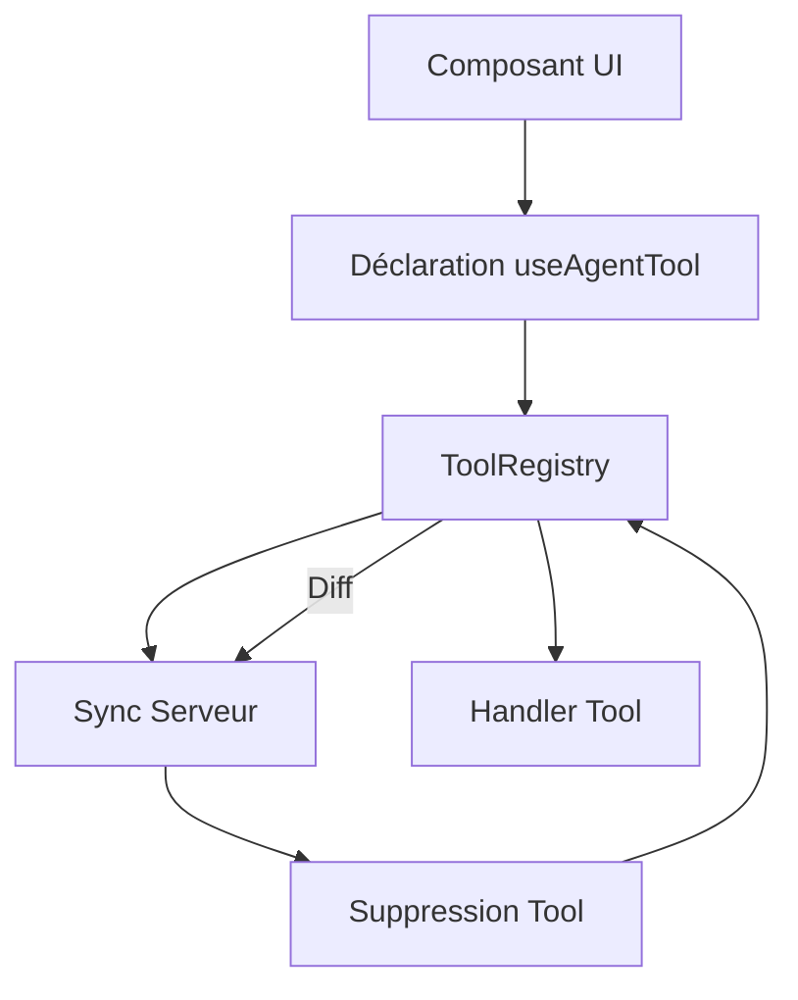
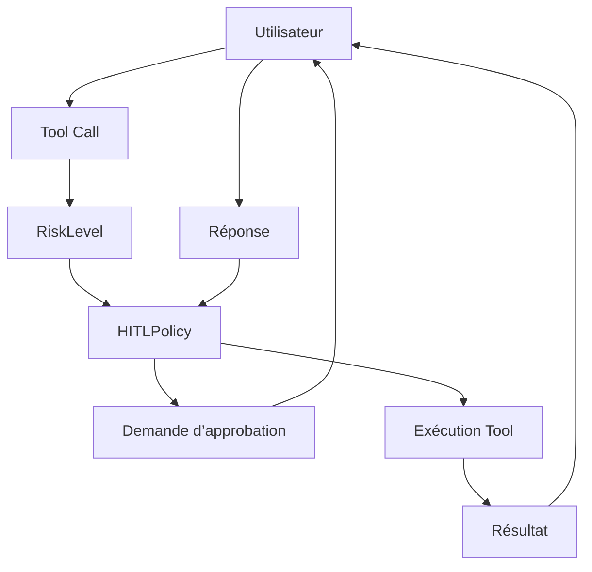
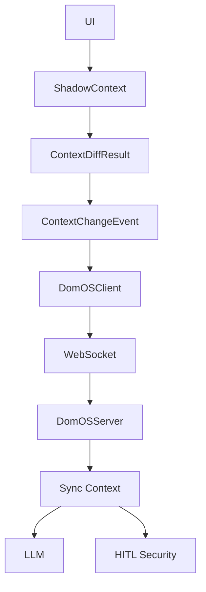
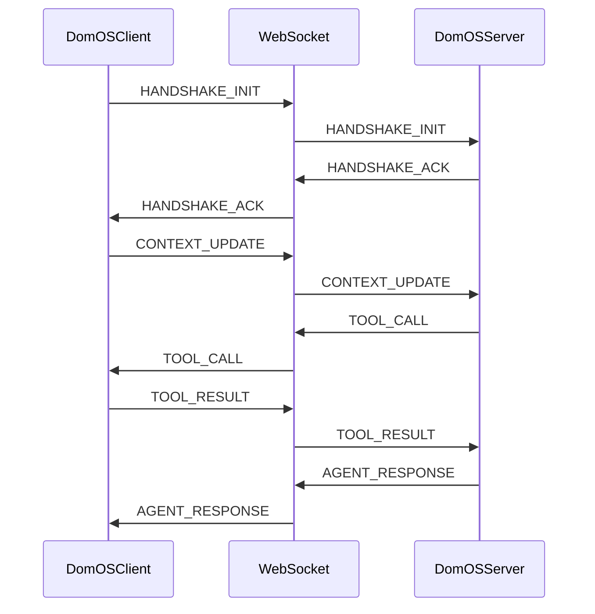
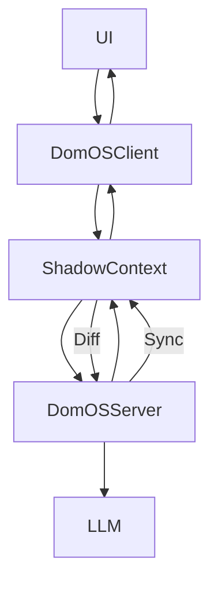

# Schémas d’architecture du SDK DomOS

## 1. Architecture globale du SDK

```mermaid
flowchart TD
  UI[UI (React/Vue/Svelte)] --> Client[DomOSClient]
  Client --> Registry[ToolRegistry]
  Client --> Context[ShadowContext]
  Client --> HITL[HITL Security]
  Client --> WS[WebSocket (ADTP)]
  WS --> Server[DomOSServer]
  Server --> LLM[LLM/Backend]
  Server --> HITLServer[HITL Security (Server)]
  Registry -->|Tools| Client
  Context -->|Sync| Server
  HITL -->|Approval| Client
  HITLServer -->|Approval| Server
```

## 2. Cycle de vie d’un tool



## 3. Workflow HITL



## 4. Synchronisation du contexte (ShadowContext)



## 5. Séquence ADTP Protocol



## 6. Carte des packages DomOS

```mermaid
flowchart TD
  Core[@domos/core]
  React[@domos/react]
  Vue[@domos/vue]
  Svelte[@domos/svelte]
  Server[@domos/server]
  AdapterGoogle[@domos/adapter-google]
  AdapterOpenAI[@domos/adapter-openai]
  Widget[DomOSWidget]
  Core --> React
  Core --> Vue
  Core --> Svelte
  Core --> Server
  Server --> AdapterGoogle
  Server --> AdapterOpenAI
  React --> Widget
  Vue --> Widget
  Svelte --> Widget
```

## 7. Shadow Context : Synchronisation UI <-> Serveur


