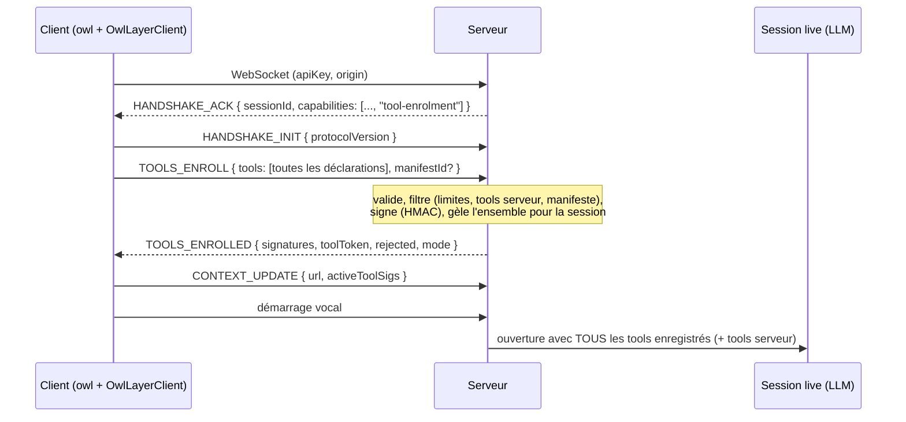
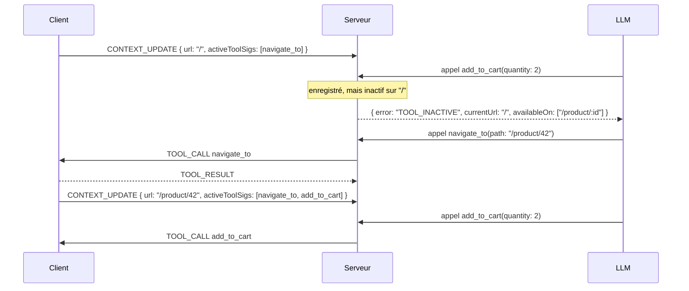

# Feature #42 : Registre de tools signé par le serveur (singleton `owl`, enregistrement au démarrage, plugin Vite)

**Statut** : Proposition — à analyser
**Domaines** : core, server, react, vue, svelte, angular, browser, nouveau package `@owllayer/vite-plugin` (un lot par domaine, voir §15)
**Porteur** : @BorisBob
**Date** : 2026-10-08
**GitHub issue** : epic à créer après validation de ce document

---

## Sommaire

1. [Résumé](#1-résumé)
2. [Contexte et problème](#2-contexte-et-problème)
3. [Objectifs et non-objectifs](#3-objectifs-et-non-objectifs)
4. [Vue d'ensemble de l'architecture](#4-vue-densemble-de-larchitecture)
5. [API développeur](#5-api-développeur)
6. [Changements du protocole AITP](#6-changements-du-protocole-aitp)
7. [Signatures et jeton de tools](#7-signatures-et-jeton-de-tools)
8. [Serveur : comportement détaillé](#8-serveur--comportement-détaillé)
9. [Client core : comportement détaillé](#9-client-core--comportement-détaillé)
10. [SDK clients : mises à jour et nomenclature publique commune](#10-sdk-clients--mises-à-jour-et-nomenclature-publique-commune)
11. [Plugin Vite `@owllayer/vite-plugin`](#11-plugin-vite-owllayervite-plugin)
12. [Modèle de menace et sécurité](#12-modèle-de-menace-et-sécurité)
13. [Compatibilité et migration](#13-compatibilité-et-migration)
14. [Récapitulatif des options](#14-récapitulatif-des-options)
15. [Plan de livraison](#15-plan-de-livraison)
16. [Plan de tests](#16-plan-de-tests)
17. [Documentation à mettre à jour](#17-documentation-à-mettre-à-jour)
18. [Décisions ouvertes](#18-décisions-ouvertes)
19. [Glossaire](#19-glossaire)

---

## 1. Résumé

Aujourd'hui, un tool n'existe côté serveur que lorsque le composant qui le déclare est monté. Les modèles vocaux qui **ne peuvent pas changer de tools en cours de session** (Gemini 3.x Live, par exemple) ne voient donc que les tools de la page où la session vocale a démarré.

Cette feature change le moment où les tools sont **déclarés**, sans changer le moment où ils sont **actifs** :

1. **Déclaration au démarrage.** Un singleton `owl`, créé une fois et passé au provider, collecte la déclaration de tous les tools de l'application dès son démarrage. Sources : les fichiers `*.tools.ts` importés au démarrage, et les tools écrits dans les composants, relevés au build par un plugin Vite.
2. **Enregistrement signé par le serveur.** À la connexion, le client envoie toutes ces déclarations. Le serveur les valide, calcule pour chacune une **signature HMAC avec un secret qu'il est seul à connaître**, **gèle** l'ensemble pour la session et renvoie les signatures ainsi qu'un **jeton signé**.
3. **Activation selon le cycle de vie.** Un tool reste actif seulement quand son composant est monté, ou quand la route correspond à son `activeOn`. Le client n'envoie plus que les **signatures** des tools actifs. Description, schéma et risque viennent toujours de l'ensemble gelé côté serveur.
4. **Contrôle à chaque appel.** Un tool non enregistré est refusé. Un tool enregistré mais inactif reçoit une réponse immédiate « pas disponible sur cette page » qui indique où il l'est. Un tool actif est exécuté après validation des arguments et HITL décidé par le serveur.
5. **Session vocale stable.** Elle s'ouvre avec l'ensemble des tools enregistrés et n'a plus besoin de reconnexion ni de mise à jour des tools. La reconnexion automatique sur changement de tools est déjà désactivée par défaut (#190).

Côté développeur, l'API reprend celle du SDK browser (`OwlLayer.registerTool(name, { … })`), avec la même signature pour tous les frameworks.

---

## 2. Contexte et problème

### 2.1 Cycle de vie actuel des tools

| SDK | API actuelle | Fichier |
|---|---|---|
| React | `useAgentTool(definition, handler)` | `packages/react/src/hooks/useAgentTool.ts` |
| Vue | `useAgentTool(definition, handler)` | `packages/vue/src/composables/useAgentTool.ts` |
| Svelte | `agentTool(...)` | `packages/svelte/src/actions/useAgentTool.ts` |
| Angular | `OwlLayerAngularService.registerTool`, directives | `packages/angular/src/lib/services/OwlLayerAngularService.ts` |
| Browser | `OwlLayer.registerTool(name, { description, parameters, risk, handler })` + auto-découverte `data-owllayer-tool` | `packages/browser/src/runtime/BrowserOwlLayer.ts`, `autoDiscovery.ts` |

Flux actuel :

```
montage du composant ──► OwlLayerClient.registerTool() ──► ToolRegistry (core)
                                                                 │ onChange
                                                                 ▼
                                             CONTEXT_UPDATE { url, activeTools: [déclarations complètes] }
                                                                 │
                                                                 ▼
                         serveur : SessionManager → session.toolRegistry.replaceAll(activeTools)
                                                                 │
                         ┌───────────────────────────────────────┴─────────────────────┐
                         ▼                                                             ▼
          LLM texte : outils envoyés à chaque requête             Session live : liveSession.updateTools(tools)
                                                                   (absent pour les modèles figés)
```

Points du code à retenir :

- **Déclarations complètes à chaque navigation.** Le `CONTEXT_UPDATE` porte les déclarations complètes (`activeTools: ToolDeclaration[]`), et le serveur les prend telles quelles (`packages/server/src/core/OwlLayerServer.ts`, `buildEffectiveToolsPayload`).
- **Le serveur répond avant le client.** Il envoie `HANDSHAKE_ACK` **dès la connexion** (`handleConnection`), avant de recevoir `HANDSHAKE_INIT`, qui ne sert aujourd'hui qu'à vérifier la version du protocole.
- **Le HITL des tools client est décidé dans le navigateur.** `OwlLayerClient.handleToolCall` applique `HITLPolicy` à partir du `risk` déclaré par le client. Côté serveur, `HITLSecurityMiddleware.check` (`packages/server/src/middleware/hitl.security.ts`) utilise lui aussi le risque reçu du client.
- **Pas de reprise de session à la reconnexion.** Une reconnexion crée une nouvelle session serveur : `SessionManager.restore` existe, mais `OwlLayerServer` ne l'appelle pas.
- **Limites (#155, #156, #170)** : `maxActiveTools` vaut 30 par défaut. `limits.maxClientTools` vaut `maxActiveTools` par défaut et ne peut pas lui être inférieur.

### 2.2 Contrainte des modèles vocaux

| Fournisseur vocal | Les tools suivent la navigation | Mécanisme |
|---|---|---|
| OpenAI Realtime | oui | `session.update` en place (`OpenAILiveAdapter.updateTools`) |
| Deepgram Voice Agent | oui | `DeepgramVoiceAgentSession.updateTools` |
| Pipeline STT → LLM texte → TTS | oui | outils envoyés à chaque tour |
| Gemini Live 2.5 (`gemini-2.5-flash-native-audio-preview-12-2025`) | oui | reprise de session avec handle en fin de tour (#191) |
| Gemini 3.x Live (`gemini-3.8-live`, …) | **non** | la session garde ses tools d'ouverture ; `updateTools` est retiré de la session |
| LiveKit (Gemini) | selon le modèle | `LiveKitLiveSession.updateTools` |

Le serveur sait déjà si une session live accepte une mise à jour : `LiveSession.updateTools` est **absent** pour les modèles figés (`GoogleLiveAdapter`, ligne `delete session.updateTools`).

### 2.3 Ce qui a déjà été essayé

- **#175 : reconnexion avec historique rejoué à chaque navigation.** Résultat : coupure de la voix, erreur affichée avant l'ouverture de la nouvelle session.
- **#190 : reconnexion désactivée par défaut.** Elle reste disponible via l'option `reconnectOnToolsChange`, et la session garde ses tools d'ouverture.
- **#191 : Gemini 2.5 redevient le modèle par défaut**, avec mise à jour des tools par reprise de session.
- **La doc VitePress annonce déjà la solution.** `docs-site/tools-guide.md`, section « Voice models and tool updates », dit : « We are preparing a solution for the next release… ».

### 2.4 Failles de sécurité existantes, indépendantes de cette feature

| # | Constat | Où | Effet |
|---|---|---|---|
| S1 | L'auto-découverte DOM du SDK browser crée un tool pour tout élément portant `data-owllayer-tool`, y compris un élément ajouté plus tard au DOM (`MutationObserver`). Nom, description, risque et schéma viennent des attributs HTML. | `packages/browser/src/runtime/autoDiscovery.ts` | Du contenu utilisateur rendu en HTML (avis, commentaire ; DOMPurify garde les `data-*` par défaut) peut ajouter un tool, choisir son risque et écrire une description qui manipule le LLM. |
| S2 | Le risque d'un tool client est décidé par le client. | `OwlLayerClient.handleToolCall`, `HITLSecurityMiddleware.check` | Un script peut enregistrer `checkout` avec `risk: 'none'` : pas de HITL. |
| S3 | Le serveur accepte n'importe quelle déclaration reçue dans `CONTEXT_UPDATE` (dans la limite de taille). | `OwlLayerServer.handleContextUpdate` | Description, schéma et risque sont contrôlés par le navigateur. |

S1 justifie une **issue de sécurité séparée**, à traiter en priorité et sans attendre cette feature (voir §15, lot 0). Le repo étant public, elle doit être rédigée sans détail d'exploitation (`SECURITY.md`).

---

## 3. Objectifs et non-objectifs

### Objectifs

- **O1.** Tous les tools de l'application sont connus du serveur au démarrage, quel que soit le modèle.
- **O2.** Le principe « un tool n'est exécutable que sur l'écran où il a du sens » est conservé (montage ou `activeOn`).
- **O3.** Une seule API, proche du SDK browser et de WebMCP, pour tous les SDK.
- **O4.** Le serveur est la seule source de vérité sur les déclarations : le navigateur ne peut ni ajouter, ni modifier un tool après l'enregistrement.
- **O5.** Le HITL des tools client est décidé par le serveur, à partir du risque enregistré.
- **O6.** Plus aucune reconnexion de la session vocale pour suivre les tools.
- **O7.** Compatibilité ascendante : les apps existantes (`useAgentTool`, `OwlLayer.registerTool`) fonctionnent sans changement.

### Non-objectifs

- Empêcher un script malveillant **déjà présent dans la page** d'appeler directement un handler : c'est hors de portée d'une librairie (CSP, SRI, contrôle des scripts tiers).
- Empêcher l'utilisateur d'approuver lui-même une action dans sa propre session (voir « What HITL guarantees », `docs-site/security-hitl.md`).
- Plugin webpack ou rspack : prévus plus tard, hors de ce lot.
- Passerelle WebMCP (`navigator.modelContext`) : prévue plus tard ; le design la rend possible (§10.6).
- Supprimer `reconnectOnToolsChange` ou la reprise de session Gemini 2.5 : ils restent disponibles et deviennent inutiles quand l'enregistrement est actif.

---

## 4. Vue d'ensemble de l'architecture

```
┌──────────────────────────────── BUILD (vite build / vite dev) ────────────────────────────────┐
│ @owllayer/vite-plugin                                                                          │
│   scanne src/**  ──► trouve owl.registerTool(...) / owl.useTool(...)                            │
│                  ──► extrait { name, description, schema, risk, activeOn, global }             │
│                  ──► module virtuel  virtual:owllayer/tools   (déclarations, sans handlers)    │
│                  ──► (option) dist/owllayer.manifest.json     (pour l'ancrage serveur, §8.10)  │
└────────────────────────────────────────────────────────────────────────────────────────────────┘
                                         │ importé par createOwl()
                                         ▼
┌──────────────────────────────── NAVIGATEUR ────────────────────────────────────────────────────┐
│ owl (singleton, OwlRegistry du core)                                                           │
│   declarations : Map<name, Declaration>   ← manifeste du build + *.tools.ts + useAgentTool     │
│   handlers     : Map<name, Handler>       ← montage des composants / module                    │
│   signatures   : Map<name, sig>           ← reçues du serveur (TOOLS_ENROLLED)                 │
│   toolToken    : string                   ← reçu du serveur, présenté à la reconnexion         │
│   actifs       = { montés } ∪ { activeOn correspond à la route } ∪ { global }                  │
│                                                                                                │
│   OwlLayerClient (core) ── WebSocket AITP ──────────────────────────────────────────────┐      │
└─────────────────────────────────────────────────────────────────────────────────────────┼──────┘
                                                                                          │
     1. TOOLS_ENROLL { tools: [déclarations] }  (ou { toolToken } à la reconnexion)       │
     2. TOOLS_ENROLLED { signatures, toolToken, rejected }                                │
     3. CONTEXT_UPDATE { url, activeToolSigs: [sig…] }                                    │
     4. TOOL_CALL / APPROVAL_REQUEST / TOOL_RESULT (inchangés)                            │
                                                                                          ▼
┌──────────────────────────────── SERVEUR ───────────────────────────────────────────────────────┐
│ ToolEnrolment (nouveau, packages/server/src/core/ToolEnrolment.ts)                             │
│   valide, signe (HMAC-SHA256, secret serveur), gèle par session : Map<name, {decl, sig}>       │
│   émet / vérifie le toolToken (stateless, multi-instance)                                      │
│                                                                                                │
│ OwlLayerServer                                                                                 │
│   surface LLM = tools serveur ∪ (enregistrés | actifs selon toolSurface)                        │
│   appel LLM  → inconnu: refus │ inactif: TOOL_INACTIVE immédiat │ actif: args validés → HITL   │
│                serveur (risque enregistré) → TOOL_CALL                                         │
│   session live ouverte avec l'ensemble enregistré, jamais mise à jour                          │
└────────────────────────────────────────────────────────────────────────────────────────────────┘
```

Répartition des responsabilités :

| Question | Qui décide |
|---|---|
| Quels tools existent ? | le serveur, au moment de l'enregistrement (gel) |
| Description, schéma et risque d'un tool | l'ensemble gelé sur le serveur |
| Le tool est-il actif maintenant ? | le client (montage / route), contrôlé par le serveur (signature connue, cohérence `activeOn`) |
| Le tool doit-il être approuvé ? | le serveur, à partir du risque enregistré |
| Exécution du handler | le client |

---

## 5. API développeur

### 5.1 Le singleton

Chaque SDK exporte `createOwl()`. L'instance est créée **une seule fois**, dans un fichier dédié, et passée au provider.

```ts
// src/owl.ts
import { createOwl } from '@owllayer/react';   // ou @owllayer/vue, @owllayer/svelte, @owllayer/angular
export const owl = createOwl();
```

```tsx
// React — main.tsx
import { owl } from './owl';
import './tools/cart.tools';      // fichiers de tools au niveau module (§5.2)

<OwlLayerProvider owl={owl} serverUrl={WS_URL} apiKey={API_KEY}>
  <App />
</OwlLayerProvider>
```

```ts
// Vue — main.ts
app.use(OwlLayerPlugin, { owl, serverUrl: WS_URL, apiKey: API_KEY });
```

```ts
// Svelte — main.ts, point d'entrée existant du store
initOwlLayer({ owl, serverUrl: WS_URL, apiKey: API_KEY });
```

```ts
// Angular — app.config.ts
provideOwlLayer({ owl, serverUrl: WS_URL, apiKey: API_KEY });
```

```ts
// Browser (CDN ou npm) — le singleton existe déjà : OwlLayer
OwlLayer.init({ endpoint, apiKey });
```

Sans prop `owl`, chaque provider crée une instance interne : les apps existantes ne changent rien.

**Pourquoi un singleton hors du contexte du framework ?**
- **Liste complète au démarrage.** Il existe avant le montage du provider et collecte donc les déclarations des fichiers importés au démarrage.
- **Pas de dépendance au contexte React.** Il est utilisable dans `ShadowContainer`, qui n'a pas le contexte React (voir `AGENTS.md`, « Shadow DOM — règle critique React »).
- **Un seul enregistrement.** Il garantit une seule source de déclarations et un seul enregistrement par client.

### 5.2 Déclaration au niveau module (`*.tools.ts`)

Même signature que `OwlLayer.registerTool` du SDK browser :

```ts
// src/tools/cart.tools.ts
import { z } from 'zod';
import { owl } from '../owl';
import { cartStore } from '../stores/cart';

owl.registerTool('add_to_cart', {
  description: 'Ajoute le produit affiché au panier',
  schema: z.object({ quantity: z.number().int().min(1).describe('Quantité') }),
  risk: 'low',
  activeOn: '/product/:id',
  handler: ({ quantity }) => cartStore.add(cartStore.currentProduct, quantity),
});

owl.registerTool('checkout', {
  description: 'Valide et paie la commande',
  risk: 'high',
  activeOn: ['/cart', '/checkout'],
  handler: () => cartStore.checkout(),
});

owl.registerTool('navigate_to', {
  description: 'Ouvre une page du site',
  schema: z.object({ path: z.string() }),
  risk: 'none',
  // sans activeOn : toujours actif (équivalent de global: true)
  handler: ({ path }) => router.push(path),
});
```

- **Connu au démarrage** : le fichier est importé avant la connexion.
- **Activation** : par la route (`activeOn`), ou permanente sans `activeOn`.
- **Handlers** : ils agissent sur des stores ou le DOM (pas de state local de composant), comme dans `apps/demo-browser/src/catalogue.js`.
- **Retrait** : `owl.registerTool` renvoie une fonction `unregister()`, comme `registerTool` dans WebMCP.

### 5.3 Déclaration dans un composant

Pour un handler qui a besoin du state ou des props. Le montage active le tool, le démontage le désactive. La déclaration est connue au démarrage **grâce au plugin Vite** (§11) ; sans plugin, elle n'est connue qu'au montage (§13.3).

**React** — préfixe `use` obligatoire. React ne permet pas autrement de suivre le montage, et le lint `react-hooks` vérifie ainsi les règles des hooks.

```tsx
import { owl } from '@/owl';

export function ProductPage({ product }: { product: Product }) {
  const [qty, setQty] = useState(1);

  owl.useTool('add_to_cart', {
    description: 'Ajoute le produit affiché au panier',
    schema: z.object({ quantity: z.number().int().min(1) }),
    risk: 'low',
    handler: ({ quantity }) => { cart.add(product, quantity); setQty(1); return 'Ajouté'; },
  });

  owl.useContext({ productId: product.id, price: product.price });
  return <ProductView product={product} qty={qty} />;
}
```

**Vue** — `owl.registerTool` dans `setup()`. Le SDK détecte le composant courant (`getCurrentInstance()`) et retire le tool dans `onUnmounted`.

```vue
<script setup lang="ts">
import { owl } from '@/owl';
const props = defineProps<{ product: Product }>();

owl.registerTool('add_to_cart', {
  description: 'Ajoute le produit affiché au panier',
  schema: z.object({ quantity: z.number().int().min(1) }),
  risk: 'low',
  handler: ({ quantity }) => cart.add(props.product, quantity),
});
</script>
```

**Svelte** — `owl.registerTool` dans le `<script>` du composant. Pendant l'initialisation du composant, le SDK enregistre le retrait avec `onDestroy`. Hors composant, `onDestroy` lève une erreur, ce qui sert à détecter le cas.

**Angular** — `owl.registerTool` dans un constructeur ou un initialiseur de champ. Le SDK utilise `inject(DestroyRef, { optional: true })` pour détecter le contexte d'injection et accrocher le retrait.

**Browser** — pas de composant : `OwlLayer.registerTool(...)` reste au niveau module et renvoie désormais `unregister()`.

### 5.4 Contexte

Même sémantique que le SDK browser actuel, reprise par tous les SDK (nomenclature complète au §10.2) :

| Appel | Effet |
|---|---|
| `owl.updateContext(data \| () => data)` | fusionne `data` dans le contexte ; renvoie `remove()` qui retire ces clés |
| `owl.setContext(data)` | remplace tout le contexte |
| `owl.clearContext()` | vide le contexte |
| `owl.getContext()` | lit le contexte courant |
| React, dans un composant : `owl.useContext(data)` | `updateContext` lié au composant, retiré au démontage |
| Vue, Svelte, Angular, dans un composant : `owl.updateContext(data)` | idem, retiré au démontage (détection du contexte composant, §5.3) |

### 5.5 Types

```ts
// packages/core/src/owl/types.ts (nouveau)
export type OwlRisk = 'none' | 'low' | 'high' | 'critical';

export interface OwlToolDefinition<S extends z.ZodTypeAny | undefined = undefined> {
  /** Description pour le LLM. Doit être fixe pour être relevée au build (§11.4). */
  description: string;
  /** Schéma Zod des arguments ; à défaut, `parameters` au format AITP / JSON Schema. */
  schema?: S;
  parameters?: ToolParameters | JsonSchemaObject;
  /** Défaut : 'none' (comme aujourd'hui), avec warning de dev pour un tool sans risk. */
  risk?: OwlRisk;
  /** Pattern(s) de route où le tool est actif. Uniquement au niveau module. */
  activeOn?: string | string[];
  /** Dans un composant : reste actif après le démontage (comportement actuel de global). */
  global?: boolean;
  handler: (args: S extends z.ZodTypeAny ? z.infer<S> : Record<string, unknown>) => unknown | Promise<unknown>;
}

export interface Owl {
  // Tools
  registerTool<S>(name: string, def: OwlToolDefinition<S>): () => void;
  unregisterTool(name: string): void;
  getTools(): OwlToolInfo[];                       // déclaration + actif + signature
  registerNavigationTool(def: OwlNavigationToolDefinition): () => void;
  registerViewStateTool(def: OwlViewStateToolDefinition): () => void;
  registerToolResolver(def: OwlToolResolverDefinition): () => void;
  // Contexte
  updateContext(data: OwlContextInput): () => void;
  setContext(data: Record<string, unknown>): void;
  clearContext(): void;
  getContext(): Record<string, unknown>;
  // Conversation, approbation, événements, voix, état : voir §10.2
  /** État d'enregistrement, pour DevTools et tests. */
  readonly enrolment: { status: 'pending' | 'enrolled' | 'legacy'; rejected: RejectedTool[] };
}
```

Chaque SDK étend `Owl` avec sa couche réactive (§10.3) : par exemple `ReactOwl extends Owl` ajoute `useTool`, `useContext`, etc.

### 5.6 `useAgentTool` reste disponible

Les API existantes ne changent pas de signature. En interne, elles passent par `owl` :

- `useAgentTool(definition, handler)` ≡ `owl.useTool(definition.name, { ...definition, handler })`
- `OwlLayer.registerTool(name, def)` ≡ `owl.registerTool(name, def)`

Le plugin Vite relève aussi les appels `useAgentTool({ name: '…', … }, handler)` (§11.3) : les apps existantes profitent de l'enregistrement au démarrage sans réécrire leurs composants.

### 5.7 Patterns de route (`activeOn`)

- **Syntaxe** : `/product/:id` (segment nommé), `/docs/*` (préfixe), `/` (exact). Un tableau signifie « l'un de ».
- **Comparaison** : sur `location.pathname`, après retrait du `base` de l'app (option `owl` : `basePath`).
- **Implémentation** : petite fonction dans le core (`matchRoute.ts`), sans dépendance. Suivi de la route avec le `watchRouteChanges` existant (`packages/core/src/client/watchRouteChanges.ts`).

---

## 6. Changements du protocole AITP

### 6.1 Nouveaux messages

Le serveur envoie `HANDSHAKE_ACK` dès la connexion, sans attendre le client (§2.1). L'enregistrement passe donc par **deux nouveaux messages**, plutôt que par `HANDSHAKE_INIT` :

```ts
// packages/core/src/protocol/aitp.types.ts
export enum MessageType {
  // ...
  TOOLS_ENROLL = 'TOOLS_ENROLL',       // client → serveur
  TOOLS_ENROLLED = 'TOOLS_ENROLLED',   // serveur → client
}

export interface ToolsEnrollPayload {
  /** Première connexion : toutes les déclarations connues du client. */
  tools?: EnrolledToolDeclaration[];
  /** Reconnexion : jeton reçu précédemment. Quand il est présent, `tools` est ignoré. */
  toolToken?: string;
  /** Identifiant du manifeste de build, si le plugin Vite est utilisé (§8.10). */
  manifestId?: string;
}

export interface EnrolledToolDeclaration extends ToolDeclaration {
  /** 'module' (registerTool au niveau module) | 'component' (dans un composant). */
  scope: 'module' | 'component';
  activeOn?: string[];
  global?: boolean;
}

export interface ToolsEnrolledPayload {
  /** Signature par nom de tool, pour les tools acceptés. */
  signatures: Record<string, string>;
  /** Jeton à présenter à la reconnexion (§7.3). */
  toolToken: string;
  /** Tools refusés et raison, pour DevTools et warnings. */
  rejected: Array<{ name: string; reason: ToolRejectReason }>;
  /** Mode appliqué par le serveur pour cette clé. */
  mode: 'off' | 'warn' | 'enforce';
}

export type ToolRejectReason =
  | 'invalid_name' | 'invalid_schema' | 'too_large' | 'limit_exceeded'
  | 'shadowed_by_server_tool' | 'not_in_manifest' | 'duplicate';
```

### 6.2 `CONTEXT_UPDATE`

```ts
export interface ContextUpdatePayload {
  url: string;
  title?: string;
  /** Mode historique (enregistrement absent ou mode 'off') : déclarations complètes. */
  activeTools?: ToolDeclaration[];
  /** Enregistrement actif : signatures des tools actifs. */
  activeToolSigs?: string[];
  context?: Record<string, unknown>;
}
```

`activeTools` devient optionnel ; il est requis en mode historique et ignoré quand `activeToolSigs` est présent. Le schéma zod du message (`aitp.schemas`) est mis à jour en conséquence.

### 6.3 `HANDSHAKE_ACK`

Ajout de la capacité `'tool-enrolment'` dans `capabilities` quand le serveur la supporte. Le client n'envoie `TOOLS_ENROLL` que si la capacité est annoncée. Sinon, il reste en mode historique, ce qui assure la compatibilité avec un ancien serveur.

### 6.4 `TOOL_CALL`

Inchangé côté client. Le serveur n'envoie `TOOL_CALL` que pour un tool **actif** et **déjà approuvé** si son risque l'exige (§8.6).

### 6.5 Nouveaux codes d'erreur

```ts
// packages/core/src/protocol/aitp.constants.ts — ErrorCode
TOOL_NOT_ENROLLED = 'TOOL_NOT_ENROLLED',          // signature inconnue dans CONTEXT_UPDATE
TOOL_INACTIVE = 'TOOL_INACTIVE',                  // appel LLM d'un tool enregistré mais inactif
TOOL_ENROLMENT_REQUIRED = 'TOOL_ENROLMENT_REQUIRED', // mode enforce, message reçu avant TOOLS_ENROLL
TOOL_TOKEN_INVALID = 'TOOL_TOKEN_INVALID',        // jeton expiré, mauvaise clé, mauvaise signature
```

### 6.6 Version du protocole

`HANDSHAKE_INIT` est refusé si `protocolVersion !== AITP_VERSION` (comparaison stricte, `OwlLayerServer.handleMessage`). Deux options (décision §18) :

- **A (recommandée)** : garder `AITP_VERSION = '1.0.0'`. Tout est additif et négocié par la capacité `tool-enrolment` : un ancien client avec un nouveau serveur fonctionne en mode historique, et inversement.
- **B** : passer à `1.1.0` et assouplir la vérification à la version majeure.

### 6.7 Séquences

**Première connexion :**



**Navigation, puis appel d'un tool inactif :**



**Reconnexion :**

```mermaid
sequenceDiagram
  participant C as Client
  participant S as Serveur (instance quelconque)
  C->>S: WebSocket
  S-->>C: HANDSHAKE_ACK { capabilities: [..., "tool-enrolment"] }
  C->>S: TOOLS_ENROLL { toolToken }
  Note over S: vérifie HMAC, clé, expiration ;<br/>reprend l'ensemble gelé du jeton (pas de nouvelle liste)
  S-->>C: TOOLS_ENROLLED { signatures (identiques), toolToken (renouvelé) }
```

---

## 7. Signatures et jeton de tools

### 7.1 Forme canonique d'une déclaration

La signature porte sur une forme canonique, pour qu'une même déclaration donne toujours la même signature :

```
canonical(decl) = JSON.stringify(trié_récursivement({
  name,
  description: description.trim(),
  parameters,                  // format AITP (types en majuscules), après conversion zod → AITP côté client
  risk: risk ?? 'none',
  activeOn: activeOn?.slice().sort() ?? [],
  scope,
  global: global ?? false,
}))
```

- **Ordre** : les clés des objets sont triées récursivement, et l'ordre des tableaux du schéma est conservé (`required`, `enum`).
- **Zod** : le schéma Zod n'est jamais envoyé tel quel. Le client le convertit avec `zodToToolParameters` (existant), et c'est la forme AITP qui est signée et validée côté serveur (`validateToolArgs`, #172).

### 7.2 Signature d'un tool

```
sig = "t1." + base64url( HMAC-SHA256( secret, "owl-tool|v1|" + apiKey + "|" + canonical(decl) ) )[0..32]
```

- **HMAC et non simple hash.** Le navigateur pourrait recalculer un hash ; il ne peut pas produire un HMAC sans le secret. Une signature n'est valable que si le serveur l'a émise.
- **Dépend de la clé API**, pas de la session. Une même déclaration a donc la même signature d'une session à l'autre, ce qui facilite la comparaison avec le manifeste de build (§8.10) et le débogage.
- **Implémentation** : `node:crypto` (`createHmac`), sans dépendance.

### 7.3 Jeton de tools (`toolToken`)

Format inspiré d'un JWT compact, sans dépendance :

```
toolToken = base64url(JSON(payload)) + "." + base64url(HMAC-SHA256(secret, base64url(JSON(payload))))

payload = {
  v: 1,
  kid: "k2",                      // identifiant du secret (rotation)
  key: sha256(apiKey)[0..16],     // liaison à la clé API, sans l'exposer
  sid: "sess_…",                  // session d'origine (journalisation, révocation)
  iat: 1730000000,
  exp: 1730086400,                // iat + toolSigning.tokenTtlSeconds (défaut : 24 h)
  tools: [EnrolledToolDeclaration…]  // l'ensemble gelé, déclarations complètes
}
```

- **Sans état.** Le jeton contient l'ensemble gelé, donc n'importe quelle instance du serveur peut le vérifier. Cela règle le cas multi-instance signalé dans `docs-site/production-deployment.md`.
- **Taille.** Avec 128 tools au maximum et des schémas bornés, le jeton reste sous la limite des messages (`limits.maxMessageBytes`, 4 Mo). Une limite dédiée `maxToolTokenBytes` (défaut : 256 Ko) refuse un jeton anormal.
- **Pas de secret.** Le jeton ne contient aucun secret : il peut être conservé dans `sessionStorage` pour survivre à un rechargement de page (§9.4).
- **Vérification** : HMAC correct (comparaison à temps constant, `timingSafeEqual`), `kid` connu, `key` égal au hash de la clé de la connexion, `exp` non dépassé. Sinon : `TOOL_TOKEN_INVALID`, et le client refait un enregistrement complet (nouvelle session).

### 7.4 Secret et rotation

```ts
toolSigning?: {
  /** Secret courant (≥ 32 octets). Défaut : généré au démarrage, avec warning en production. */
  secret?: string;
  /** Identifiant du secret courant, mis dans le jeton. Défaut : 'k1'. */
  keyId?: string;
  /** Anciens secrets encore acceptés pour vérifier les jetons pendant une rotation. */
  previousSecrets?: Array<{ keyId: string; secret: string }>;
  /** Durée de vie du jeton. Défaut : 86400 (24 h). */
  tokenTtlSeconds?: number;
}
```

- **Secret généré au démarrage** : cela fonctionne avec une seule instance. Les jetons deviennent invalides au redémarrage, et le client refait alors un enregistrement complet.
- **Plusieurs instances** : le secret doit être fixé et partagé. Avec `NODE_ENV=production` et plusieurs instances déclarées, un secret absent est une erreur de démarrage (cohérent avec #172).

---

## 8. Serveur : comportement détaillé

### 8.1 Nouveau module `ToolEnrolment`

`packages/server/src/core/ToolEnrolment.ts` (nouveau, sans dépendance) :

```ts
export class ToolEnrolment {
  constructor(options: { signing: ToolSigningOptions; limits: EnrolmentLimits; manifest?: ManifestStore });
  /** Valide, filtre et signe ; renvoie l'ensemble gelé et le résultat à envoyer au client. */
  enrol(apiKey: string, sessionId: string, tools: EnrolledToolDeclaration[], serverToolNames: Set<string>): EnrolmentResult;
  /** Vérifie un jeton et reconstruit l'ensemble gelé. */
  resume(apiKey: string, token: string): EnrolmentResult | { error: 'TOOL_TOKEN_INVALID' };
  sign(apiKey: string, decl: EnrolledToolDeclaration): string;
}

export interface FrozenToolSet {
  bySig: Map<string, EnrolledToolDeclaration>;
  byName: Map<string, { decl: EnrolledToolDeclaration; sig: string }>;
  enrolledAt: number;
}
```

La session (`packages/server/src/core/SessionManager.ts`) gagne un champ `frozenTools: FrozenToolSet | null`.

### 8.2 Traitement de `TOOLS_ENROLL`

1. **Une seule fois par session.** Un second `TOOLS_ENROLL` est ignoré et journalisé, sauf le cas des tools tardifs (§8.7).
2. **Avec `toolToken`** → `resume()`. En cas d'échec, `TOOL_TOKEN_INVALID` : le client renvoie alors `TOOLS_ENROLL { tools }`.
3. **Avec `tools`**, validation de chaque déclaration :
   - nom : `^[a-zA-Z][a-zA-Z0-9_]{0,63}$` (compatible avec les contraintes des fournisseurs) ;
   - description : ≤ 2 000 caractères ;
   - `parameters` : schéma AITP valide, profondeur ≤ 8, taille JSON ≤ 16 Ko ;
   - `risk` : valeur connue ;
   - `activeOn` : ≤ 16 patterns, chacun ≤ 256 caractères ;
   - nom en double → `duplicate` ;
   - nom d'un tool serveur → `shadowed_by_server_tool` (même règle qu'aujourd'hui dans `buildEffectiveToolsPayload`) ;
   - au-delà de `limits.maxEnrolledTools` (défaut 128) → `limit_exceeded` pour les suivants ;
   - si un manifeste est ancré pour la clé (§8.10) : déclaration absente ou différente → `not_in_manifest`.
4. Signature et gel ; création du jeton.
5. Envoi de `TOOLS_ENROLLED`, et du SYSTEM_EVENT `tools_effective` existant (DevTools).
6. Journalisation : nombre accepté, refusés et raisons.

### 8.3 Traitement de `CONTEXT_UPDATE`

- **Avec `activeToolSigs`** : actifs = signatures ∩ `frozenTools.bySig`.
  - Signature inconnue : ignorée, journalisée. En mode `warn`, SYSTEM_EVENT d'avertissement en plus.
  - Le registre de session `session.toolRegistry` est rempli avec les déclarations **du gel**, jamais du message.
- **Contrôle de cohérence `activeOn`.** Un tool de scope `module` avec `activeOn` qui ne correspond pas à `url` est retiré des actifs. Ce n'est pas une barrière de sécurité, puisque le client fournit l'URL ; cela empêche seulement les incohérences.
- **Sans `activeToolSigs`** (mode historique) : comportement actuel. En mode `enforce`, un `CONTEXT_UPDATE` avec `activeTools` est refusé (`TOOL_ENROLMENT_REQUIRED`).
- **La session live n'est pas touchée** quand l'enregistrement est actif : pas d'appel à `updateTools` (§8.8).

### 8.4 Surface de tools envoyée au LLM

Nouvelle option `toolSurface: 'auto' | 'active' | 'enrolled'` (défaut `'auto'`) :

| Mode LLM | `auto` choisit | Contenu |
|---|---|---|
| Texte (requête par tour) | `active` | tools serveur + tools actifs (comportement actuel, prompt plus court) |
| Live avec `updateTools` (OpenAI Realtime, Deepgram, Gemini 2.5) | `enrolled` | tous les tools enregistrés à l'ouverture, plus de mise à jour |
| Live sans `updateTools` (Gemini 3.x) | `enrolled` | tous les tools enregistrés à l'ouverture |

Choisir `enrolled` aussi pour les modèles qui acceptent une mise à jour supprime toute reconnexion ou reprise. C'est la stabilité demandée.

Avec `enrolled`, les descriptions envoyées au LLM sont enrichies (dans la logique de `toolGuidance`) d'une mention de disponibilité, par exemple `(disponible sur : /product/:id)`. Le prompt système reçoit aussi une consigne : « Si un tool renvoie TOOL_INACTIVE, naviguer d'abord vers une page indiquée dans availableOn. »

### 8.5 Appel d'un tool par le LLM (texte et live)

Point d'entrée commun aux trois chemins existants : texte (`processLLMResponse`), live (`handleLiveToolCall`) et pont / voix hybride.

```
appel(name, args)
 ├─ tool serveur disponible pour la clé ? ──► chemin serveur existant (inchangé)
 ├─ frozenTools absent (mode historique) ──► chemin client existant (inchangé)
 ├─ name ∉ frozenTools ──► refus : { error: "TOOL_NOT_FOUND" }
 ├─ name ∉ actifs ──► réponse immédiate au LLM, sans TOOL_CALL :
 │       { error: "TOOL_INACTIVE", message, currentUrl, availableOn }
 ├─ validateToolArgs(decl.parameters, args) échoue ──► { error: "INVALID_ARGUMENTS", details }
 ├─ risk ∈ {high, critical} ──► HITL serveur (§8.6)
 └─ sinon ──► TOOL_CALL (ToolRouter.executeClientTool, inchangé)
```

`validateToolArgs` (`packages/server/src/core/validateToolArgs.ts`, #172) est réutilisé tel quel pour les tools client.

### 8.6 HITL décidé par le serveur pour les tools client

Le serveur reprend le flux déjà utilisé pour les tools serveur, `pendingServerApprovals` (#169) :

1. Le serveur envoie `APPROVAL_REQUEST { callId, toolName, risk (du gel), args }` et met l'appel en attente, dans la limite du délai d'approbation existant (120 s).
2. Le client affiche la modale existante (`HitlOverlay`, `useApproval`, etc.) et répond `APPROVAL_RESPONSE`. La vérification d'appartenance à la session est déjà en place depuis #169.
3. Si l'appel est approuvé, le serveur envoie `TOOL_CALL` avec un champ `preApproved: true`. Le client exécute alors le handler **sans redemander**.
4. Si l'appel est refusé, `TOOL_APPROVAL_DENIED` est renvoyé au LLM.

Côté client, `HITLPolicy` reste utilisé en mode historique. En mode enregistré, le client ne décide plus du HITL : il ne fait qu'afficher les demandes du serveur. Le risque déclaré par le client n'a donc plus d'effet après l'enregistrement.

### 8.7 Tools déclarés après le gel

Il s'agit des tools d'un composant non relevés par le plugin (description dynamique, plugin absent) ou d'un chunk chargé tard.

| Mode | Comportement |
|---|---|
| `warn` | le client envoie `TOOLS_ENROLL { tools: [nouveaux] }` ; le serveur les ajoute au gel, les signe, renvoie un jeton renouvelé et journalise « late enrolment ». La session live **n'est pas** mise à jour : ces tools ne sont visibles qu'en texte et pour les modèles à `updateTools` si `toolSurface: 'active'`. |
| `enforce` | refusés (`rejected: late_enrolment`). Le client affiche un warning de dev avec le fichier source s'il est connu. |
| `off` | sans objet (mode historique). |

### 8.8 Session live

- **Ouverture.** À l'ouverture (`startLiveSession` et équivalents), les tools passés sont `getAvailableToolDeclarations(session)`, qui renvoie avec `enrolled` l'ensemble gelé plus les tools serveur.
- **Ordre vocal / enregistrement.** Si la voix démarre avant `TOOLS_ENROLLED`, le serveur attend l'enregistrement jusqu'à `enrolmentWaitMs` (défaut : 3 000 ms), puis ouvre avec ce qu'il a, avec un warning.
- **Pas de mise à jour.** `liveSession.updateTools` n'est plus appelé quand l'enregistrement est actif. `reconnectOnToolsChange` et la reprise Gemini 2.5 ne servent plus, mais restent disponibles en mode historique.

### 8.9 Modes

```ts
toolEnrolment?: {
  /** 'off' : comportement actuel. 'warn' : enregistrement, tolérant. 'enforce' : strict. Défaut : 'warn'. */
  mode?: 'off' | 'warn' | 'enforce';
  /** Surcharge par clé API. */
  modeByApiKey?: Record<string, 'off' | 'warn' | 'enforce'>;
  enrolmentWaitMs?: number;
}
```

Le mode d'une clé peut aussi être stocké avec la clé (`ApiKeyRecord`, comme `allowedOrigins` en #171) et modifié dans l'API admin. C'est à décider (§18).

| Comportement | `off` | `warn` | `enforce` |
|---|---|---|---|
| Client sans enregistrement (ancien SDK) | accepté | accepté, warning | refusé (`TOOL_ENROLMENT_REQUIRED`) |
| Signature inconnue dans `CONTEXT_UPDATE` | — | ignorée + warning | ignorée + log de sécurité |
| Tool tardif | — | accepté | refusé |
| HITL des tools client | client | serveur | serveur |
| Manifeste ancré (§8.10) | — | écart = warning | écart = refus |

### 8.10 Ancrage facultatif sur le manifeste de build

L'enregistrement à la première connexion fait confiance à ce qui est dans la page au démarrage (§12.3). Pour une garantie plus forte en production, le serveur peut se référer au manifeste généré par le plugin Vite :

```ts
server.toolManifest('pk_live_shop', manifest);                // objet JSON
server.toolManifest('pk_live_shop', './owllayer.manifest.json'); // fichier
```

- **Contenu** : le manifeste liste des déclarations canoniques et un identifiant `manifestId` (hash du contenu).
- **Contrôle** : à l'enregistrement, chaque tool doit figurer **à l'identique** dans un manifeste ancré pour la clé ; sinon `not_in_manifest`.
- **Déploiements progressifs** : `toolManifest` accepte plusieurs manifestes par clé (le courant et le précédent), retirés par `server.removeToolManifest(key, manifestId)`.
- **Variante signée en CI** (front et serveur déployés séparément) : la CI exécute `owllayer-manifest sign dist/owllayer.manifest.json --secret $OWL_MANIFEST_SECRET`. Le client envoie le manifeste signé dans `TOOLS_ENROLL`, et le serveur vérifie la signature avec `toolManifestSecret`. Cette variante est facultative et peut faire l'objet d'un lot ultérieur.

### 8.11 Journalisation et observabilité

- **Événements** dans le logger serveur et le graphe de session :
  - `tools.enrolled { accepted, rejected[] }` ;
  - `tools.unknown_signature` ;
  - `tools.inactive_call { name, url }` ;
  - `tools.token_invalid { reason }` ;
  - `tools.late_enrolment`.
- **Tableau de bord admin** (`packages/ui`) : nombre de tools enregistrés et refusés par session. C'est un ajout facultatif, en lot séparé.

---

## 9. Client core : comportement détaillé

### 9.1 Nouveau module `OwlRegistry`

`packages/core/src/owl/OwlRegistry.ts` (nouveau) :

```ts
export class OwlRegistry implements Owl {
  private declarations = new Map<string, OwlDeclaration>();   // nom → déclaration
  private handlers = new Map<string, OwlHandlerBinding>();    // nom → handler + componentId
  private signatures = new Map<string, string>();             // nom → sig (TOOLS_ENROLLED)
  private toolToken: string | null = null;
  private client: OwlLayerClient | null = null;               // attaché par le provider

  constructor(options?: { manifest?: OwlDeclaration[]; basePath?: string });
  registerTool(name, def): () => void;
  unregisterTool(name): void;
  // + toute l'API commune du §10.2 (updateContext, setContext, on, approve, getState…)
  /** Appelé par le provider : attache le client et déclenche l'enregistrement. */
  attach(client: OwlLayerClient): void;
  /** Utilisé par les SDK pour les tools de composant. */
  bindComponentTool(name, def, componentId): () => void;
}
```

- **Sources de déclarations** :
  1. le manifeste du plugin Vite (`virtual:owllayer/tools`), chargé par `createOwl()` s'il existe (§11.6) ;
  2. les `registerTool` au niveau module, exécutés avant `attach` ;
  3. les tools de composant au montage. S'ils sont déjà dans le manifeste, seul le handler est ajouté.
- **Écart entre composant et manifeste.** Si la déclaration d'un composant diffère de celle du manifeste (comparaison des formes canoniques, §7.1), c'est le manifeste qui fait foi. Un warning de dev indique le fichier, et la déclaration du composant est ignorée.
- **Lien avec `OwlLayerClient` et `ToolRegistry`.** `OwlRegistry` alimente le `ToolRegistry` existant du client avec les tools **actifs** (montés, `activeOn` correspondant, `global`). Ainsi `handleToolCall`, la validation Zod côté client (#160) et les DevTools restent inchangés.

### 9.2 Séquence côté client

1. **`attach(client)`** : abonnement à `HANDSHAKE_ACK`.
2. **À `HANDSHAKE_ACK`** :
   - si la capacité `tool-enrolment` est présente, envoi de `TOOLS_ENROLL { toolToken }` si un jeton est disponible, sinon `{ tools: [toutes les déclarations, converties en AITP] }` ;
   - sinon, mode historique : comportement actuel, `CONTEXT_UPDATE` avec `activeTools`.
3. **À `TOOLS_ENROLLED`** : enregistrement des signatures et du jeton, warnings de dev pour `rejected`, puis envoi du `CONTEXT_UPDATE { activeToolSigs }` initial.
4. **À chaque changement d'actifs** (montage, démontage, route) : `CONTEXT_UPDATE { activeToolSigs }`, regroupé par microtâche comme aujourd'hui (`scheduleSync`).
5. **À `TOOL_TOKEN_INVALID`** : suppression du jeton, puis `TOOLS_ENROLL { tools }`.

### 9.3 Suivi de route

`OwlRegistry` utilise `watchRouteChanges` (core) et `matchRoute` (§5.7) pour recalculer les tools actifs de scope `module`. Les SDK qui ont un routeur peuvent lui notifier la route directement : React Router, Vue Router, SvelteKit, Angular Router (voir `packages/angular/src/routeSync.test.ts`).

### 9.4 Conservation du jeton

- Gardé en mémoire et, si `sessionPersistence` est actif (SDK browser), dans `sessionStorage` sous la clé `owllayer:toolToken:<hash apiKey>`. Il ne contient aucun secret (§7.3).
- Supprimé à `destroy()` et à `TOOL_TOKEN_INVALID`.

### 9.5 Protections côté client (renfort, pas une frontière)

- **Instance figée.** `OwlRegistry` est figé avec `Object.freeze`, et ses maps sont des champs privés (`#declarations`). Cela complique un remplacement par un script tiers sans rien garantir (§12.4).
- **Exécution liée au serveur.** Le client n'exécute un `TOOL_CALL` que pour un tool qu'il a lui-même enregistré et activé, comme aujourd'hui (`TOOL_NOT_FOUND` sinon).

---

## 10. SDK clients : mises à jour et nomenclature publique commune

### 10.1 État actuel : cinq API différentes pour les mêmes notions

Inventaire des exports publics (`packages/*/src/index.ts`, `packages/angular/src/public-api.ts`) :

| Notion | React | Vue | Svelte | Angular | Browser |
|---|---|---|---|---|---|
| Enregistrer un tool | `useAgentTool(def, handler)` | `useAgentTool(def, handler)` | action `use:agentTool={{ …, handler }}` | `service.registerTool(def, handler)` → dispose | `OwlLayer.registerTool(name, { …, handler })` |
| Retirer un tool | démontage | démontage | destruction du nœud | `dispose()` | `OwlLayer.unregisterTool(name)` |
| Tool de navigation | `useNavigationTool(handler, opts)` | `useNavigationTool` | action `navigateTool` | `registerNavigationTool` | — |
| Tool d'état de vue | `useViewStateTool(handler)` | `useViewStateTool` | action `uiStateTool` | `registerViewStateTool` | — |
| Resolver | `useAgentToolResolver` | `useAgentToolResolver` | action `agentToolResolver` | `registerToolResolver` | — |
| Contexte | `useAgentContext(data)` | `useAgentContext(data)` | action `agentContext` | `registerContext(dataOrGetter)` → dispose | `updateContext` (fusion), `setContext` (remplacement) |
| Approbation | `useApproval()` → `approve`, `deny` | `useApproval()` → `approve`, `deny` | `approveAction()`, `denyAction()`, store `pendingApproval` | composant + service | overlay interne |
| Événements | `useOwlLayerEvent`, `useOwlLayerAnyEvent` | `useOwlLayerEvent`, `useOwlLayerAnyEvent` | `subscribeEvent`, `subscribeAnyEvent` | `service.subscribeAnyEvent` | `subscribeEvent`, `subscribeAnyEvent`, `onResponse`, `onError`, `onReady`, `onToolCall`, `onAgentStateChange` |
| Agent / état | `useAgent()` | `useAgent()` → `state` | stores + `createAgent()` | `OwlLayerAngularService` | `OwlLayer.getAgentState()`, `getSession()` |
| Interruption | `sendInterrupt` | `sendInterrupt` | `sendInterrupt` | `sendInterrupt` | — |

Constats :
- **Même notion, cinq noms** : `useAgentTool`, `agentTool`, `registerTool` (service), `registerTool` (browser), avec **trois signatures différentes**. On trouve `(def, handler)`, `{ …, handler }` et `(name, { …, handler })`.
- **Tools spécialisés** : les préfixes changent selon le SDK (`use`, `register`, aucun) et les noms aussi (`ViewState` contre `uiState`, `navigateTool` contre `NavigationTool`).
- **Contexte** : quatre noms différents, et deux sémantiques dans le SDK browser seul.

### 10.2 Nomenclature commune (API publique)

**Règle** : une notion a **un seul nom et une seule signature**, sur l'instance `owl`, dans tous les SDK. Le SDK browser l'expose sur `OwlLayer`, qui est son instance `owl`. Seule la couche réactive propre à chaque framework varie (§10.3).

| Domaine | Méthode commune | Signature | Retour |
|---|---|---|---|
| **Tools** | `registerTool` | `(name, { description, schema \| parameters, risk, activeOn, global, handler })` | `unregister()` |
| | `unregisterTool` | `(name)` | — |
| | `getTools` | `()` | `OwlToolInfo[]` : déclaration, actif, signature, source |
| | `registerNavigationTool` | `({ handler, routes?, name?, description? })` | `unregister()` |
| | `registerViewStateTool` | `({ handler, name?, description? })` | `unregister()` |
| | `registerToolResolver` | `({ name, description, actions, resolve, risk? })` (forme actuelle de `ResolverConfig`) | `unregister()` |
| **Contexte** | `updateContext` | `(data \| () => data)` : fusion | `remove()` |
| | `setContext` | `(data)` : remplacement | — |
| | `clearContext` | `()` | — |
| | `getContext` | `()` | `Record<string, unknown>` |
| **Conversation** | `sendText` | `(text)` | — |
| | `interrupt` | `()` | — |
| **Approbation** | `approve` | `(callId?)` (défaut : demande en cours) | — |
| | `deny` | `(callId?)` | — |
| | `getPendingApproval` | `()` | `PendingApproval \| null` |
| **Événements** | `on` | `(type, listener)` | `off()` |
| | `onAny` | `(listener)` | `off()` |
| **Voix** | `startVoice`, `stopVoice`, `muteMic` | noms du SDK browser actuel | — |
| **État** | `getState` | `()` | `{ agentState, sessionId, connected, enrolment }` |

Conventions de nommage :
- **Verbes** : `register*` / `unregister*` pour ce qui a un cycle de vie (tools) ; `update*`, `set*`, `clear*`, `get*` pour les données (contexte, état) ; `on*` pour les abonnements.
- **Retour** : tout ce qui s'enregistre ou s'abonne renvoie une fonction de retrait (`unregister`, `remove`, `off`), comme `registerTool` de WebMCP.
- **Termes** : `Tool` (jamais `AgentTool`, l'agent est implicite), `Context`, `NavigationTool`, `ViewStateTool` (`uiState` est abandonné), `ToolResolver`.
- **Objet de définition** : le nom est le premier argument, le handler est **dans** l'objet de définition (forme du SDK browser et de WebMCP). Il n'y a plus de second argument `handler`.
- **Types publics** : préfixe `Owl` (`OwlToolDefinition`, `OwlToolInfo`, `OwlContextInput`, `PendingApproval`). Les anciens types restent exportés comme alias dépréciés.

### 10.3 Couche réactive par framework

Une seule règle : **dans un composant, l'appel est lié au cycle de vie du composant** (retrait automatique au démontage). Hors composant, il dure jusqu'à `unregister()` / `remove()`.

| Framework | Dans un composant | Lecture réactive de l'état |
|---|---|---|
| **React** | préfixe `use` obligatoire (règles des hooks) : `owl.useTool`, `owl.useNavigationTool`, `owl.useViewStateTool`, `owl.useToolResolver`, `owl.useContext`, `owl.useEvent`, `owl.useAnyEvent` | `owl.useAgent()` (état), `owl.useApproval()` (`pendingApproval`, `approve`, `deny`, `labels`) |
| **Vue** | mêmes noms que §10.2 dans `setup()` (détection `getCurrentInstance`, retrait `onUnmounted`) | `owl.state` (`reactive`), `owl.pendingApproval` (`Ref`) |
| **Svelte** | mêmes noms que §10.2 dans le `<script>` du composant (retrait `onDestroy`) | `owl.state`, `owl.pendingApproval` (stores `Readable`) |
| **Angular** | mêmes noms que §10.2 en contexte d'injection (retrait via `DestroyRef`) | `owl.state` et `owl.pendingApproval` (`Signal`) |
| **Browser** | sans objet : mêmes noms sur `OwlLayer` | `OwlLayer.getState()` et `OwlLayer.on('state', …)` |

Correspondance React : `owl.useX(...)` ≡ `owl.registerX(...)` ou `owl.updateContext(...)` lié au composant. Le handler le plus récent est conservé à chaque rendu (comme `useAgentTool` aujourd'hui).

Exemple identique dans les cinq SDK (hors préfixe React) :

```ts
owl.registerTool('add_to_cart', {
  description: 'Ajoute le produit affiché au panier',
  schema: z.object({ quantity: z.number().int().min(1) }),
  risk: 'low',
  handler: ({ quantity }) => cart.add(product, quantity),
});
owl.updateContext({ productId: product.id });
owl.registerNavigationTool({ handler: ({ path }) => router.push(path) });
```

### 10.4 Correspondance ancien nom → nouveau nom (alias dépréciés)

Aucun nom existant n'est supprimé dans cette version. Les anciens noms restent exportés :
- avec `@deprecated` en JSDoc ;
- avec **un seul warning de dev par nom** ;
- jusqu'à la prochaine version majeure.

Ils deviennent des enveloppes de l'API `owl`.

| SDK | Ancien | Nouveau |
|---|---|---|
| React | `useAgentTool(def, handler)` | `owl.useTool(def.name, { ...def, handler })` |
| | `useNavigationTool(handler, opts)` | `owl.useNavigationTool({ handler, ...opts })` |
| | `useViewStateTool(handler)` | `owl.useViewStateTool({ handler })` |
| | `useAgentToolResolver(config, opts)` | `owl.useToolResolver(config)` |
| | `useAgentContext(data)` | `owl.useContext(data)` |
| | `useOwlLayerEvent`, `useOwlLayerAnyEvent` | `owl.useEvent`, `owl.useAnyEvent` |
| | `useAgent`, `useApproval` | `owl.useAgent`, `owl.useApproval` (mêmes retours) |
| Vue | `useAgentTool`, `useNavigationTool`, `useViewStateTool`, `useAgentToolResolver`, `useAgentContext` | `owl.registerTool`, `owl.registerNavigationTool`, `owl.registerViewStateTool`, `owl.registerToolResolver`, `owl.updateContext` |
| | `useOwlLayerEvent`, `useOwlLayerAnyEvent` | `owl.on`, `owl.onAny` |
| | `useAgent().state`, `useApproval()` | `owl.state`, `owl.pendingApproval` + `owl.approve` / `owl.deny` |
| Svelte | actions `agentTool`, `navigateTool`, `uiStateTool`, `agentToolResolver`, `agentContext` | `owl.registerTool`, `owl.registerNavigationTool`, `owl.registerViewStateTool`, `owl.registerToolResolver`, `owl.updateContext` |
| | `approveAction`, `denyAction` | `owl.approve`, `owl.deny` |
| | `subscribeEvent`, `subscribeAnyEvent` | `owl.on`, `owl.onAny` |
| | `sendInterrupt` | `owl.interrupt` |
| Angular | `service.registerTool(def, handler)` | `owl.registerTool(def.name, { ...def, handler })` |
| | `registerNavigationTool`, `registerViewStateTool`, `registerToolResolver` (fonctions libres) | mêmes noms sur `owl` |
| | `registerContext(dataOrGetter)` | `owl.updateContext(dataOrGetter)` |
| | `service.subscribeAnyEvent` | `owl.onAny` |
| Browser | `subscribeEvent`, `subscribeAnyEvent` | `OwlLayer.on`, `OwlLayer.onAny` |
| | `onResponse`, `onError`, `onReady`, `onToolCall`, `onAgentStateChange` | conservés comme raccourcis de `OwlLayer.on(...)` (pas dépréciés : API historique du CDN) |
| | `getAgentState()`, `getSession()` | `OwlLayer.getState()` (les deux restent) |
| | `updateContext`, `setContext` | inchangés (déjà la sémantique commune) |

Les composants visuels gardent leurs noms, déjà communs : `OwlLayerWidget`, `ApprovalModal`, `ApprovalBanner`, `AgentIndicator`, `OwlLayerTool`, `OwlLayerToolBtn`. Angular garde le suffixe `Component` de sa convention.

### 10.5 Changements par SDK

**Core (`@owllayer/core`)**
- **`OwlRegistry`** (§9.1) porte toute l'API commune du §10.2, ainsi que les types `Owl*`.
- **Mutualisation** : le core gagne `registerNavigationTool`, `registerViewStateTool` et `registerToolResolver`, à partir des implémentations dupliquées dans chaque SDK (`*/resolverHelpers.ts`, `useNavigationTool`, `useViewStateTool`). Les SDK ne gardent que l'adaptation au cycle de vie.
- **`createResolverFromSwitch`, `createCRUDResolver`** : ils sont dupliqués dans React, Svelte et Angular et sont déplacés dans le core. Chaque SDK les réexporte pour la compatibilité.

**React (`@owllayer/react`)**
- `createOwl()` → `ReactOwl` (API commune + `use*`) ; prop `owl` sur `OwlLayerProvider`.
- Les hooks existants deviennent des alias dépréciés de `owl.use*` (§10.4).
- `owl.use*` ne dépend pas du contexte React : utilisable aussi dans `ShadowContainer`.
- Fichiers :
  - nouveaux : `src/owl/createOwl.ts`, `src/owl/hooks.ts` ;
  - modifiés : `provider/OwlLayerProvider.tsx`, `hooks/*.ts`, `index.ts`.

**Vue (`@owllayer/vue`)**
- `createOwl()` ; option `owl` de `OwlLayerPlugin` ; `owl.state` et `owl.pendingApproval` réactifs.
- Détection du composant courant pour le retrait automatique.
- Composables existants → alias dépréciés.
- Fichiers :
  - nouveaux : `src/owl/createOwl.ts` ;
  - modifiés : `plugin/OwlLayerPlugin.ts`, `composables/*.ts`, `index.ts`.

**Svelte (`@owllayer/svelte`)**
- `createOwl()` ; option `owl` de `initOwlLayer` ; stores `owl.state` et `owl.pendingApproval`.
- `owl.registerTool` dans le script du composant, avec retrait par `onDestroy`.
- Les actions `use:agentTool` & co. restent comme alias dépréciés. Elles lient le tool à un **nœud DOM** : ce cas reste couvert par `use:owl.toolAction={{ name, … }}` si on le juge utile (décision §18).
- Fichiers :
  - nouveaux : `src/owl/createOwl.ts` ;
  - modifiés : `stores/owllayer.store.ts`, `actions/*.ts`, `index.ts`.

**Angular (`@owllayer/angular`)**
- `createOwl()` ; option `owl` de `provideOwlLayer` ; `injectOwlLayer()` renvoie l'instance `owl` ; état en signals.
- Retrait automatique via `DestroyRef` en contexte d'injection.
- `OwlLayerAngularService` reste, et délègue à `owl`.
- `OwlLayerToolDirective` utilise `owl.registerTool`.
- Fichiers :
  - nouveaux : `lib/owl/createOwl.ts` ;
  - modifiés : `providers/provideOwlLayer.ts`, `services/OwlLayerAngularService.ts`, `context/registerAgentContext.ts`, `navigation/*.ts`, `resolver/registerToolResolver.ts`, `directives/OwlLayerToolDirective.ts`, `public-api.ts`.

**Browser (`@owllayer/browser`)**
- `OwlLayer` devient l'instance `OwlRegistry` : `registerTool` accepte `activeOn` et `schema` (Zod, en plus de `parameters`) et renvoie `unregister()`.
- Nouveautés : `on`, `onAny`, `getState`, `approve`, `deny`, `getPendingApproval`, `interrupt`, `registerNavigationTool`, `registerViewStateTool`, `registerToolResolver`, `getTools`, `clearContext`, `getContext`.
- `autoDiscovery.allow` et `declarations` (§12.5).
- Fichiers : `runtime/BrowserOwlLayer.ts`, `runtime/BrowserOwlLayerCore.ts`, `runtime/autoDiscovery.ts`, `types.ts`, `owllayer.core.ts`, `index.ts`.
- **Shopify et WooCommerce** (construits sur `@owllayer/browser`) : aucun changement requis. Ils héritent de l'API.

Règles communes :
- **Pas d'import croisé** entre SDK (`AGENTS.md`) : chaque SDK enveloppe `OwlRegistry` du core.
- **`componentId`** : il est généré comme aujourd'hui (`useId` en React, etc.) et sert à `bindComponentTool`.
- **Test de contrat partagé.** Une même suite (`packages/core/tests/contract/owlApi.contract.ts`) est exécutée contre l'instance `owl` de chaque SDK. Elle vérifie que noms, signatures et retours du §10.2 sont identiques, et empêche les SDK de diverger à nouveau.

### 10.6 Passerelle WebMCP (plus tard, hors lot)

La forme `registerTool(name, { description, schema, handler })` + `unregister()` correspond à l'API impérative de WebMCP (`navigator.modelContext.registerTool`). Quand le navigateur l'expose, une option `webmcp: true` pourra déclarer les tools **actifs** auprès de `navigator.modelContext`, en conservant le HITL OwlLayer. WebMCP est un brouillon : les noms seront vérifiés au moment de l'implémentation.

---

## 11. Plugin Vite `@owllayer/vite-plugin`

### 11.1 Rôle

Relever au build les tools déclarés **dans les composants**, pour qu'ils fassent partie des déclarations envoyées au démarrage, sans exécuter les composants ni charger les chunks des pages.

### 11.2 Package

```
packages/vite-plugin/
├── package.json        # name: @owllayer/vite-plugin, type: module, peerDependencies: { vite: ">=6" }
├── src/
│   ├── index.ts        # export default function owllayer(options?): Plugin
│   ├── scan.ts         # parcours des fichiers, détection des appels
│   ├── extract.ts      # extraction d'une déclaration depuis l'AST
│   ├── scope.ts        # résolution des identifiants libres (imports, constantes de module)
│   ├── frameworks.ts   # obtention du JS d'un .vue / .svelte / .ts / .tsx
│   ├── virtualModule.ts# génération de virtual:owllayer/tools
│   ├── manifest.ts     # génération de owllayer.manifest.json (option)
│   └── diagnostics.ts  # warnings et erreurs avec fichier:ligne:colonne
├── tests/              # vitest : fixtures React, Vue, Svelte, cas refusés
├── README.md
└── tsconfig.json
```

**Dépendances : aucune obligatoire.**

| Besoin | Solution | Statut |
|---|---|---|
| Parser | `this.parse` (parser ESTree exposé par Vite / Rollup) | fourni par Vite |
| TS / JSX vers JS | `transformWithEsbuild` exporté par `vite` (Vite 6, version des démos) ; `transformWithOxc` si Vite ≥ 8 | fourni par Vite |
| `.vue` | `@vue/compiler-sfc` (`parse`, `compileScript`) | peerDependency **optionnelle**, déjà présente dans tout projet Vue |
| `.svelte` | `svelte/compiler` (`parse` pour extraire le `<script>`) | peerDependency **optionnelle**, déjà présente dans tout projet Svelte |
| Parcours de l'AST | petit walker récursif interne (~40 lignes) | pas de dépendance |
| Exécution du manifeste en Node (option JSON) | `createServer` + `ssrLoadModule` de Vite | fourni par Vite |

Aucune nouvelle dépendance npm n'est ajoutée au monorepo, sauf validation contraire (règle `AGENTS.md`).

### 11.3 Appels détectés

| Forme | Exemple |
|---|---|
| Méthode du singleton | `owl.registerTool('name', { … })`, `owl.useTool('name', { … })` |
| API historiques | `useAgentTool({ name: 'name', … }, handler)` (React, Vue), `agentTool({ name: 'name', … })` (Svelte), `OwlLayer.registerTool('name', { … })` (browser), `registerTool(...)` du service Angular |

- **Identification de `owl`** : identifiant importé depuis le module déclaré dans l'option `owlModule` (défaut : tout import nommé `owl`), ou option `calleeNames`.
- **API historiques** : identifiants importés depuis `@owllayer/react`, `@owllayer/vue`, `@owllayer/svelte`, `@owllayer/browser` ou `@owllayer/angular`.

### 11.4 Règles d'extraction

Une déclaration est **extractible** si :

| Champ | Accepté | Refusé (→ tool « découvert au montage ») |
|---|---|---|
| `name` | littéral chaîne | variable, template avec expression |
| `description` | littéral chaîne, template sans expression, concaténation de littéraux, constante de module littérale | référence à une prop, au state, à un appel de fonction |
| `risk` | littéral parmi les 4 valeurs | variable |
| `schema` | expression Zod dont les identifiants libres sont des **imports** (`z`, schémas importés) ou des **constantes de module** elles-mêmes extractibles | référence à une variable locale de composant |
| `parameters` | littéral objet JSON | variable |
| `activeOn`, `global` | littéraux | variables |
| `handler` | ignoré (jamais extrait) | — |

Une déclaration non extractible donne un **diagnostic** (`warn` par défaut, `error` avec `strict: true`) :

```
[owllayer] src/pages/ProductPage.tsx:42:5  "add_to_cart": description depends on "product" (component scope).
           The tool will only be known when the component is mounted. Use a fixed description,
           and pass the product through the arguments or the context (owl.useContext).
```

### 11.5 Pipeline

**`vite build`** :
1. `configResolved` : lecture des options, `root`, `include` (défaut `src/**/*.{ts,tsx,js,jsx,vue,svelte}`), `exclude` (tests, `node_modules`).
2. `buildStart` : scan **de tous les fichiers inclus**, indépendamment du graphe de modules. C'est indispensable : les pages chargées en différé ne sont pas encore transformées quand le module virtuel est demandé.
   - obtention du JS (`frameworks.ts`) ;
   - `this.parse` → AST → appels détectés → extraction → diagnostics ;
   - table `name → { declaration source, imports requis, fichier:ligne }` ;
   - doublon de nom avec des déclarations différentes → **erreur** de build, avec les deux emplacements.
3. `resolveId('virtual:owllayer/tools')` → `'\0virtual:owllayer/tools'`.
4. `load('\0virtual:owllayer/tools')` → code généré (§11.6).
5. `generateBundle` (option `manifest: true`) → `this.emitFile({ type: 'asset', fileName: 'owllayer.manifest.json' })`. Les schémas Zod y sont convertis en AITP en exécutant le module virtuel dans Node (`ssrLoadModule` d'un serveur Vite temporaire en mode middleware). C'est un point à valider dans le spike (§15, lot 7).

**`vite dev`** :
1. Même scan dans `configureServer`.
2. `server.watcher` (`add`, `change`, `unlink`) : rescan du fichier, mise à jour de la table, invalidation du module virtuel (`server.moduleGraph.invalidateModule`) puis rechargement complet. Les déclarations font partie de la session : une nouvelle déclaration n'est prise en compte qu'à la prochaine connexion. L'overlay de dev le signale.

### 11.6 Module virtuel généré

```ts
// \0virtual:owllayer/tools — généré
import { z } from 'zod';
import { addressSchema } from '/src/schemas/address.ts';

export const manifestId = 'm_5f2c1a9e';
export default [
  {
    name: 'add_to_cart',
    description: 'Ajoute le produit affiché au panier',
    schema: z.object({ quantity: z.number().int().min(1) }),
    risk: 'low',
    scope: 'component',
    source: 'src/pages/ProductPage.tsx:42',
  },
  {
    name: 'fill_address',
    description: 'Remplit l\'adresse de livraison',
    schema: addressSchema,
    risk: 'low',
    scope: 'component',
    source: 'src/pages/Checkout.tsx:18',
  },
];
```

- **Imports minimaux.** Seuls les imports nécessaires aux schémas sont recopiés (`z`, schémas partagés). Le code des pages n'est jamais importé, ce qui préserve le découpage en chunks.
- **Chargement par `createOwl()`.** Le module est chargé avec `import('virtual:owllayer/tools')` **dans le package SDK** : un import résolu par le plugin s'il est présent, un module vide sinon. Le mécanisme exact (alias `resolve.alias` injecté par le plugin vers un fichier vide par défaut, ou option `owl({ manifest })` explicite) sera choisi pendant le spike.

```ts
// variante explicite, sans magie
import tools from 'virtual:owllayer/tools';
export const owl = createOwl({ manifest: tools });
```

- **Types** : `@owllayer/vite-plugin/client` fournit `declare module 'virtual:owllayer/tools'`.

### 11.7 Options

```ts
export interface OwlLayerViteOptions {
  include?: string | string[];          // défaut : 'src/**/*.{ts,tsx,js,jsx,vue,svelte}'
  exclude?: string | string[];          // défaut : ['**/*.test.*', '**/*.spec.*', '**/node_modules/**']
  owlModule?: string;                   // ex. '/src/owl.ts' ; défaut : tout import nommé `owl`
  calleeNames?: string[];               // noms supplémentaires reconnus
  legacyApis?: boolean;                 // relever useAgentTool & co. ; défaut : true
  strict?: boolean;                     // non extractible = erreur de build ; défaut : false
  manifest?: boolean | { fileName?: string }; // émettre owllayer.manifest.json ; défaut : false
}
```

```ts
// vite.config.ts
import react from '@vitejs/plugin-react';
import owllayer from '@owllayer/vite-plugin';

export default defineConfig({
  plugins: [react(), owllayer({ owlModule: '/src/owl.ts', manifest: true })],
});
```

### 11.8 Limites connues du plugin

- **Analyse statique** : une déclaration construite dynamiquement (boucle, fonction utilitaire qui fabrique des tools) n'est pas relevée. Diagnostic émis, et le tool est découvert au montage.
- **Pas de lien avec le routeur.** Un tool de composant n'a pas d'`activeOn` : il est actif quand le composant est monté. Le LLM ne sait pas sur quelle page aller, sauf si la description ou le champ facultatif `availableOn` (indication seulement) le précise.
- **Bundlers** : webpack et rspack non couverts dans ce lot. Sans plugin, ces projets gardent les tools de module (§5.2) et le mode de découverte au montage.

---

## 12. Modèle de menace et sécurité

### 12.1 Acteurs et frontières de confiance

```
navigateur (NON FIABLE) ─── WebSocket ───► serveur OwlLayer (FIABLE) ───► LLM (NON FIABLE : injection de prompt)
   ├─ code de l'app                                 ├─ secret de signature
   ├─ scripts tiers, extensions                     ├─ ensemble gelé par session
   ├─ contenu utilisateur rendu (avis…)             └─ manifeste ancré (option)
   └─ utilisateur (DevTools)
```

### 12.2 Menaces couvertes

| Menace | Mécanisme | Résultat |
|---|---|---|
| Injecter un nouveau tool après le démarrage (JS, DOM, chunk malveillant) | signature HMAC inconnue du serveur | ignoré, journalisé |
| Modifier description, schéma ou risque d'un tool enregistré | le serveur ne lit que le gel | sans effet sur le LLM, le HITL et la validation |
| Baisser le risque pour éviter l'approbation | HITL décidé par le serveur à partir du risque gelé | approbation toujours exigée |
| Forger une signature | HMAC-SHA256 avec secret serveur | impossible sans le secret |
| Couper le WebSocket pour se réenregistrer | reconnexion avec `toolToken` → même ensemble | refusé |
| Rejouer le jeton sur une autre clé ou après expiration | `key` et `exp` dans le jeton signé | `TOOL_TOKEN_INVALID` |
| Arguments malformés envoyés à un handler | `validateToolArgs` serveur avant `TOOL_CALL` | refusé |
| Appel d'un tool hors de son écran (par le LLM) | contrôle des actifs + `TOOL_INACTIVE` | refusé, sans aller jusqu'au navigateur |
| Inonder le serveur de déclarations | `maxEnrolledTools`, tailles, profondeur, `maxToolTokenBytes`, limites de #170 | refusé |
| Description piégée injectée via le DOM (S1) | auto-découverte limitée à `allow` + déclaration venant du code | bloqué |
| Approbation forgée par une autre session | vérification d'appartenance (#169) | refusé |

### 12.3 Limite de l'enregistrement au premier contact

Tout ce qui est présent dans la page **avant** l'envoi de `TOOLS_ENROLL` est enregistré et signé. Exemples :
- une injection XSS exécutée au chargement ;
- une extension malveillante ;
- un avis client rendu dans le HTML initial avec un attribut d'auto-découverte (traité par §12.5) ;
- l'utilisateur qui modifie le code dans ses DevTools avant de se connecter (sans gravité : seule sa propre session est concernée).

Une nouvelle session (jeton absent ou invalide) donne lieu à un nouvel enregistrement. Le jeton garantit la **continuité** d'une session, il n'interdit pas d'en ouvrir une nouvelle. Une nouvelle session ne reprend pas l'historique côté serveur (pas de `restore`), il n'y a donc rien à détourner.

**Réponses :**
- l'ancrage sur le manifeste de build en mode `enforce` (§8.10) : seuls les tools présents dans le build peuvent être enregistrés ;
- l'auto-découverte DOM limitée par une liste d'autorisation (§12.5) ;
- la CSP de l'intégrateur, dans la documentation.

### 12.4 Hors de portée

| Menace | Pourquoi | Contre-mesure |
|---|---|---|
| Script malveillant qui appelle directement un handler ou le DOM | il s'exécute avec les droits de la page | CSP, SRI, revue des scripts tiers |
| Script qui modifie `owl` ou `WebSocket.prototype` avant le chargement | idem | idem ; `Object.freeze` ne fait que compliquer |
| Utilisateur qui approuve lui-même une action | c'est sa session | autorisation métier côté serveur pour les actions sensibles (paiement, remboursement) |
| Résultat de tool (`TOOL_RESULT`) contenant une injection de prompt | donnée renvoyée au LLM | traiter les résultats comme des données ; hors périmètre, à suivre |

### 12.5 Auto-découverte DOM (SDK browser)

Nouvelle option :

```ts
OwlLayer.init({
  autoDiscovery: {
    enabled: true,
    /** Noms autorisés. Un élément data-owllayer-tool hors liste est ignoré. */
    allow: ['add_to_cart', 'clear_cart'],
    /** Déclarations venant du code ; les attributs data-owllayer-description/-risk/-schema sont ignorés. */
    declarations: 'code',   // 'code' | 'attributes' (historique)
  },
});
```

- **Liaison au code** : un élément `data-owllayer-tool="add_to_cart"` ne fait que **lier** l'élément au tool `add_to_cart` déclaré dans le code (`OwlLayer.registerTool`), qui donne description, risque et schéma.
- **Valeur par défaut, à décider (§18)** :
  - `attributes` pendant une version, avec warning si `allow` est absent ;
  - puis `code`.
- **Correctif immédiat** : le lot 0 (issue de sécurité séparée) peut livrer `allow` tout de suite, sans attendre l'enregistrement.

### 12.6 Récapitulatif des garanties par mode

| Garantie | `off` | `warn` | `enforce` | `enforce` + manifeste |
|---|---|---|---|---|
| Pas d'ajout de tool après le démarrage | ✗ | ✓ (sauf tardifs, journalisés) | ✓ | ✓ |
| Déclarations non modifiables | ✗ | ✓ | ✓ | ✓ |
| HITL décidé par le serveur | ✗ | ✓ | ✓ | ✓ |
| Seuls les tools du build | ✗ | ✗ | ✗ | ✓ |
| Anciens clients acceptés | ✓ | ✓ | ✗ | ✗ |

---

## 13. Compatibilité et migration

### 13.1 Matrice client / serveur

| Client \ Serveur | Ancien serveur | Nouveau serveur `off` | Nouveau serveur `warn` | Nouveau serveur `enforce` |
|---|---|---|---|---|
| Ancien client | inchangé | inchangé | inchangé + warning serveur | refusé (`TOOL_ENROLMENT_REQUIRED`) |
| Nouveau client | historique (pas de capacité) | historique | enregistrement | enregistrement |

### 13.2 Changements visibles

- **Tool non enregistré** (`warn`/`enforce`) : le LLM reçoit `TOOL_NOT_FOUND` au lieu de passer par le client. C'est la même issue qu'aujourd'hui quand le client ne connaît pas le tool.
- **Tool inactif** : réponse `TOOL_INACTIVE` immédiate, au lieu d'un aller-retour client.
- **HITL** (`warn`/`enforce`) : l'approbation des tools client part du serveur. La modale reste la même, l'ordre des messages change (`APPROVAL_REQUEST` puis `TOOL_CALL` avec `preApproved`). Les UI d'approbation personnalisées (`useApproval`, etc.) doivent être vérifiées.
- **`CONTEXT_UPDATE` plus léger** : signatures au lieu de déclarations.
- **Session vocale** : ouverte avec tous les tools et jamais reconnectée.

### 13.3 Sans le plugin Vite

| Type de tool | Connu au démarrage | Notes |
|---|---|---|
| `owl.registerTool` au niveau module | oui | aucun outil de build requis |
| Tool de composant, `useAgentTool` | non | tardif → accepté en `warn` (texte et modèles à `updateTools`), refusé en `enforce` |

Le client affiche en dev un warning unique par tool tardif :

```
[owllayer] "add_to_cart" was declared after start-up (mounted component).
           Voice models that keep their opening tools will not see it.
           Add @owllayer/vite-plugin, or declare it in a *.tools.ts file.
```

### 13.4 Migration conseillée d'une app

1. Créer `src/owl.ts` et passer `owl` au provider.
2. Ajouter `@owllayer/vite-plugin` : les `useAgentTool` existants sont relevés sans réécriture.
3. Corriger les diagnostics du plugin (descriptions dynamiques).
4. Déplacer dans des `*.tools.ts` avec `activeOn` les tools qui n'ont pas besoin du state d'un composant.
5. En production, passer la clé en `enforce`, puis ancrer le manifeste.

---

## 14. Récapitulatif des options

### Serveur (`OwlLayerServerOptions`)

| Option | Défaut | Rôle |
|---|---|---|
| `toolEnrolment.mode` | `'warn'` | `off` / `warn` / `enforce` |
| `toolEnrolment.modeByApiKey` | — | surcharge par clé |
| `toolEnrolment.enrolmentWaitMs` | `3000` | attente de l'enregistrement avant ouverture vocale |
| `toolSigning.secret` | généré au démarrage | secret HMAC (obligatoire en multi-instance) |
| `toolSigning.keyId` | `'k1'` | identifiant du secret |
| `toolSigning.previousSecrets` | `[]` | rotation |
| `toolSigning.tokenTtlSeconds` | `86400` | durée du jeton |
| `toolSurface` | `'auto'` | `auto` / `active` / `enrolled` |
| `limits.maxEnrolledTools` | `128` | nombre de tools enregistrables |
| `limits.maxToolTokenBytes` | `262144` | taille max du jeton |
| `server.toolManifest(key, manifest)` | — | ancrage sur le manifeste de build |

`maxActiveTools` (30) et `limits.maxClientTools` gardent leur rôle pour les tools **actifs**.

### Client (`createOwl(options)`)

| Option | Défaut | Rôle |
|---|---|---|
| `manifest` | chargé automatiquement si le plugin est présent | déclarations du build |
| `basePath` | `import.meta.env.BASE_URL` si disponible, sinon `'/'` | pour `activeOn` |
| `persistToken` | `true` si `sessionStorage` est disponible | conservation du jeton |

### Browser (`OwlLayer.init`)

| Option | Défaut | Rôle |
|---|---|---|
| `autoDiscovery.allow` | — | noms autorisés |
| `autoDiscovery.declarations` | `'attributes'` (transition) | source des déclarations |

### Plugin Vite : voir §11.7.

---

## 15. Plan de livraison

Epic « Signed tool registry » ; un lot = une sous-issue = un domaine (règle `AGENTS.md` et `CONTRIBUTING.md`), avec un changeset par package publié. Ordre :

| Lot | Domaine | Contenu | Dépend de |
|---|---|---|---|
| **0** | browser | **Issue de sécurité séparée (S1)** : `autoDiscovery.allow` + option `declarations`, sans attendre la suite | — |
| **1** | core | types AITP (`TOOLS_ENROLL`, `TOOLS_ENROLLED`, `activeToolSigs`, codes d'erreur), schémas zod des messages, sérialiseur, `OwlRegistry` avec l'API commune (§10.2), tools de navigation, d'état de vue et resolvers mutualisés, `matchRoute`, enregistrement et jeton dans `OwlLayerClient`, mode historique, test de contrat (§10.5) | — |
| **2** | server | `ToolEnrolment` (validation, HMAC, gel, jeton), traitement `TOOLS_ENROLL` / `CONTEXT_UPDATE`, contrôle des appels (§8.5), HITL serveur pour tools client (§8.6), `toolSurface`, ouverture live avec l'ensemble gelé, modes, options, journalisation | 1 |
| **3** | react | `createOwl`, API commune + `owl.use*` (§10.3), prop `owl`, anciens hooks en alias dépréciés (§10.4) ; `apps/demo-react` migrée | 1 |
| **4** | vue | idem Vue (§10.5) ; `apps/demo-vue` | 1 |
| **5** | svelte | idem Svelte (§10.5) ; `apps/demo-svelte` | 1 |
| **6** | angular | idem Angular (§10.5) ; `apps/demo-angular` | 1 |
| **7** | browser | `OwlLayer` sur `OwlRegistry`, API commune (§10.2), `activeOn`, `unregister()` ; `apps/demo-browser` | 0, 1 |
| **8** | vite-plugin (nouveau package) | **spike d'abord** (§18, points 6 et 7), puis plugin, diagnostics, module virtuel, manifeste JSON ; ajout aux démos | 1 |
| **9** | server | ancrage du manifeste (`toolManifest`), variante signée en CI (`owllayer-manifest sign`) | 2, 8 |
| **10** | docs | VitePress `docs-site` (§17) ; `apps/docs-site` si conservé | 2 à 8 |

Pour chaque lot :
- un canvas `issues/issue_<n>_*.md` ;
- une branche `issue-<n>-<desc>` depuis `dev-integration` ;
- `pnpm --filter <package> build lint test` au vert ;
- un changeset (une phrase utilisateur + numéro d'issue, puis des puces).

---

## 16. Plan de tests

### Core
- `OwlRegistry` : sources (manifeste, module, composant), priorité du manifeste, warnings d'écart, activation par montage et par route, `global`, `unregister`.
- `matchRoute` : segments, préfixes, `basePath`, tableaux.
- `OwlLayerClient` :
  - envoi de `TOOLS_ENROLL` seulement avec la capacité ;
  - mode historique sinon ;
  - jeton à la reconnexion ;
  - `TOOL_TOKEN_INVALID` → réenregistrement ;
  - `CONTEXT_UPDATE` avec signatures regroupé par microtâche ;
  - `preApproved` exécuté sans modale.
- Contrat : sérialisation canonique identique entre client et serveur (fixtures partagées).

### Server
- `ToolEnrolment` :
  - validation (noms, tailles, profondeur, doublons, tools serveur, limites) ;
  - stabilité des signatures (même entrée → même sig) ;
  - HMAC incorrect, mauvaise clé, `exp` dépassé, `kid` inconnu, rotation.
- Sécurité (même style que `security.*.test.ts` de #168) :
  - signature inconnue ignorée ;
  - description, schéma ou risque modifiés sans effet ;
  - risque abaissé côté client → approbation quand même ;
  - reconnexion sans jeton = nouvelle session, avec jeton = même ensemble ;
  - jeton d'une autre clé refusé ;
  - `enforce` refuse un ancien client et les tools tardifs.
- Appels : `TOOL_NOT_FOUND`, `TOOL_INACTIVE` (contenu : `currentUrl`, `availableOn`), arguments invalides, HITL serveur (approuvé, refusé, délai).
- Live : ouverture avec l'ensemble gelé, `updateTools` jamais appelé, attente `enrolmentWaitMs`.

### SDK
- Test de contrat de l'API commune (§10.5) exécuté contre chaque SDK.
- Alias dépréciés : même comportement que la nouvelle API, warning émis une seule fois.
- Montage / démontage → actifs, pour chaque framework (tests existants de `useAgentTool` étendus).
- Détection du contexte composant (Vue, Svelte, Angular) et appel hors composant.
- Browser : `allow` de l'auto-découverte, élément injecté hors liste ignoré, attributs ignorés en mode `code`.

### Plugin Vite
- Fixtures : `.tsx`, `.vue` (`<script setup>`), `.svelte`, `.ts` ; schémas importés ; constantes de module.
- Refus : description dynamique, schéma local, nom variable → diagnostics avec fichier:ligne.
- Doublon de nom avec déclarations différentes → erreur de build.
- Module virtuel : imports minimaux, pas d'import des pages (vérifier les chunks du build).
- Dev : modification d'un fichier → module virtuel invalidé.
- Manifeste JSON : conversion zod → AITP, `manifestId` stable.

### Bout en bout (démos)
- Démo React + Gemini 3.x Live :
  - démarrer la voix sur `/` ;
  - demander l'ajout au panier → `TOOL_INACTIVE`, puis navigation, puis ajout réussi ;
  - aucune reconnexion de la session vocale (logs serveur).
- Même scénario avec OpenAI Realtime et en texte.

---

## 17. Documentation à mettre à jour

Site de référence : **VitePress `docs-site/`**.

| Page | Contenu |
|---|---|
| `docs-site/tools-guide.md` | réécrire « Voice models and tool updates » (solution livrée) ; nouvelle section « Declaring tools once » (`createOwl`, `*.tools.ts`, `activeOn`, composants) |
| `docs-site/vite-plugin.md` (nouveau) | installation, options, règles d'extraction, diagnostics, manifeste |
| `docs-site/security-hitl.md` | enregistrement signé, HITL décidé par le serveur, modes, limites (§12.3, §12.4), CSP recommandée |
| `docs-site/aitp-protocol.md` | `TOOLS_ENROLL`, `TOOLS_ENROLLED`, `activeToolSigs`, codes d'erreur, capacité `tool-enrolment`, séquences |
| `docs-site/server-setup.md` | options `toolEnrolment`, `toolSigning`, `toolSurface`, limites, `toolManifest` |
| `docs-site/production-deployment.md` | secret partagé en multi-instance, rotation, `enforce` + manifeste |
| `docs-site/react-sdk.md`, `vue-sdk.md`, `svelte-sdk.md`, `angular-sdk.md`, `vanilla-browser.md` | API `owl` de chaque SDK |
| `docs-site/api-reference.md` | types `Owl`, `OwlToolDefinition`, options ; tableau de la nomenclature commune (§10.2) |
| `docs-site/migration-owl-api.md` (nouveau) | correspondance ancien nom → nouveau nom (§10.4), exemples avant / après pour chaque SDK |
| `SECURITY.md` | contrôles serveur ajoutés |
| `packages/*/README.md` concernés | exemples |

---

## 18. Décisions ouvertes

| # | Question | Proposition |
|---|---|---|
| 1 | Version AITP | option A : rester en 1.0.0, capacité `tool-enrolment` (§6.6) |
| 2 | Mode par défaut | `warn` dans cette version ; `enforce` recommandé en production ; défaut `enforce` à la prochaine majeure |
| 3 | Mode stocké avec la clé API (SQLite / Mongo / admin) ou seulement en option serveur | option serveur d'abord ; stockage par clé dans un lot ultérieur |
| 4 | `toolSurface` par défaut pour les modèles live qui acceptent `updateTools` | `enrolled` (stabilité, aucune reconnexion) |
| 5 | Valeur par défaut de `autoDiscovery.declarations` | `attributes` + warning pendant une version, puis `code` |
| 6 | Chargement automatique du manifeste du plugin (alias injecté) ou explicite (`createOwl({ manifest })`) | spike du lot 8 ; préférence pour l'automatique avec repli explicite |
| 7 | Conversion zod → AITP du manifeste JSON au build (exécution Node via Vite) | spike du lot 8 ; si trop fragile, le manifeste JSON est produit par une commande séparée |
| 8 | Nom de la méthode React : `owl.useTool` | confirmé ; `owl.registerTool` ailleurs |
| 8b | Nomenclature commune (§10.2) et dépréciation des anciens noms jusqu'à la prochaine majeure | à valider ; aucun nom supprimé dans cette version |
| 8c | Svelte : garder une action liée à un nœud DOM (`use:owl.toolAction`) | facultatif ; sinon les anciennes actions restent en alias dépréciés |
| 8d | Raccourcis du SDK browser (`onResponse`, `onReady`, …) étendus aux autres SDK | non : `on(type, …)` suffit ; ils restent dans le SDK browser |
| 9 | Champ `availableOn` (indication seule) pour les tools de composant | facultatif, affiché au LLM, non contrôlé |
| 10 | Variante du manifeste signé en CI | lot 9, facultatif |
| 11 | Plugins webpack / rspack | hors lot ; `unplugin` serait une nouvelle dépendance à valider |

---

## 19. Glossaire

| Terme | Sens |
|---|---|
| **Déclaration** | nom, description, schéma, risque, `activeOn`, scope d'un tool ; jamais le handler |
| **Enregistrement** | envoi des déclarations au serveur à la connexion (`TOOLS_ENROLL`) |
| **Gel** | ensemble des déclarations acceptées et signées pour une session ; non modifiable ensuite |
| **Signature** | HMAC serveur d'une déclaration canonique ; identifie un tool enregistré |
| **Jeton de tools** | ensemble gelé signé, présenté à la reconnexion |
| **Actif** | tool dont le composant est monté, dont `activeOn` correspond à la route, ou `global` |
| **Manifeste** | liste des déclarations produite au build par le plugin Vite |
| **Tool tardif** | tool déclaré après le gel (composant non relevé au build) |
| **Modèle figé** | modèle live qui garde ses tools d'ouverture (`LiveSession.updateTools` absent) |
